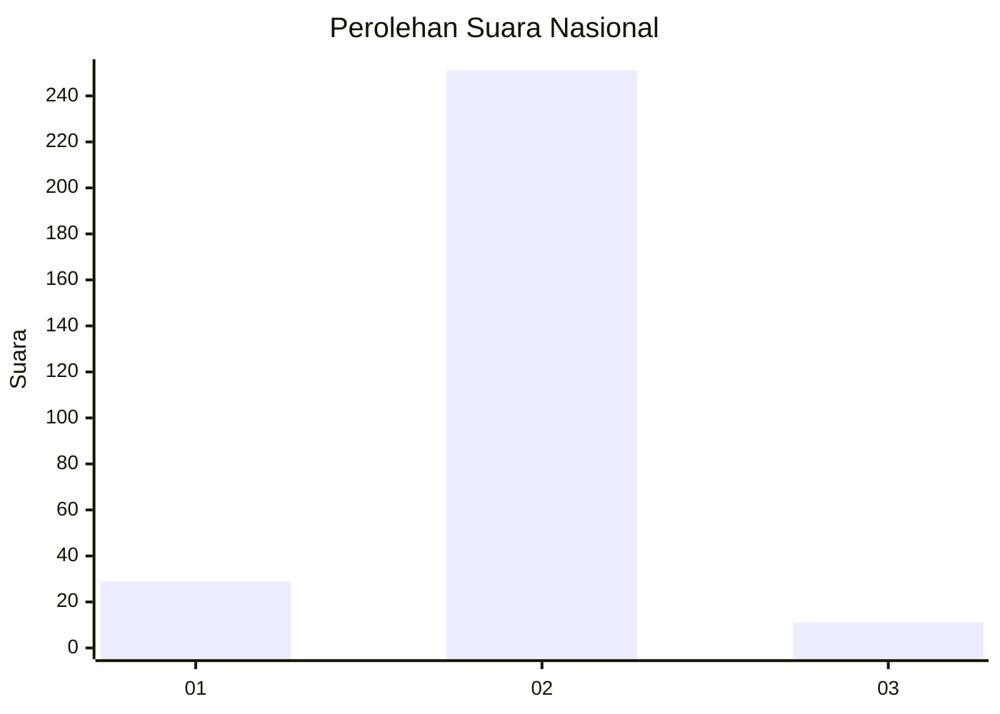
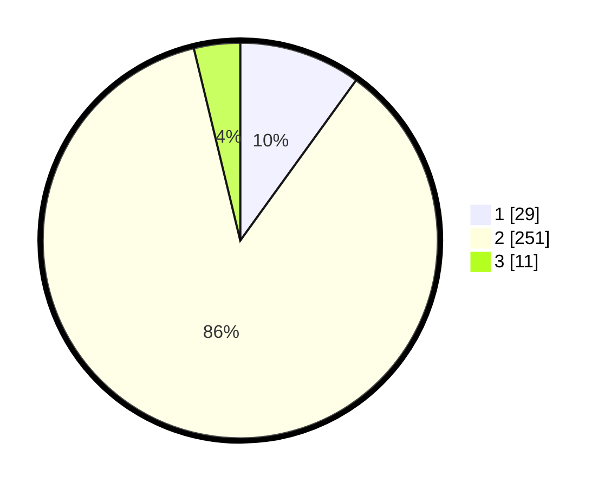

# Hasil

## Grafik

## Tabel

| No. | Nama Paslon    | Suara | Suara (raw) | Persentase |
|:--- |:-------------- | -----:| -----------:| ----------:|
| 1   | ANIES MUHAIMIN | 29    | [29][p-1]   | 9,97       |
| 2   | PRABOWO GIBRAN | 251   | [251][p-2]  | 86,25      |
| 3   | GANJAR MAHFUD  | 11    | [11][p-3]   | 3,78       |

[p-1]: https://github.com/gigit-pemilu/pemilu-2024/blob/main/pilpres/hitung-suara/sub/99-luar-negeri/sub/89-penang-malaysia/sub/01-penang-malaysia/sub/0001-penang-malaysia/sub/081-ksk-066/sub/paslon-1.txt
[p-2]: https://github.com/gigit-pemilu/pemilu-2024/blob/main/pilpres/hitung-suara/sub/99-luar-negeri/sub/89-penang-malaysia/sub/01-penang-malaysia/sub/0001-penang-malaysia/sub/081-ksk-066/sub/paslon-2.txt
[p-3]: https://github.com/gigit-pemilu/pemilu-2024/blob/main/pilpres/hitung-suara/sub/99-luar-negeri/sub/89-penang-malaysia/sub/01-penang-malaysia/sub/0001-penang-malaysia/sub/081-ksk-066/sub/paslon-3.txt

## Foto C Plano

https://sirekap-obj-formc.kpu.go.id/7e9f/pemilu/ppwp/99/89/01/00/01/9989010001081-20240216-105643--d61db9da-4187-4ad4-b95c-e684d22c3498.jpg

https://sirekap-obj-formc.kpu.go.id/7e9f/pemilu/ppwp/99/89/01/00/01/9989010001081-20240216-110400--7caccb2d-371b-4701-85a7-01e0ece01aa0.jpg

https://sirekap-obj-formc.kpu.go.id/7e9f/pemilu/ppwp/99/89/01/00/01/9989010001081-20240216-110905--27bdb8b6-3563-4346-b468-d200bc8fe587.jpg

## Metadata

| Key        | Value               |
| ---------- | ------------------- |
| Time Stamp | 2024-02-16 12:51:22 |

## DATA PEMILIH TETAP

Jumlah pemilih dalam DPT: **468**.
 * L: **24**.
 * P: **444**.

## DATA PENGGUNA HAK PILIH

Jumlah pengguna hak pilih dalam DPT: **39**.
 * L: **0**.
 * P: **39**.

Jumlah pengguna hak pilih dalam DPTb: **24**.
 * L: **0**.
 * P: **24**.

Jumlah pengguna hak pilih dalam DPK: **233**.
 * L: **1**.
 * P: **232**.

Jumlah pengguna hak pilih: **296**.
 * L: **1**.
 * P: **295**.

## JUMLAH SUARA SAH DAN TIDAK SAH

JUMLAH SELURUH SUARA SAH: **291**.

JUMLAH SUARA TIDAK SAH: **5**.

JUMLAH SELURUH SUARA SAH DAN SUARA TIDAK SAH: **296**.

