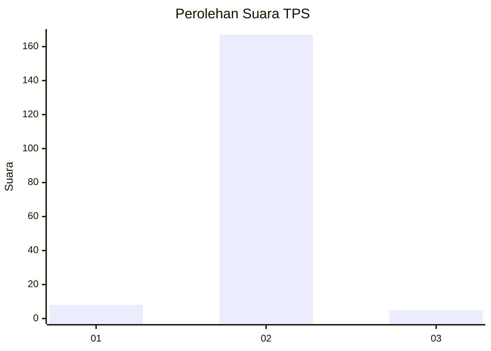
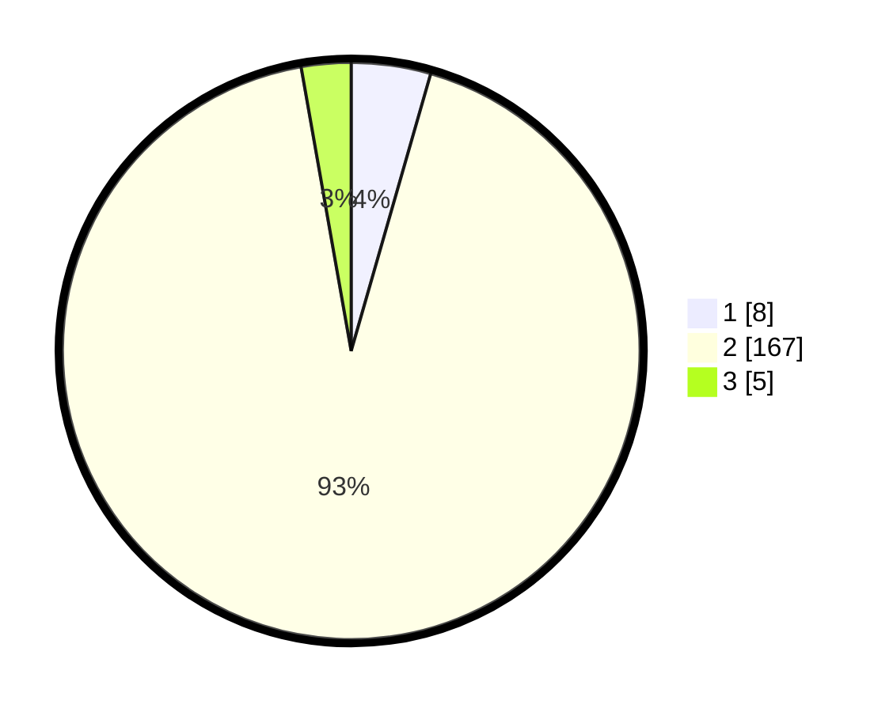

# Hasil

## Grafik

## Tabel

| No. | Nama Paslon    | Suara | Suara (raw) | Persentase |
|:--- |:-------------- | -----:| -----------:| ----------:|
| 1   | ANIES MUHAIMIN | 8     | [8][p-1]    | 4,44       |
| 2   | PRABOWO GIBRAN | 167   | [167][p-2]  | 92,78      |
| 3   | GANJAR MAHFUD  | 5     | [5][p-3]    | 2,78       |

[p-1]: https://github.com/gigit-pemilu/pemilu-2024-99-luar-negeri/blob/main/pilpres/hitung-suara/sub/99-luar-negeri/sub/89-penang-malaysia/sub/01-penang-malaysia/sub/0001-penang-malaysia/sub/082-ksk-067/sub/paslon-1.txt
[p-2]: https://github.com/gigit-pemilu/pemilu-2024-99-luar-negeri/blob/main/pilpres/hitung-suara/sub/99-luar-negeri/sub/89-penang-malaysia/sub/01-penang-malaysia/sub/0001-penang-malaysia/sub/082-ksk-067/sub/paslon-2.txt
[p-3]: https://github.com/gigit-pemilu/pemilu-2024-99-luar-negeri/blob/main/pilpres/hitung-suara/sub/99-luar-negeri/sub/89-penang-malaysia/sub/01-penang-malaysia/sub/0001-penang-malaysia/sub/082-ksk-067/sub/paslon-3.txt

## Foto C Plano

https://sirekap-obj-formc.kpu.go.id/b48e/pemilu/ppwp/99/89/01/00/01/9989010001082-20240217-094737--377c4c98-6c64-44bc-bfa7-3299a1152b21.jpg

https://sirekap-obj-formc.kpu.go.id/b48e/pemilu/ppwp/99/89/01/00/01/9989010001082-20240217-094859--a6c352c0-2a79-4eef-a516-35510b14b570.jpg

https://sirekap-obj-formc.kpu.go.id/b48e/pemilu/ppwp/99/89/01/00/01/9989010001082-20240217-094952--b6a1e16e-ca16-423e-8618-4ae35f1f713b.jpg

## Metadata

| Key        | Value               |
| ---------- | ------------------- |
| Time Stamp | 2024-02-17 10:00:02 |

## DATA PEMILIH TETAP

Jumlah pemilih dalam DPT: **177**.
 * L: **38**.
 * P: **139**.

## DATA PENGGUNA HAK PILIH

Jumlah pengguna hak pilih dalam DPT: **19**.
 * L: **0**.
 * P: **19**.

Jumlah pengguna hak pilih dalam DPTb: **52**.
 * L: **0**.
 * P: **52**.

Jumlah pengguna hak pilih dalam DPK: **111**.
 * L: **0**.
 * P: **111**.

Jumlah pengguna hak pilih: **182**.
 * L: **0**.
 * P: **182**.

## JUMLAH SUARA SAH DAN TIDAK SAH

JUMLAH SELURUH SUARA SAH: **180**.

JUMLAH SUARA TIDAK SAH: **1**.

JUMLAH SELURUH SUARA SAH DAN SUARA TIDAK SAH: **181**.

