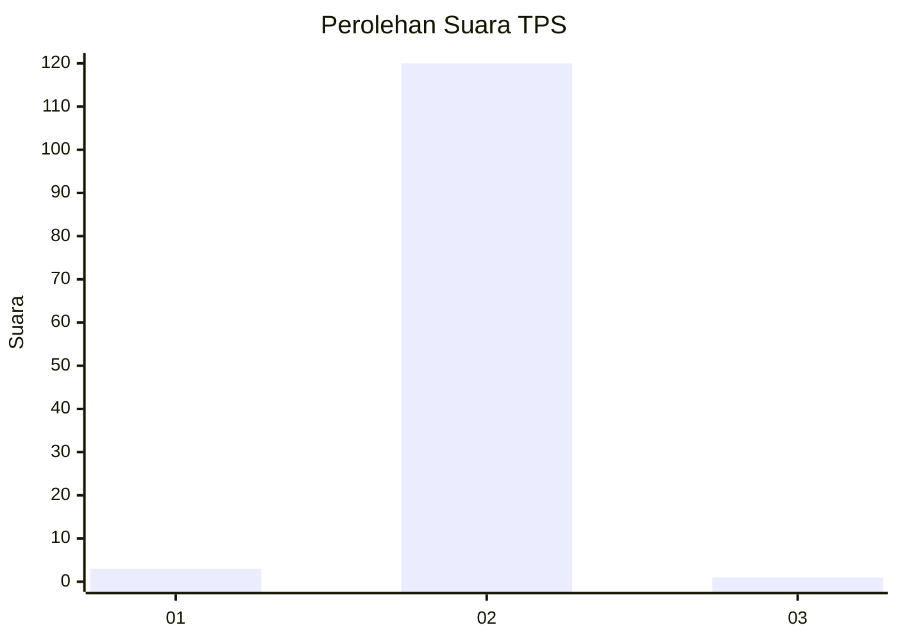
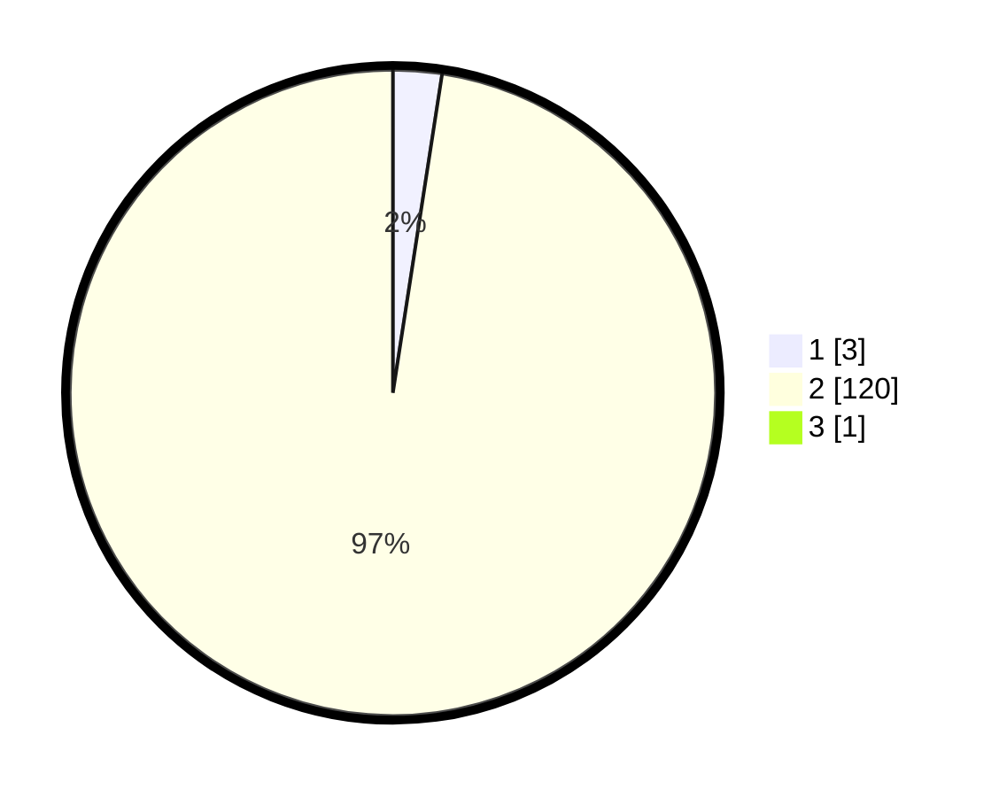

# Hasil

## Grafik

## Tabel

| No. | Nama Paslon    | Suara | Suara (raw) | Persentase |
|:--- |:-------------- | -----:| -----------:| ----------:|
| 1   | ANIES MUHAIMIN | 3     | [3][p-1]    | 2,42       |
| 2   | PRABOWO GIBRAN | 120   | [120][p-2]  | 96,77      |
| 3   | GANJAR MAHFUD  | 1     | [1][p-3]    | 0,81       |

[p-1]: https://github.com/gigit-pemilu/pemilu-2024-99-luar-negeri/blob/main/pilpres/hitung-suara/sub/99-luar-negeri/sub/89-penang-malaysia/sub/01-penang-malaysia/sub/0001-penang-malaysia/sub/083-ksk-068/sub/paslon-1.txt
[p-2]: https://github.com/gigit-pemilu/pemilu-2024-99-luar-negeri/blob/main/pilpres/hitung-suara/sub/99-luar-negeri/sub/89-penang-malaysia/sub/01-penang-malaysia/sub/0001-penang-malaysia/sub/083-ksk-068/sub/paslon-2.txt
[p-3]: https://github.com/gigit-pemilu/pemilu-2024-99-luar-negeri/blob/main/pilpres/hitung-suara/sub/99-luar-negeri/sub/89-penang-malaysia/sub/01-penang-malaysia/sub/0001-penang-malaysia/sub/083-ksk-068/sub/paslon-3.txt

## Foto C Plano

https://sirekap-obj-formc.kpu.go.id/ceea/pemilu/ppwp/99/89/01/00/01/9989010001083-20240216-123718--89205488-0ac2-4530-888e-8dc9d690ea39.jpg

https://sirekap-obj-formc.kpu.go.id/ceea/pemilu/ppwp/99/89/01/00/01/9989010001083-20240216-114412--b95ff22d-a640-45f7-83c0-1c82ac2296ac.jpg

https://sirekap-obj-formc.kpu.go.id/ceea/pemilu/ppwp/99/89/01/00/01/9989010001083-20240216-114506--14c4fc0b-ebd4-4894-8649-b5a41c5eed28.jpg

## Metadata

| Key        | Value               |
| ---------- | ------------------- |
| Time Stamp | 2024-02-16 12:51:22 |

## DATA PEMILIH TETAP

Jumlah pemilih dalam DPT: **304**.
 * L: **0**.
 * P: **304**.

## DATA PENGGUNA HAK PILIH

Jumlah pengguna hak pilih dalam DPT: **23**.
 * L: **0**.
 * P: **23**.

Jumlah pengguna hak pilih dalam DPTb: **68**.
 * L: **0**.
 * P: **68**.

Jumlah pengguna hak pilih dalam DPK: **34**.
 * L: **0**.
 * P: **34**.

Jumlah pengguna hak pilih: **125**.
 * L: **0**.
 * P: **125**.

## JUMLAH SUARA SAH DAN TIDAK SAH

JUMLAH SELURUH SUARA SAH: **124**.

JUMLAH SUARA TIDAK SAH: **1**.

JUMLAH SELURUH SUARA SAH DAN SUARA TIDAK SAH: **125**.

