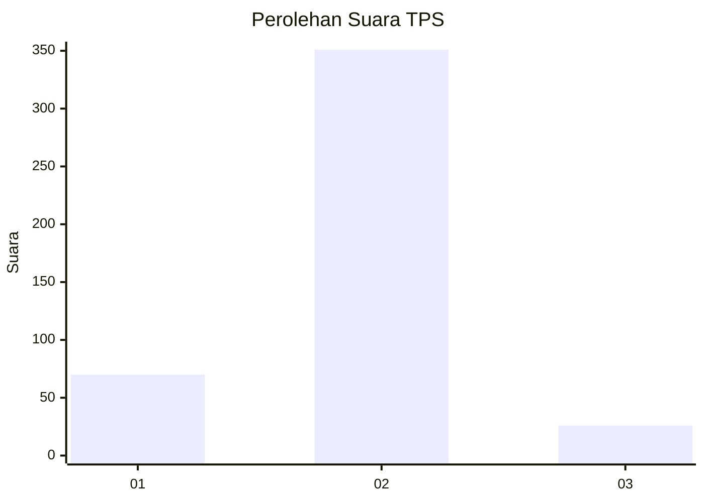
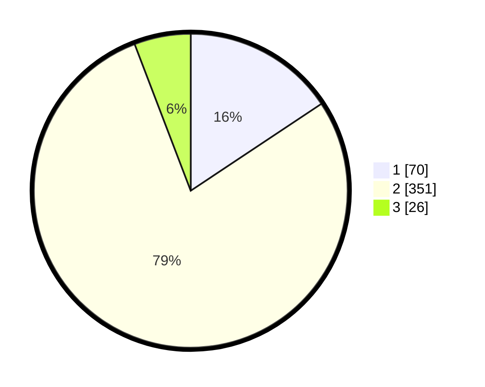

# Hasil

## Grafik

## Tabel

| No. | Nama Paslon    | Suara | Suara (raw) | Persentase |
|:--- |:-------------- | -----:| -----------:| ----------:|
| 1   | ANIES MUHAIMIN | 70    | [70][p-1]   | 15,66      |
| 2   | PRABOWO GIBRAN | 351   | [351][p-2]  | 78,52      |
| 3   | GANJAR MAHFUD  | 26    | [26][p-3]   | 5,82       |

[p-1]: https://github.com/gigit-pemilu/pemilu-2024-99-luar-negeri/blob/main/pilpres/hitung-suara/sub/99-luar-negeri/sub/89-penang-malaysia/sub/01-penang-malaysia/sub/0001-penang-malaysia/sub/085-ksk-070/sub/paslon-1.txt
[p-2]: https://github.com/gigit-pemilu/pemilu-2024-99-luar-negeri/blob/main/pilpres/hitung-suara/sub/99-luar-negeri/sub/89-penang-malaysia/sub/01-penang-malaysia/sub/0001-penang-malaysia/sub/085-ksk-070/sub/paslon-2.txt
[p-3]: https://github.com/gigit-pemilu/pemilu-2024-99-luar-negeri/blob/main/pilpres/hitung-suara/sub/99-luar-negeri/sub/89-penang-malaysia/sub/01-penang-malaysia/sub/0001-penang-malaysia/sub/085-ksk-070/sub/paslon-3.txt

## Foto C Plano

https://sirekap-obj-formc.kpu.go.id/b8ec/pemilu/ppwp/99/89/01/00/01/9989010001085-20240216-192226--05b3a6a7-03e3-4791-8b24-752d33cf94e9.jpg

https://sirekap-obj-formc.kpu.go.id/b8ec/pemilu/ppwp/99/89/01/00/01/9989010001085-20240214-205252--f16ceccf-ecfc-4aa6-a2b2-a02f6755484f.jpg

https://sirekap-obj-formc.kpu.go.id/b8ec/pemilu/ppwp/99/89/01/00/01/9989010001085-20240214-205346--5947db0b-f22d-4e85-8ed7-60939f709ae2.jpg

## Metadata

| Key        | Value               |
| ---------- | ------------------- |
| Time Stamp | 2024-02-16 21:01:00 |

## DATA PEMILIH TETAP

Jumlah pemilih dalam DPT: **722**.
 * L: **0**.
 * P: **722**.

## DATA PENGGUNA HAK PILIH

Jumlah pengguna hak pilih dalam DPT: **127**.
 * L: **0**.
 * P: **127**.

Jumlah pengguna hak pilih dalam DPTb: **20**.
 * L: **1**.
 * P: **19**.

Jumlah pengguna hak pilih dalam DPK: **309**.
 * L: **0**.
 * P: **309**.

Jumlah pengguna hak pilih: **456**.
 * L: **1**.
 * P: **455**.

## JUMLAH SUARA SAH DAN TIDAK SAH

JUMLAH SELURUH SUARA SAH: **447**.

JUMLAH SUARA TIDAK SAH: **9**.

JUMLAH SELURUH SUARA SAH DAN SUARA TIDAK SAH: **456**.

