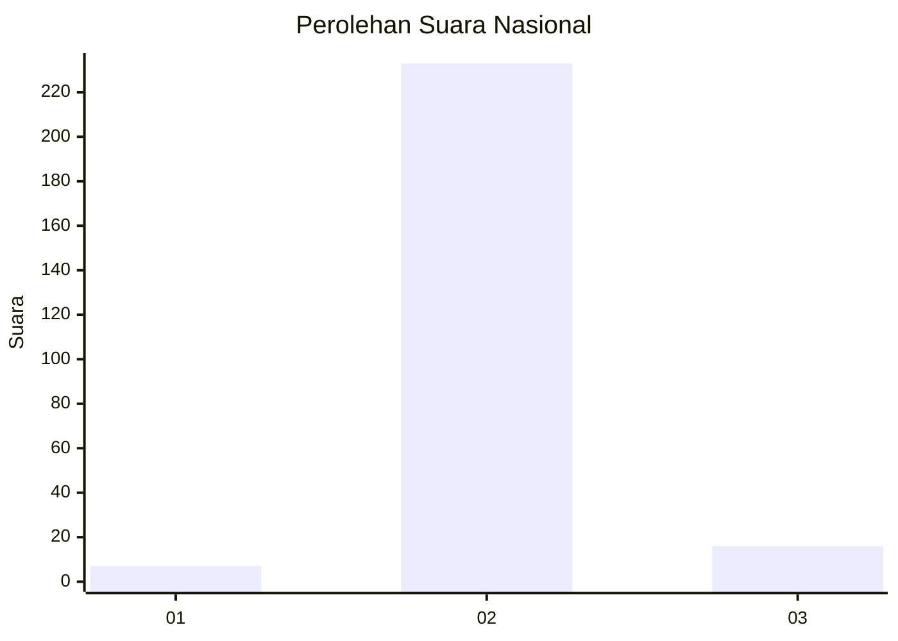
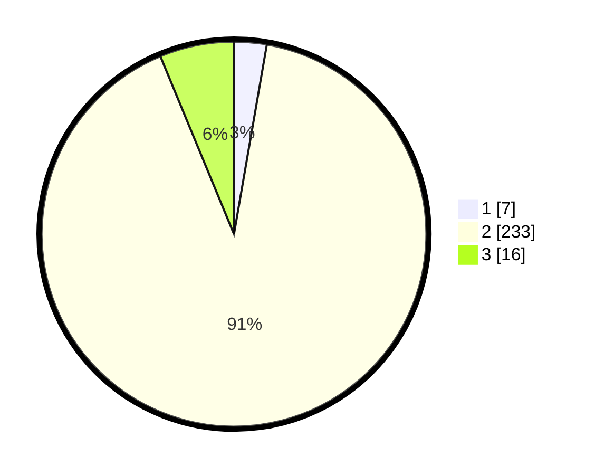

# Hasil

## Grafik

## Tabel

| No. | Nama Paslon    | Suara | Suara (raw) | Persentase |
|:--- |:-------------- | -----:| -----------:| ----------:|
| 1   | ANIES MUHAIMIN | 7     | [7][p-1]    | 2,73       |
| 2   | PRABOWO GIBRAN | 233   | [233][p-2]  | 91,02      |
| 3   | GANJAR MAHFUD  | 16    | [16][p-3]   | 6,25       |

[p-1]: https://github.com/gigit-pemilu/pemilu-2024/blob/main/pilpres/hitung-suara/sub/99-luar-negeri/sub/89-penang-malaysia/sub/01-penang-malaysia/sub/0001-penang-malaysia/sub/087-ksk-072/sub/paslon-1.txt
[p-2]: https://github.com/gigit-pemilu/pemilu-2024/blob/main/pilpres/hitung-suara/sub/99-luar-negeri/sub/89-penang-malaysia/sub/01-penang-malaysia/sub/0001-penang-malaysia/sub/087-ksk-072/sub/paslon-2.txt
[p-3]: https://github.com/gigit-pemilu/pemilu-2024/blob/main/pilpres/hitung-suara/sub/99-luar-negeri/sub/89-penang-malaysia/sub/01-penang-malaysia/sub/0001-penang-malaysia/sub/087-ksk-072/sub/paslon-3.txt

## Foto C Plano

https://sirekap-obj-formc.kpu.go.id/652f/pemilu/ppwp/99/89/01/00/01/9989010001087-20240217-134027--d9a0e80f-0901-4712-9b79-ba726e6b7cb9.jpg

https://sirekap-obj-formc.kpu.go.id/652f/pemilu/ppwp/99/89/01/00/01/9989010001087-20240217-134500--c60ab0a3-bf1a-4b90-a750-4f861929cdac.jpg

https://sirekap-obj-formc.kpu.go.id/652f/pemilu/ppwp/99/89/01/00/01/9989010001087-20240217-134848--fd55b365-aaf3-4d13-bfcf-34fa6e0bafd0.jpg

## Metadata

| Key        | Value               |
| ---------- | ------------------- |
| Time Stamp | 2024-02-17 14:45:18 |

## DATA PEMILIH TETAP

Jumlah pemilih dalam DPT: **549**.
 * L: **0**.
 * P: **549**.

## DATA PENGGUNA HAK PILIH

Jumlah pengguna hak pilih dalam DPT: **17**.
 * L: **0**.
 * P: **17**.

Jumlah pengguna hak pilih dalam DPTb: **226**.
 * L: **1**.
 * P: **225**.

Jumlah pengguna hak pilih dalam DPK: **26**.
 * L: **0**.
 * P: **26**.

Jumlah pengguna hak pilih: **259**.
 * L: **1**.
 * P: **258**.

## JUMLAH SUARA SAH DAN TIDAK SAH

JUMLAH SELURUH SUARA SAH: **256**.

JUMLAH SUARA TIDAK SAH: **3**.

JUMLAH SELURUH SUARA SAH DAN SUARA TIDAK SAH: **259**.

