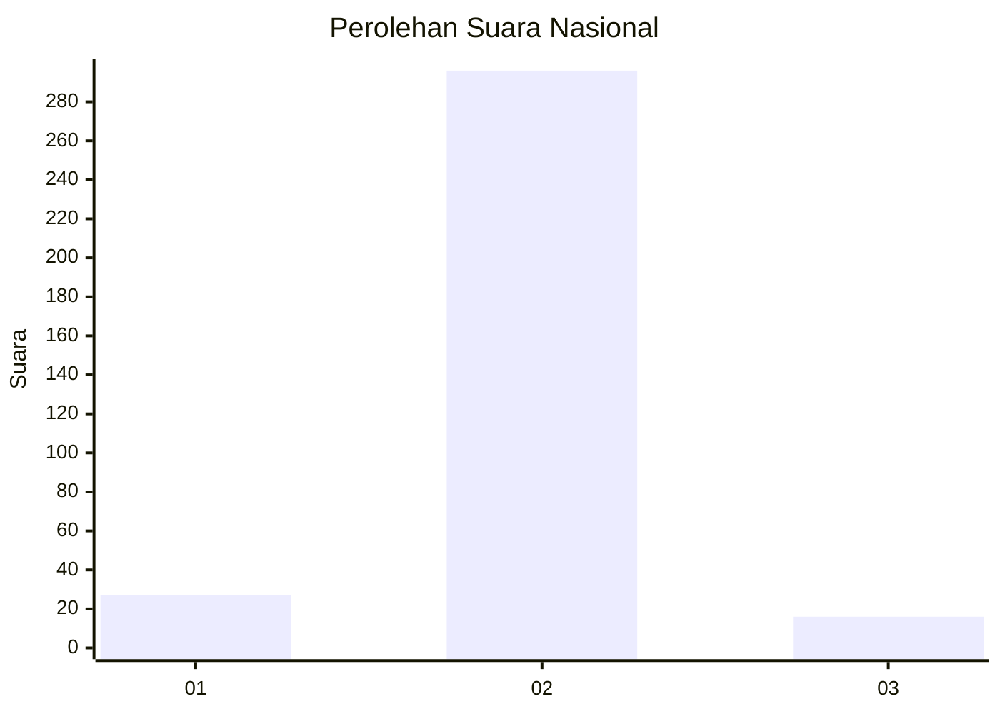
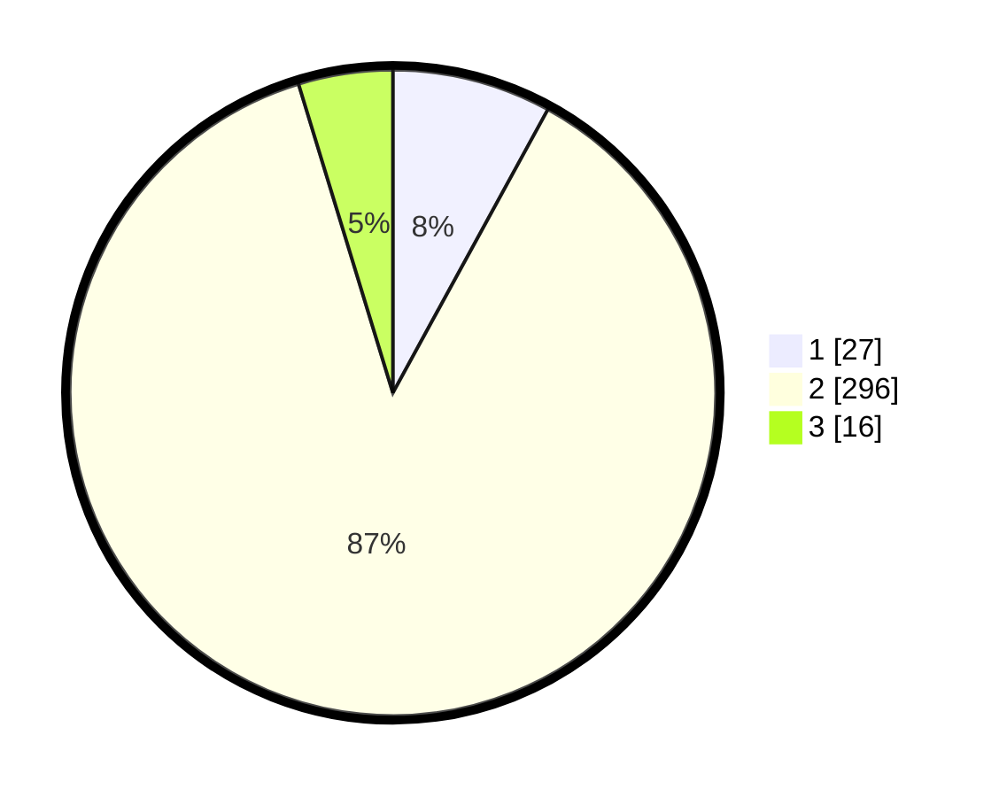

# Hasil

## Grafik

## Tabel

| No. | Nama Paslon    | Suara | Suara (raw) | Persentase |
|:--- |:-------------- | -----:| -----------:| ----------:|
| 1   | ANIES MUHAIMIN | 27    | [27][p-1]   | 7,96       |
| 2   | PRABOWO GIBRAN | 296   | [296][p-2]  | 87,32      |
| 3   | GANJAR MAHFUD  | 16    | [16][p-3]   | 4,72       |

[p-1]: https://github.com/gigit-pemilu/pemilu-2024/blob/main/pilpres/hitung-suara/sub/99-luar-negeri/sub/89-penang-malaysia/sub/01-penang-malaysia/sub/0001-penang-malaysia/sub/088-ksk-073/sub/paslon-1.txt
[p-2]: https://github.com/gigit-pemilu/pemilu-2024/blob/main/pilpres/hitung-suara/sub/99-luar-negeri/sub/89-penang-malaysia/sub/01-penang-malaysia/sub/0001-penang-malaysia/sub/088-ksk-073/sub/paslon-2.txt
[p-3]: https://github.com/gigit-pemilu/pemilu-2024/blob/main/pilpres/hitung-suara/sub/99-luar-negeri/sub/89-penang-malaysia/sub/01-penang-malaysia/sub/0001-penang-malaysia/sub/088-ksk-073/sub/paslon-3.txt

## Foto C Plano

https://sirekap-obj-formc.kpu.go.id/07ec/pemilu/ppwp/99/89/01/00/01/9989010001088-20240215-065929--8208ea0d-f063-4061-b382-811d0b8f5630.jpg

https://sirekap-obj-formc.kpu.go.id/07ec/pemilu/ppwp/99/89/01/00/01/9989010001088-20240215-070023--68979517-06da-42ac-b042-1314f1522b2a.jpg

https://sirekap-obj-formc.kpu.go.id/07ec/pemilu/ppwp/99/89/01/00/01/9989010001088-20240215-004416--e3e7969a-e7ac-4e1c-be0c-9e9b82001062.jpg

## Metadata

| Key        | Value               |
| ---------- | ------------------- |
| Time Stamp | 2024-02-16 21:01:00 |

## DATA PEMILIH TETAP

Jumlah pemilih dalam DPT: **858**.
 * L: **0**.
 * P: **858**.

## DATA PENGGUNA HAK PILIH

Jumlah pengguna hak pilih dalam DPT: **43**.
 * L: **0**.
 * P: **43**.

Jumlah pengguna hak pilih dalam DPTb: **3**.
 * L: **1**.
 * P: **2**.

Jumlah pengguna hak pilih dalam DPK: **297**.
 * L: **1**.
 * P: **296**.

Jumlah pengguna hak pilih: **343**.
 * L: **2**.
 * P: **341**.

## JUMLAH SUARA SAH DAN TIDAK SAH

JUMLAH SELURUH SUARA SAH: **339**.

JUMLAH SUARA TIDAK SAH: **4**.

JUMLAH SELURUH SUARA SAH DAN SUARA TIDAK SAH: **343**.

