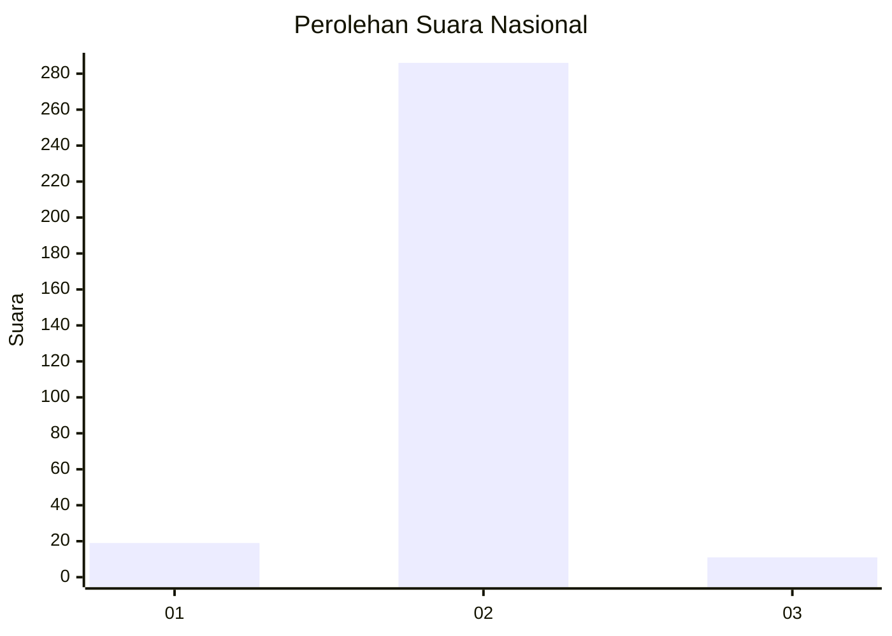
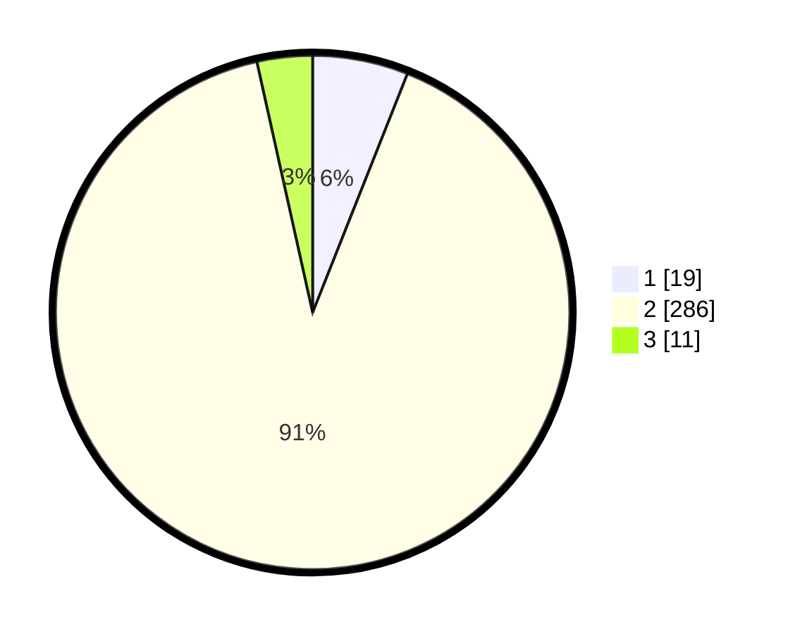

# Hasil

## Grafik

## Tabel

| No. | Nama Paslon    | Suara | Suara (raw) | Persentase |
|:--- |:-------------- | -----:| -----------:| ----------:|
| 1   | ANIES MUHAIMIN | 19    | [19][p-1]   | 6,01       |
| 2   | PRABOWO GIBRAN | 286   | [286][p-2]  | 90,51      |
| 3   | GANJAR MAHFUD  | 11    | [11][p-3]   | 3,48       |

[p-1]: https://github.com/gigit-pemilu/pemilu-2024/blob/main/pilpres/hitung-suara/sub/99-luar-negeri/sub/89-penang-malaysia/sub/01-penang-malaysia/sub/0001-penang-malaysia/sub/089-ksk-074/sub/paslon-1.txt
[p-2]: https://github.com/gigit-pemilu/pemilu-2024/blob/main/pilpres/hitung-suara/sub/99-luar-negeri/sub/89-penang-malaysia/sub/01-penang-malaysia/sub/0001-penang-malaysia/sub/089-ksk-074/sub/paslon-2.txt
[p-3]: https://github.com/gigit-pemilu/pemilu-2024/blob/main/pilpres/hitung-suara/sub/99-luar-negeri/sub/89-penang-malaysia/sub/01-penang-malaysia/sub/0001-penang-malaysia/sub/089-ksk-074/sub/paslon-3.txt

## Foto C Plano

https://sirekap-obj-formc.kpu.go.id/4cbd/pemilu/ppwp/99/89/01/00/01/9989010001089-20240217-102029--4c777227-95e5-49f0-ba67-99ff78262137.jpg

https://sirekap-obj-formc.kpu.go.id/4cbd/pemilu/ppwp/99/89/01/00/01/9989010001089-20240217-102833--42312807-3ced-46db-a609-cafc237edb15.jpg

https://sirekap-obj-formc.kpu.go.id/4cbd/pemilu/ppwp/99/89/01/00/01/9989010001089-20240217-103017--27437b40-3b66-4165-8d59-0aa398712839.jpg

## Metadata

| Key        | Value               |
| ---------- | ------------------- |
| Time Stamp | 2024-02-17 11:00:02 |

## DATA PEMILIH TETAP

Jumlah pemilih dalam DPT: **570**.
 * L: **0**.
 * P: **0**.

## DATA PENGGUNA HAK PILIH

Jumlah pengguna hak pilih dalam DPT: **55**.
 * L: **0**.
 * P: **55**.

Jumlah pengguna hak pilih dalam DPTb: **36**.
 * L: **0**.
 * P: **36**.

Jumlah pengguna hak pilih dalam DPK: **227**.
 * L: **0**.
 * P: **227**.

Jumlah pengguna hak pilih: **318**.
 * L: **0**.
 * P: **318**.

## JUMLAH SUARA SAH DAN TIDAK SAH

JUMLAH SELURUH SUARA SAH: **316**.

JUMLAH SUARA TIDAK SAH: **2**.

JUMLAH SELURUH SUARA SAH DAN SUARA TIDAK SAH: **318**.

