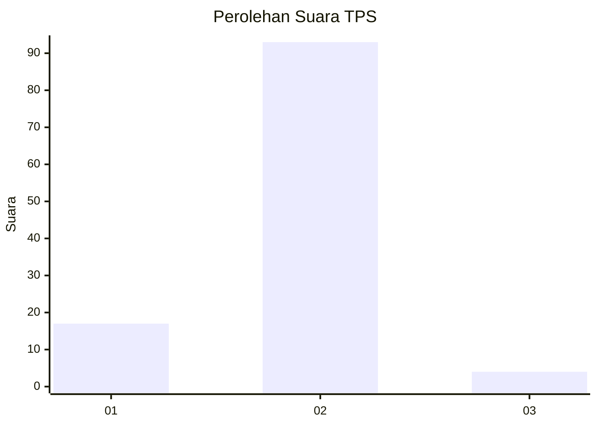
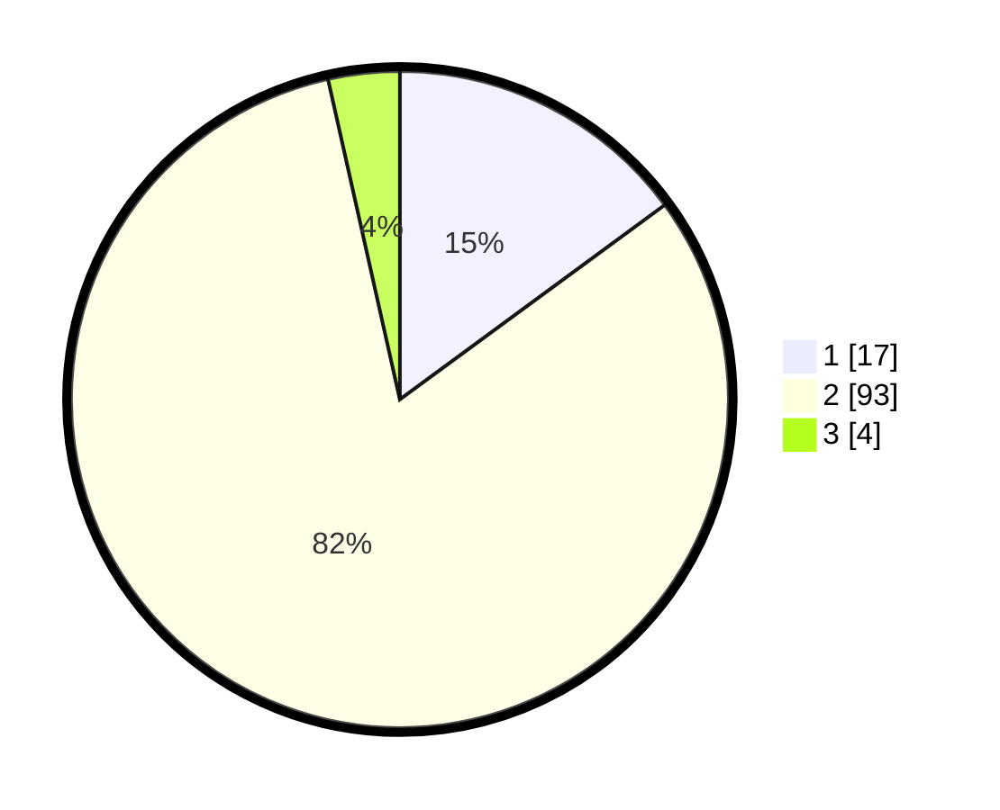

# Hasil

## Grafik

## Tabel

| No. | Nama Paslon    | Suara | Suara (raw) | Persentase |
|:--- |:-------------- | -----:| -----------:| ----------:|
| 1   | ANIES MUHAIMIN | 17    | [17][p-1]   | 14,91      |
| 2   | PRABOWO GIBRAN | 93    | [93][p-2]   | 81,58      |
| 3   | GANJAR MAHFUD  | 4     | [4][p-3]    | 3,51       |

[p-1]: https://github.com/gigit-pemilu/pemilu-2024-99-luar-negeri/blob/main/pilpres/hitung-suara/sub/99-luar-negeri/sub/89-penang-malaysia/sub/01-penang-malaysia/sub/0001-penang-malaysia/sub/099-ksk-084/sub/paslon-1.txt
[p-2]: https://github.com/gigit-pemilu/pemilu-2024-99-luar-negeri/blob/main/pilpres/hitung-suara/sub/99-luar-negeri/sub/89-penang-malaysia/sub/01-penang-malaysia/sub/0001-penang-malaysia/sub/099-ksk-084/sub/paslon-2.txt
[p-3]: https://github.com/gigit-pemilu/pemilu-2024-99-luar-negeri/blob/main/pilpres/hitung-suara/sub/99-luar-negeri/sub/89-penang-malaysia/sub/01-penang-malaysia/sub/0001-penang-malaysia/sub/099-ksk-084/sub/paslon-3.txt

## Foto C Plano

https://sirekap-obj-formc.kpu.go.id/4cb9/pemilu/ppwp/99/89/01/00/01/9989010001099-20240215-040330--4412fbb2-c36a-4760-bf42-9a3c6853676b.jpg

https://sirekap-obj-formc.kpu.go.id/4cb9/pemilu/ppwp/99/89/01/00/01/9989010001099-20240216-092101--3b1275d5-9db4-4cd3-8a59-7f20160e12bb.jpg

https://sirekap-obj-formc.kpu.go.id/4cb9/pemilu/ppwp/99/89/01/00/01/9989010001099-20240215-040500--9ff14994-7219-40f5-b23d-bcdd1405aace.jpg

## Metadata

| Key        | Value               |
| ---------- | ------------------- |
| Time Stamp | 2024-02-16 09:30:28 |

## DATA PEMILIH TETAP

Jumlah pemilih dalam DPT: **169**.
 * L: **21**.
 * P: **148**.

## DATA PENGGUNA HAK PILIH

Jumlah pengguna hak pilih dalam DPT: **10**.
 * L: **0**.
 * P: **10**.

Jumlah pengguna hak pilih dalam DPTb: **42**.
 * L: **1**.
 * P: **41**.

Jumlah pengguna hak pilih dalam DPK: **62**.
 * L: **27**.
 * P: **35**.

Jumlah pengguna hak pilih: **114**.
 * L: **28**.
 * P: **86**.

## JUMLAH SUARA SAH DAN TIDAK SAH

JUMLAH SELURUH SUARA SAH: **114**.

JUMLAH SUARA TIDAK SAH: **0**.

JUMLAH SELURUH SUARA SAH DAN SUARA TIDAK SAH: **114**.

