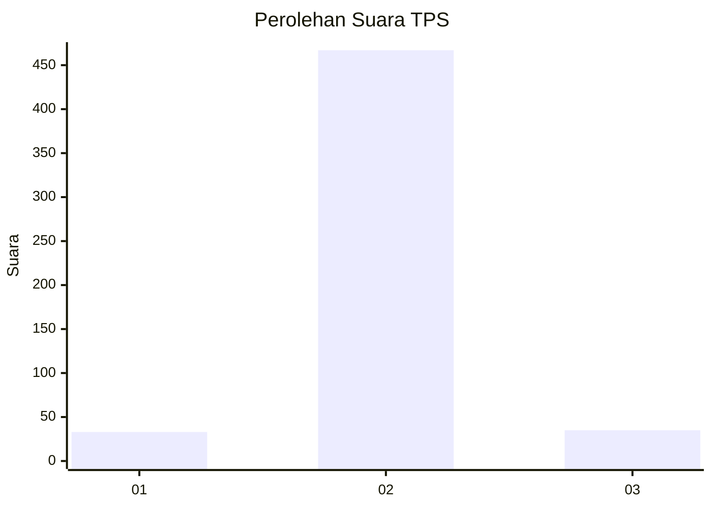
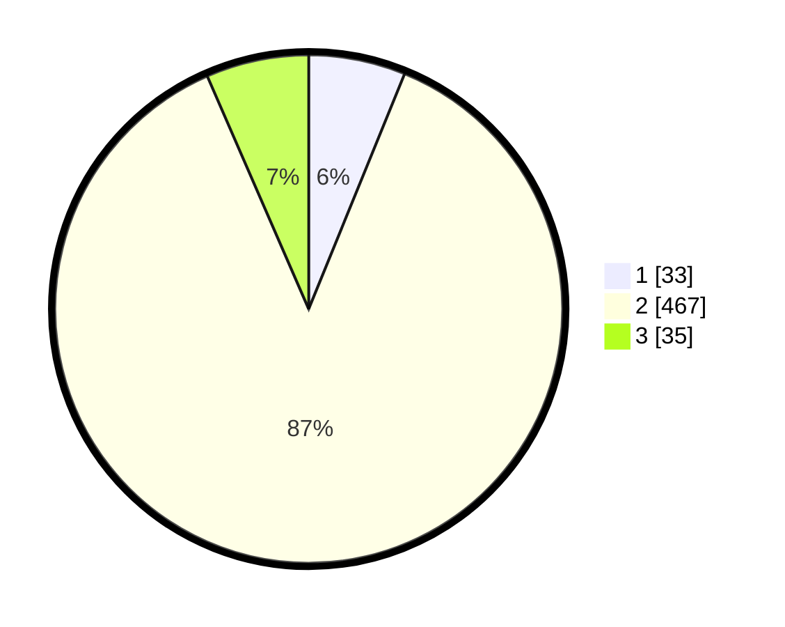

# Hasil

## Grafik

## Tabel

| No. | Nama Paslon    | Suara | Suara (raw) | Persentase |
|:--- |:-------------- | -----:| -----------:| ----------:|
| 1   | ANIES MUHAIMIN | 33    | [33][p-1]   | 6,17       |
| 2   | PRABOWO GIBRAN | 467   | [467][p-2]  | 87,29      |
| 3   | GANJAR MAHFUD  | 35    | [35][p-3]   | 6,54       |

[p-1]: https://github.com/gigit-pemilu/pemilu-2024-99-luar-negeri/blob/main/pilpres/hitung-suara/sub/99-luar-negeri/sub/89-penang-malaysia/sub/01-penang-malaysia/sub/0001-penang-malaysia/sub/100-ksk-085/sub/paslon-1.txt
[p-2]: https://github.com/gigit-pemilu/pemilu-2024-99-luar-negeri/blob/main/pilpres/hitung-suara/sub/99-luar-negeri/sub/89-penang-malaysia/sub/01-penang-malaysia/sub/0001-penang-malaysia/sub/100-ksk-085/sub/paslon-2.txt
[p-3]: https://github.com/gigit-pemilu/pemilu-2024-99-luar-negeri/blob/main/pilpres/hitung-suara/sub/99-luar-negeri/sub/89-penang-malaysia/sub/01-penang-malaysia/sub/0001-penang-malaysia/sub/100-ksk-085/sub/paslon-3.txt

## Foto C Plano

https://sirekap-obj-formc.kpu.go.id/34f9/pemilu/ppwp/99/89/01/00/01/9989010001100-20240217-184405--2c89cd7c-b09b-4ee7-b5c1-fb82c5bc7a12.jpg

https://sirekap-obj-formc.kpu.go.id/34f9/pemilu/ppwp/99/89/01/00/01/9989010001100-20240217-203216--589cf8dd-b1a6-473c-8755-ca087f478a4c.jpg

https://sirekap-obj-formc.kpu.go.id/34f9/pemilu/ppwp/99/89/01/00/01/9989010001100-20240217-184906--473bc969-59dd-4654-a718-233a9ee65de8.jpg

## Metadata

| Key        | Value               |
| ---------- | ------------------- |
| Time Stamp | 2024-02-19 06:16:00 |

## DATA PEMILIH TETAP

Jumlah pemilih dalam DPT: **781**.
 * L: **71**.
 * P: **710**.

## DATA PENGGUNA HAK PILIH

Jumlah pengguna hak pilih dalam DPT: **95**.
 * L: **0**.
 * P: **95**.

Jumlah pengguna hak pilih dalam DPTb: **145**.
 * L: **1**.
 * P: **144**.

Jumlah pengguna hak pilih dalam DPK: **300**.
 * L: **10**.
 * P: **290**.

Jumlah pengguna hak pilih: **540**.
 * L: **11**.
 * P: **529**.

## JUMLAH SUARA SAH DAN TIDAK SAH

JUMLAH SELURUH SUARA SAH: **535**.

JUMLAH SUARA TIDAK SAH: **5**.

JUMLAH SELURUH SUARA SAH DAN SUARA TIDAK SAH: **540**.

