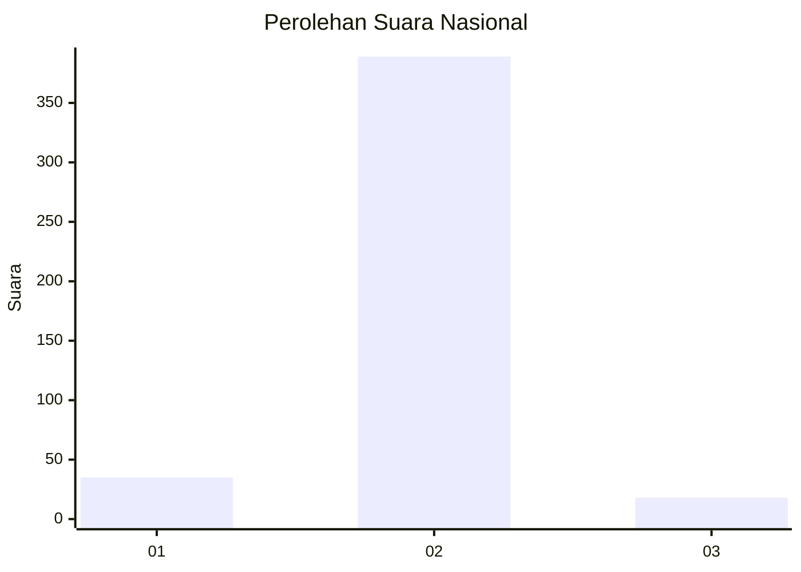
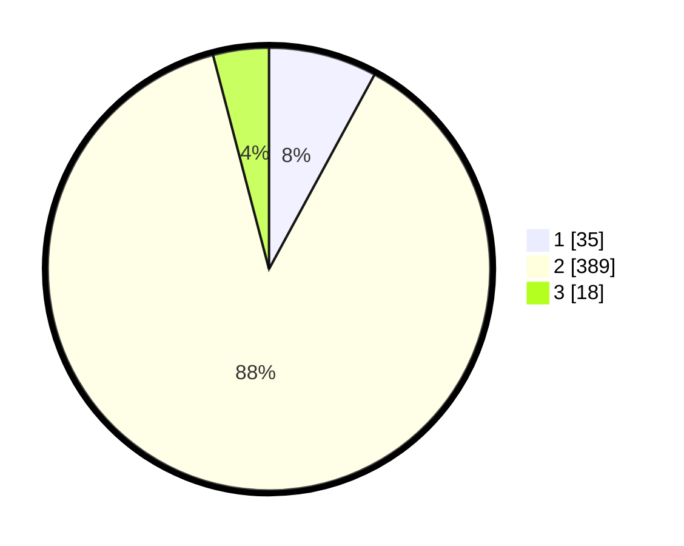

# Hasil

## Grafik

## Tabel

| No. | Nama Paslon    | Suara | Suara (raw) | Persentase |
|:--- |:-------------- | -----:| -----------:| ----------:|
| 1   | ANIES MUHAIMIN | 35    | [35][p-1]   | 7,92       |
| 2   | PRABOWO GIBRAN | 389   | [389][p-2]  | 88,01      |
| 3   | GANJAR MAHFUD  | 18    | [18][p-3]   | 4,07       |

[p-1]: https://github.com/gigit-pemilu/pemilu-2024/blob/main/pilpres/hitung-suara/sub/99-luar-negeri/sub/89-penang-malaysia/sub/01-penang-malaysia/sub/0001-penang-malaysia/sub/101-ksk-086/sub/paslon-1.txt
[p-2]: https://github.com/gigit-pemilu/pemilu-2024/blob/main/pilpres/hitung-suara/sub/99-luar-negeri/sub/89-penang-malaysia/sub/01-penang-malaysia/sub/0001-penang-malaysia/sub/101-ksk-086/sub/paslon-2.txt
[p-3]: https://github.com/gigit-pemilu/pemilu-2024/blob/main/pilpres/hitung-suara/sub/99-luar-negeri/sub/89-penang-malaysia/sub/01-penang-malaysia/sub/0001-penang-malaysia/sub/101-ksk-086/sub/paslon-3.txt

## Foto C Plano

https://sirekap-obj-formc.kpu.go.id/497b/pemilu/ppwp/99/89/01/00/01/9989010001101-20240216-200513--fb842478-9094-4eeb-b80e-65e349309dba.jpg

https://sirekap-obj-formc.kpu.go.id/497b/pemilu/ppwp/99/89/01/00/01/9989010001101-20240216-200634--34ae6eb6-b1c3-4f7d-a6e3-9117c7c322e2.jpg

https://sirekap-obj-formc.kpu.go.id/497b/pemilu/ppwp/99/89/01/00/01/9989010001101-20240216-201035--e20153c9-035d-40c6-9a75-aa043c6ecb1d.jpg

## Metadata

| Key        | Value               |
| ---------- | ------------------- |
| Time Stamp | 2024-02-16 21:01:00 |

## DATA PEMILIH TETAP

Jumlah pemilih dalam DPT: **173**.
 * L: **13**.
 * P: **160**.

## DATA PENGGUNA HAK PILIH

Jumlah pengguna hak pilih dalam DPT: **18**.
 * L: **0**.
 * P: **18**.

Jumlah pengguna hak pilih dalam DPTb: **30**.
 * L: **4**.
 * P: **26**.

Jumlah pengguna hak pilih dalam DPK: **400**.
 * L: **3**.
 * P: **397**.

Jumlah pengguna hak pilih: **448**.
 * L: **7**.
 * P: **441**.

## JUMLAH SUARA SAH DAN TIDAK SAH

JUMLAH SELURUH SUARA SAH: **442**.

JUMLAH SUARA TIDAK SAH: **6**.

JUMLAH SELURUH SUARA SAH DAN SUARA TIDAK SAH: **448**.

