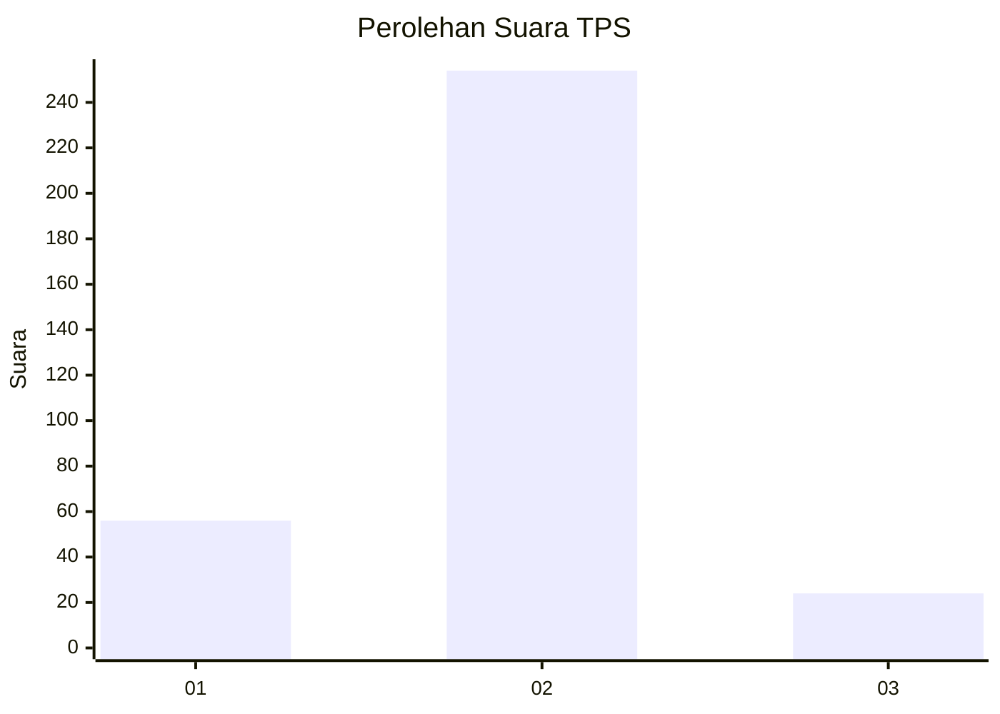
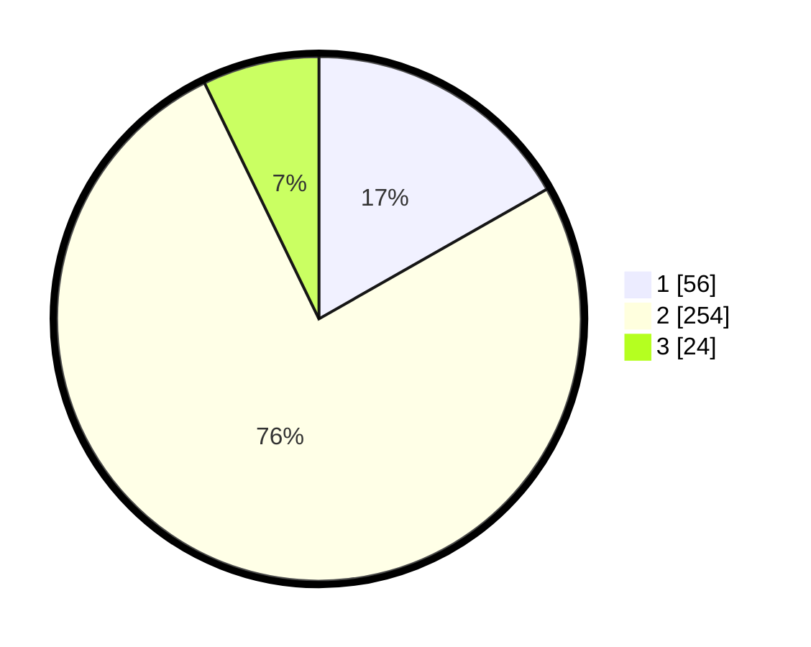

# Hasil

## Grafik

## Tabel

| No. | Nama Paslon    | Suara | Suara (raw) | Persentase |
|:--- |:-------------- | -----:| -----------:| ----------:|
| 1   | ANIES MUHAIMIN | 56    | [56][p-1]   | 16,77      |
| 2   | PRABOWO GIBRAN | 254   | [254][p-2]  | 76,05      |
| 3   | GANJAR MAHFUD  | 24    | [24][p-3]   | 7,19       |

[p-1]: https://github.com/gigit-pemilu/pemilu-2024-99-luar-negeri/blob/main/pilpres/hitung-suara/sub/99-luar-negeri/sub/89-penang-malaysia/sub/01-penang-malaysia/sub/0001-penang-malaysia/sub/102-ksk-087/sub/paslon-1.txt
[p-2]: https://github.com/gigit-pemilu/pemilu-2024-99-luar-negeri/blob/main/pilpres/hitung-suara/sub/99-luar-negeri/sub/89-penang-malaysia/sub/01-penang-malaysia/sub/0001-penang-malaysia/sub/102-ksk-087/sub/paslon-2.txt
[p-3]: https://github.com/gigit-pemilu/pemilu-2024-99-luar-negeri/blob/main/pilpres/hitung-suara/sub/99-luar-negeri/sub/89-penang-malaysia/sub/01-penang-malaysia/sub/0001-penang-malaysia/sub/102-ksk-087/sub/paslon-3.txt

## Foto C Plano

https://sirekap-obj-formc.kpu.go.id/2d37/pemilu/ppwp/99/89/01/00/01/9989010001102-20240217-094722--b90da011-efe2-4e6a-8e2d-c1ae04ac7cad.jpg

https://sirekap-obj-formc.kpu.go.id/2d37/pemilu/ppwp/99/89/01/00/01/9989010001102-20240217-095224--f508868c-2490-4865-a714-7341899a1241.jpg

https://sirekap-obj-formc.kpu.go.id/2d37/pemilu/ppwp/99/89/01/00/01/9989010001102-20240217-095351--7a33634c-3500-456f-8f7d-06f61bdd4f08.jpg

## Metadata

| Key        | Value               |
| ---------- | ------------------- |
| Time Stamp | 2024-02-17 10:00:02 |

## DATA PEMILIH TETAP

Jumlah pemilih dalam DPT: **118**.
 * L: **25**.
 * P: **90**.

## DATA PENGGUNA HAK PILIH

Jumlah pengguna hak pilih dalam DPT: **4**.
 * L: **3**.
 * P: **1**.

Jumlah pengguna hak pilih dalam DPTb: **19**.
 * L: **8**.
 * P: **11**.

Jumlah pengguna hak pilih dalam DPK: **313**.
 * L: **65**.
 * P: **248**.

Jumlah pengguna hak pilih: **336**.
 * L: **76**.
 * P: **260**.

## JUMLAH SUARA SAH DAN TIDAK SAH

JUMLAH SELURUH SUARA SAH: **334**.

JUMLAH SUARA TIDAK SAH: **2**.

JUMLAH SELURUH SUARA SAH DAN SUARA TIDAK SAH: **336**.

