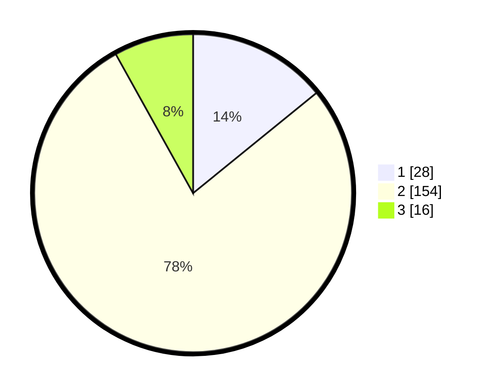

# Hasil

## Grafik

## Tabel

| No. | Nama Paslon    | Suara | Suara (raw) | Persentase |
|:--- |:-------------- | -----:| -----------:| ----------:|
| 1   | ANIES MUHAIMIN | 28    | [28][p-1]   | 14,14      |
| 2   | PRABOWO GIBRAN | 154   | [154][p-2]  | 77,78      |
| 3   | GANJAR MAHFUD  | 16    | [16][p-3]   | 8,08       |

[p-1]: https://github.com/gigit-pemilu/pemilu-2024/blob/main/pilpres/hitung-suara/sub/99-luar-negeri/sub/89-penang-malaysia/sub/01-penang-malaysia/sub/0001-penang-malaysia/sub/104-ksk-089/sub/paslon-1.txt
[p-2]: https://github.com/gigit-pemilu/pemilu-2024/blob/main/pilpres/hitung-suara/sub/99-luar-negeri/sub/89-penang-malaysia/sub/01-penang-malaysia/sub/0001-penang-malaysia/sub/104-ksk-089/sub/paslon-2.txt
[p-3]: https://github.com/gigit-pemilu/pemilu-2024/blob/main/pilpres/hitung-suara/sub/99-luar-negeri/sub/89-penang-malaysia/sub/01-penang-malaysia/sub/0001-penang-malaysia/sub/104-ksk-089/sub/paslon-3.txt

## Foto C Plano

https://sirekap-obj-formc.kpu.go.id/8f43/pemilu/ppwp/99/89/01/00/01/9989010001104-20240217-121527--08c4047c-2039-4288-8992-ef0b5545a277.jpg

https://sirekap-obj-formc.kpu.go.id/8f43/pemilu/ppwp/99/89/01/00/01/9989010001104-20240217-121846--3668b2dc-a836-436d-ace7-6ae33fcbce94.jpg

https://sirekap-obj-formc.kpu.go.id/8f43/pemilu/ppwp/99/89/01/00/01/9989010001104-20240217-122005--46eacce2-2f11-40a7-96f3-b9e34bafcf85.jpg

## Metadata

| Key        | Value               |
| ---------- | ------------------- |
| Time Stamp | 2024-02-17 13:37:34 |

## DATA PEMILIH TETAP

Jumlah pemilih dalam DPT: **288**.
 * L: **227**.
 * P: **61**.

## DATA PENGGUNA HAK PILIH

Jumlah pengguna hak pilih dalam DPT: **8**.
 * L: **8**.
 * P: **0**.

Jumlah pengguna hak pilih dalam DPTb: **73**.
 * L: **69**.
 * P: **4**.

Jumlah pengguna hak pilih dalam DPK: **123**.
 * L: **102**.
 * P: **21**.

Jumlah pengguna hak pilih: **204**.
 * L: **179**.
 * P: **25**.

## JUMLAH SUARA SAH DAN TIDAK SAH

JUMLAH SELURUH SUARA SAH: **198**.

JUMLAH SUARA TIDAK SAH: **6**.

JUMLAH SELURUH SUARA SAH DAN SUARA TIDAK SAH: **204**.

