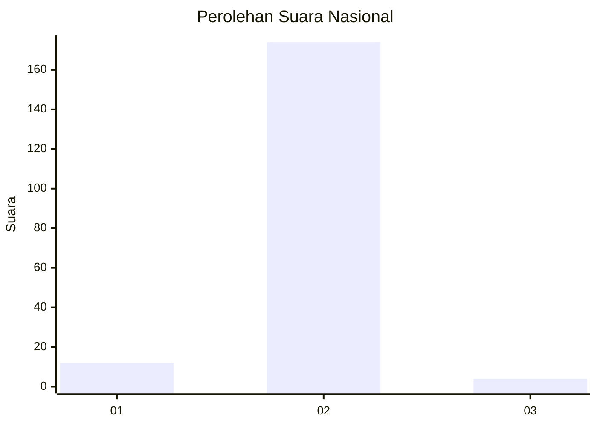
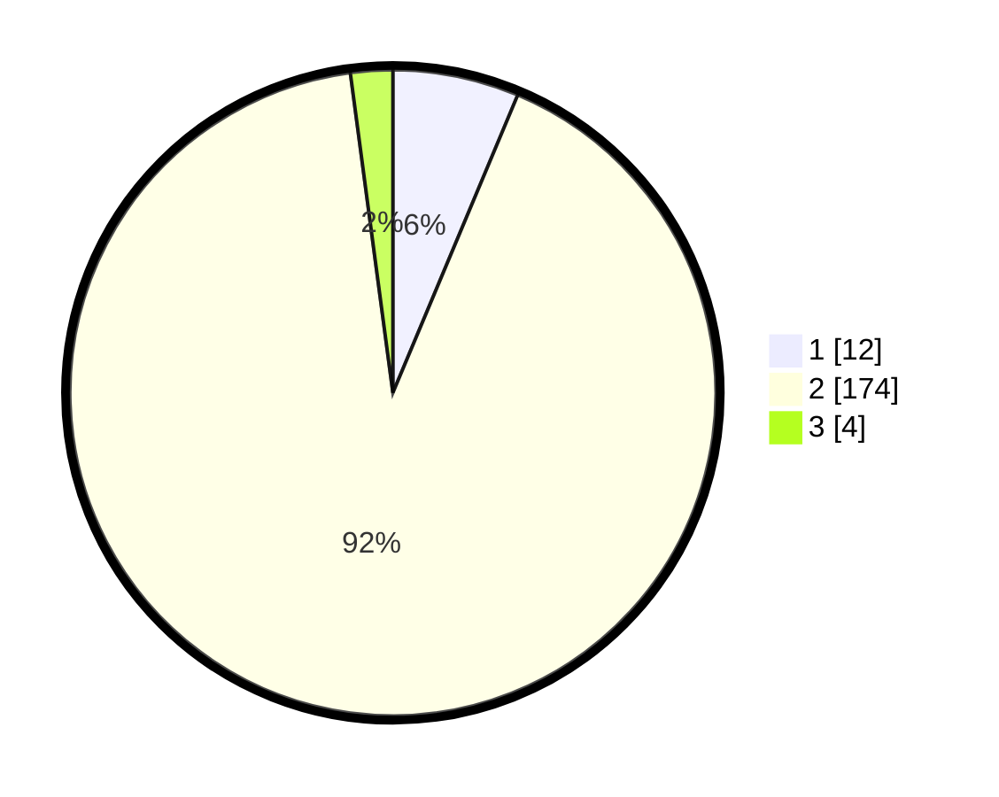

# Hasil

## Grafik

## Tabel

| No. | Nama Paslon    | Suara | Suara (raw) | Persentase |
|:--- |:-------------- | -----:| -----------:| ----------:|
| 1   | ANIES MUHAIMIN | 12    | [12][p-1]   | 6,32       |
| 2   | PRABOWO GIBRAN | 174   | [174][p-2]  | 91,58      |
| 3   | GANJAR MAHFUD  | 4     | [4][p-3]    | 2,11       |

[p-1]: https://github.com/gigit-pemilu/pemilu-2024/blob/main/pilpres/hitung-suara/sub/99-luar-negeri/sub/89-penang-malaysia/sub/01-penang-malaysia/sub/0001-penang-malaysia/sub/109-ksk-094/sub/paslon-1.txt
[p-2]: https://github.com/gigit-pemilu/pemilu-2024/blob/main/pilpres/hitung-suara/sub/99-luar-negeri/sub/89-penang-malaysia/sub/01-penang-malaysia/sub/0001-penang-malaysia/sub/109-ksk-094/sub/paslon-2.txt
[p-3]: https://github.com/gigit-pemilu/pemilu-2024/blob/main/pilpres/hitung-suara/sub/99-luar-negeri/sub/89-penang-malaysia/sub/01-penang-malaysia/sub/0001-penang-malaysia/sub/109-ksk-094/sub/paslon-3.txt

## Foto C Plano

https://sirekap-obj-formc.kpu.go.id/3f56/pemilu/ppwp/99/89/01/00/01/9989010001109-20240216-190158--cc0b1531-e79a-49db-a21f-45c644a1c2e5.jpg

https://sirekap-obj-formc.kpu.go.id/3f56/pemilu/ppwp/99/89/01/00/01/9989010001109-20240216-190311--36cc6037-b5bd-45bc-9b0c-132861fe475f.jpg

https://sirekap-obj-formc.kpu.go.id/3f56/pemilu/ppwp/99/89/01/00/01/9989010001109-20240216-190348--fa91b5d6-11a6-4b47-9bad-d10647509f7d.jpg

## Metadata

| Key        | Value               |
| ---------- | ------------------- |
| Time Stamp | 2024-02-16 21:01:00 |

## DATA PEMILIH TETAP

Jumlah pemilih dalam DPT: **263**.
 * L: **0**.
 * P: **263**.

## DATA PENGGUNA HAK PILIH

Jumlah pengguna hak pilih dalam DPT: **34**.
 * L: **0**.
 * P: **34**.

Jumlah pengguna hak pilih dalam DPTb: **87**.
 * L: **0**.
 * P: **87**.

Jumlah pengguna hak pilih dalam DPK: **87**.
 * L: **0**.
 * P: **87**.

Jumlah pengguna hak pilih: **208**.
 * L: **0**.
 * P: **208**.

## JUMLAH SUARA SAH DAN TIDAK SAH

JUMLAH SELURUH SUARA SAH: **190**.

JUMLAH SUARA TIDAK SAH: **18**.

JUMLAH SELURUH SUARA SAH DAN SUARA TIDAK SAH: **208**.

