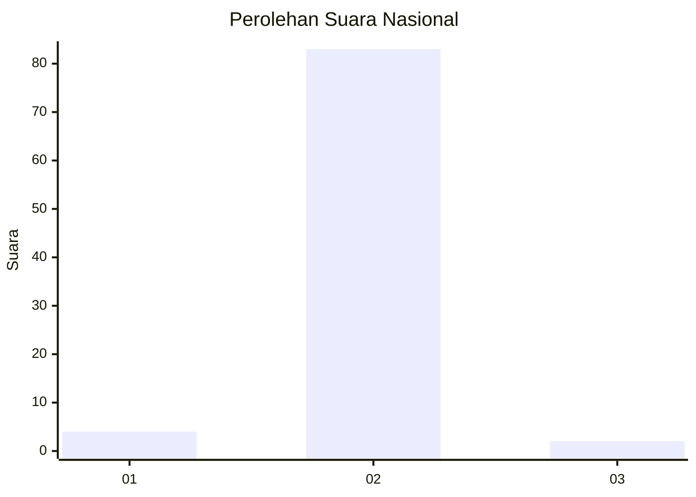
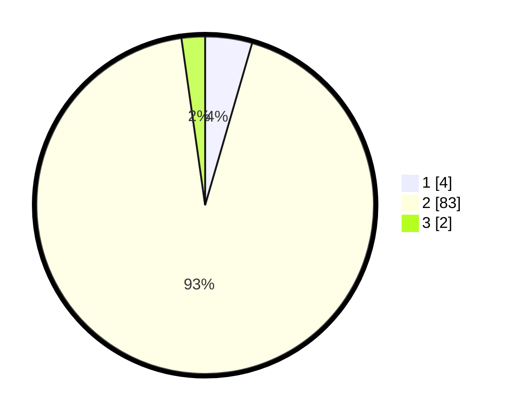

# Hasil

## Grafik

## Tabel

| No. | Nama Paslon    | Suara | Suara (raw) | Persentase |
|:--- |:-------------- | -----:| -----------:| ----------:|
| 1   | ANIES MUHAIMIN | 4     | [4][p-1]    | 4,49       |
| 2   | PRABOWO GIBRAN | 83    | [83][p-2]   | 93,26      |
| 3   | GANJAR MAHFUD  | 2     | [2][p-3]    | 2,25       |

[p-1]: https://github.com/gigit-pemilu/pemilu-2024/blob/main/pilpres/hitung-suara/sub/99-luar-negeri/sub/89-penang-malaysia/sub/01-penang-malaysia/sub/0001-penang-malaysia/sub/110-ksk-095/sub/paslon-1.txt
[p-2]: https://github.com/gigit-pemilu/pemilu-2024/blob/main/pilpres/hitung-suara/sub/99-luar-negeri/sub/89-penang-malaysia/sub/01-penang-malaysia/sub/0001-penang-malaysia/sub/110-ksk-095/sub/paslon-2.txt
[p-3]: https://github.com/gigit-pemilu/pemilu-2024/blob/main/pilpres/hitung-suara/sub/99-luar-negeri/sub/89-penang-malaysia/sub/01-penang-malaysia/sub/0001-penang-malaysia/sub/110-ksk-095/sub/paslon-3.txt

## Foto C Plano

https://sirekap-obj-formc.kpu.go.id/6f82/pemilu/ppwp/99/89/01/00/01/9989010001110-20240217-185957--4d60939b-7a03-4cc9-b193-f1ee63875b70.jpg

https://sirekap-obj-formc.kpu.go.id/6f82/pemilu/ppwp/99/89/01/00/01/9989010001110-20240217-191123--2693137d-d345-4e0a-bde4-640946605b85.jpg

https://sirekap-obj-formc.kpu.go.id/6f82/pemilu/ppwp/99/89/01/00/01/9989010001110-20240217-190312--6a1900b8-baf8-482b-ac14-7c0d04857102.jpg

## Metadata

| Key        | Value               |
| ---------- | ------------------- |
| Time Stamp | 2024-02-17 19:30:00 |

## DATA PEMILIH TETAP

Jumlah pemilih dalam DPT: **170**.
 * L: **0**.
 * P: **170**.

## DATA PENGGUNA HAK PILIH

Jumlah pengguna hak pilih dalam DPT: **50**.
 * L: **0**.
 * P: **50**.

Jumlah pengguna hak pilih dalam DPTb: **26**.
 * L: **1**.
 * P: **25**.

Jumlah pengguna hak pilih dalam DPK: **15**.
 * L: **0**.
 * P: **15**.

Jumlah pengguna hak pilih: **91**.
 * L: **0**.
 * P: **91**.

## JUMLAH SUARA SAH DAN TIDAK SAH

JUMLAH SELURUH SUARA SAH: **89**.

JUMLAH SUARA TIDAK SAH: **2**.

JUMLAH SELURUH SUARA SAH DAN SUARA TIDAK SAH: **91**.

