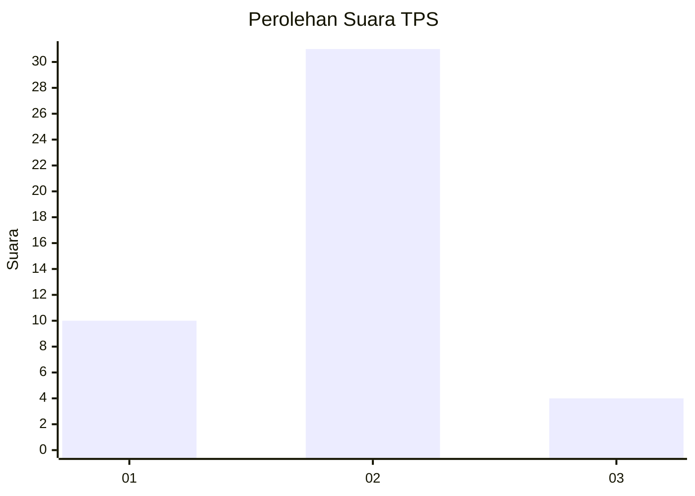
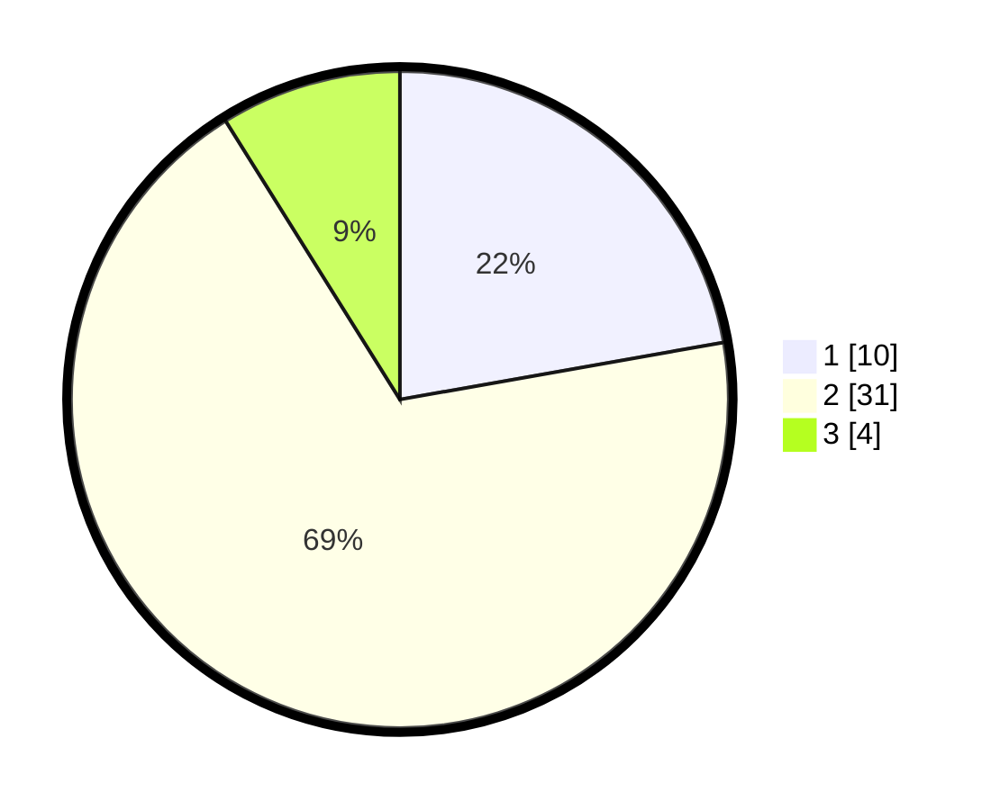

# Hasil

## Grafik

## Tabel

| No. | Nama Paslon    | Suara | Suara (raw) | Persentase |
|:--- |:-------------- | -----:| -----------:| ----------:|
| 1   | ANIES MUHAIMIN | 10    | [10][p-1]   | 22,22      |
| 2   | PRABOWO GIBRAN | 31    | [31][p-2]   | 68,89      |
| 3   | GANJAR MAHFUD  | 4     | [4][p-3]    | 8,89       |

[p-1]: https://github.com/gigit-pemilu/pemilu-2024-99-luar-negeri/blob/main/pilpres/hitung-suara/sub/99-luar-negeri/sub/89-penang-malaysia/sub/01-penang-malaysia/sub/0001-penang-malaysia/sub/119-ksk-104/sub/paslon-1.txt
[p-2]: https://github.com/gigit-pemilu/pemilu-2024-99-luar-negeri/blob/main/pilpres/hitung-suara/sub/99-luar-negeri/sub/89-penang-malaysia/sub/01-penang-malaysia/sub/0001-penang-malaysia/sub/119-ksk-104/sub/paslon-2.txt
[p-3]: https://github.com/gigit-pemilu/pemilu-2024-99-luar-negeri/blob/main/pilpres/hitung-suara/sub/99-luar-negeri/sub/89-penang-malaysia/sub/01-penang-malaysia/sub/0001-penang-malaysia/sub/119-ksk-104/sub/paslon-3.txt

## Foto C Plano

https://sirekap-obj-formc.kpu.go.id/2102/pemilu/ppwp/99/89/01/00/01/9989010001119-20240217-181711--e9afd9c8-c803-4880-ad22-7427ea86627a.jpg

https://sirekap-obj-formc.kpu.go.id/2102/pemilu/ppwp/99/89/01/00/01/9989010001119-20240217-182235--efe8806a-5be2-4117-b958-c545da161d66.jpg

https://sirekap-obj-formc.kpu.go.id/2102/pemilu/ppwp/99/89/01/00/01/9989010001119-20240217-182337--bc1c9359-7412-4a13-a0f8-d893a10e8489.jpg

## Metadata

| Key        | Value               |
| ---------- | ------------------- |
| Time Stamp | 2024-02-21 23:00:00 |

## DATA PEMILIH TETAP

Jumlah pemilih dalam DPT: **250**.
 * L: **105**.
 * P: **145**.

## DATA PENGGUNA HAK PILIH

Jumlah pengguna hak pilih dalam DPT: **0**.
 * L: **0**.
 * P: **0**.

Jumlah pengguna hak pilih dalam DPTb: **24**.
 * L: **18**.
 * P: **6**.

Jumlah pengguna hak pilih dalam DPK: **22**.
 * L: **16**.
 * P: **6**.

Jumlah pengguna hak pilih: **46**.
 * L: **34**.
 * P: **12**.

## JUMLAH SUARA SAH DAN TIDAK SAH

JUMLAH SELURUH SUARA SAH: **45**.

JUMLAH SUARA TIDAK SAH: **1**.

JUMLAH SELURUH SUARA SAH DAN SUARA TIDAK SAH: **46**.

