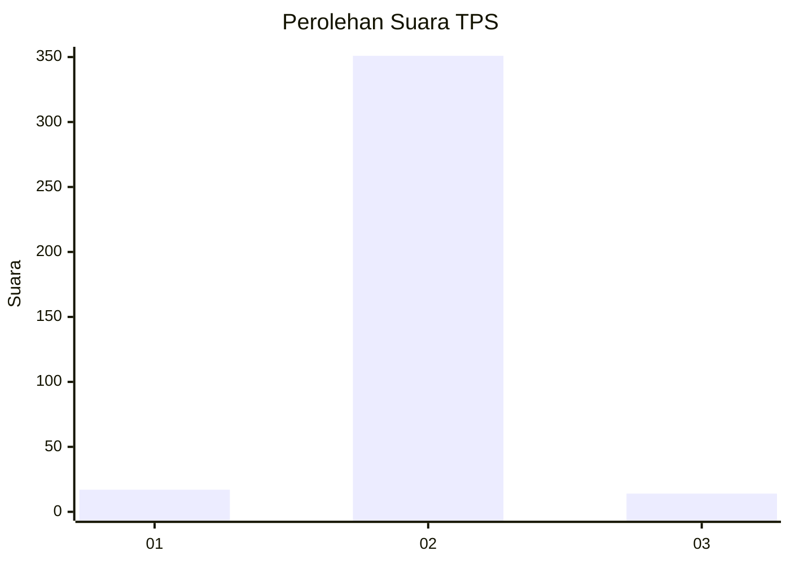
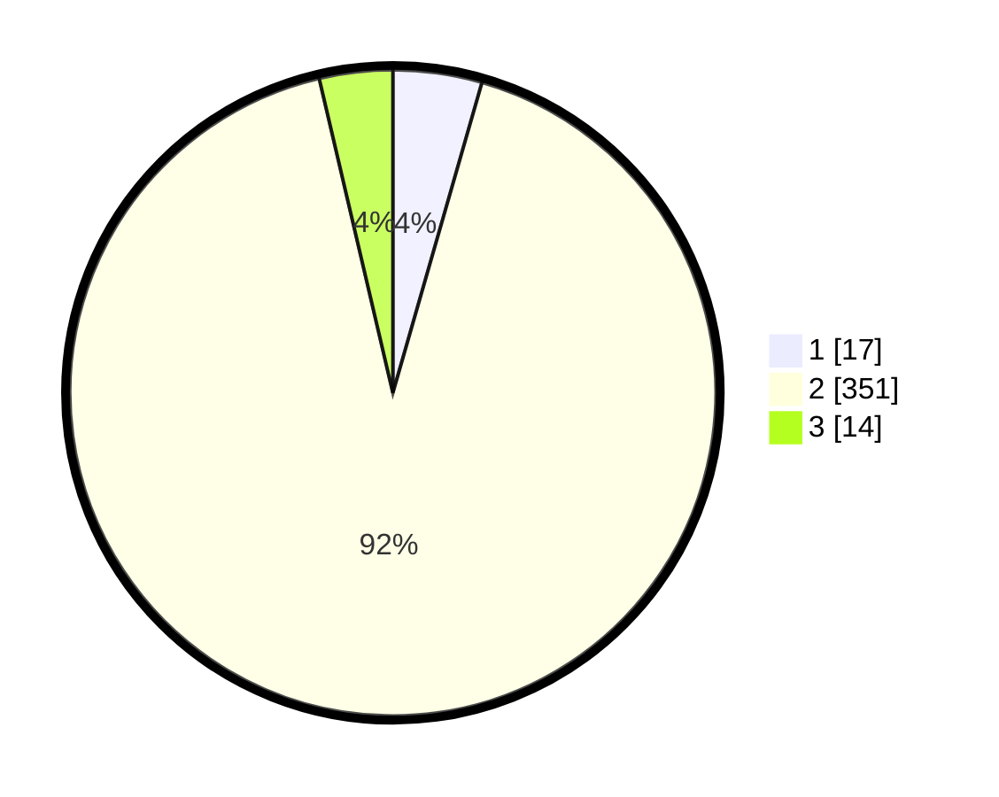

# Hasil

## Grafik

## Tabel

| No. | Nama Paslon    | Suara | Suara (raw) | Persentase |
|:--- |:-------------- | -----:| -----------:| ----------:|
| 1   | ANIES MUHAIMIN | 17    | [17][p-1]   | 4,45       |
| 2   | PRABOWO GIBRAN | 351   | [351][p-2]  | 91,88      |
| 3   | GANJAR MAHFUD  | 14    | [14][p-3]   | 3,66       |

[p-1]: https://github.com/gigit-pemilu/pemilu-2024-99-luar-negeri/blob/main/pilpres/hitung-suara/sub/99-luar-negeri/sub/89-penang-malaysia/sub/01-penang-malaysia/sub/0001-penang-malaysia/sub/120-ksk-105/sub/paslon-1.txt
[p-2]: https://github.com/gigit-pemilu/pemilu-2024-99-luar-negeri/blob/main/pilpres/hitung-suara/sub/99-luar-negeri/sub/89-penang-malaysia/sub/01-penang-malaysia/sub/0001-penang-malaysia/sub/120-ksk-105/sub/paslon-2.txt
[p-3]: https://github.com/gigit-pemilu/pemilu-2024-99-luar-negeri/blob/main/pilpres/hitung-suara/sub/99-luar-negeri/sub/89-penang-malaysia/sub/01-penang-malaysia/sub/0001-penang-malaysia/sub/120-ksk-105/sub/paslon-3.txt

## Foto C Plano

https://sirekap-obj-formc.kpu.go.id/35e0/pemilu/ppwp/99/89/01/00/01/9989010001120-20240217-125448--5235746d-022a-4351-af0b-a9cb1d909c63.jpg

https://sirekap-obj-formc.kpu.go.id/35e0/pemilu/ppwp/99/89/01/00/01/9989010001120-20240217-125251--4b664c9d-5d10-41f3-a5b6-5cb5d76bf631.jpg

https://sirekap-obj-formc.kpu.go.id/35e0/pemilu/ppwp/99/89/01/00/01/9989010001120-20240217-130451--ae57febf-0a04-4a37-ab54-cccb923cd0b4.jpg

## Metadata

| Key        | Value               |
| ---------- | ------------------- |
| Time Stamp | 2024-02-17 13:37:34 |

## DATA PEMILIH TETAP

Jumlah pemilih dalam DPT: **173**.
 * L: **25**.
 * P: **148**.

## DATA PENGGUNA HAK PILIH

Jumlah pengguna hak pilih dalam DPT: **10**.
 * L: **0**.
 * P: **10**.

Jumlah pengguna hak pilih dalam DPTb: **5**.
 * L: **2**.
 * P: **3**.

Jumlah pengguna hak pilih dalam DPK: **371**.
 * L: **7**.
 * P: **364**.

Jumlah pengguna hak pilih: **386**.
 * L: **9**.
 * P: **377**.

## JUMLAH SUARA SAH DAN TIDAK SAH

JUMLAH SELURUH SUARA SAH: **382**.

JUMLAH SUARA TIDAK SAH: **4**.

JUMLAH SELURUH SUARA SAH DAN SUARA TIDAK SAH: **386**.

