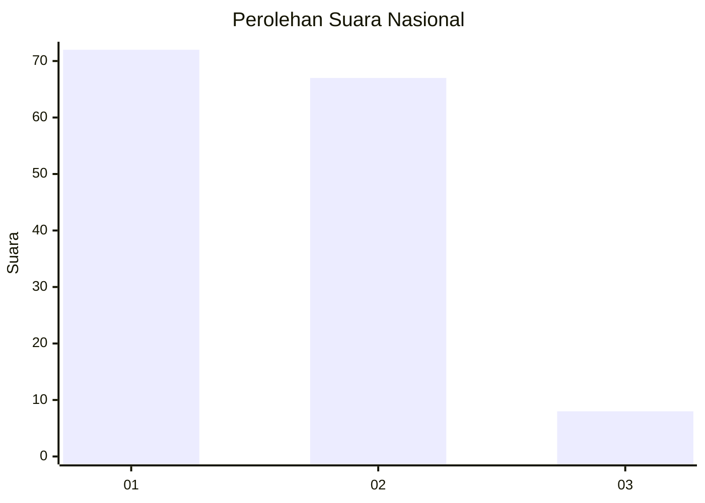
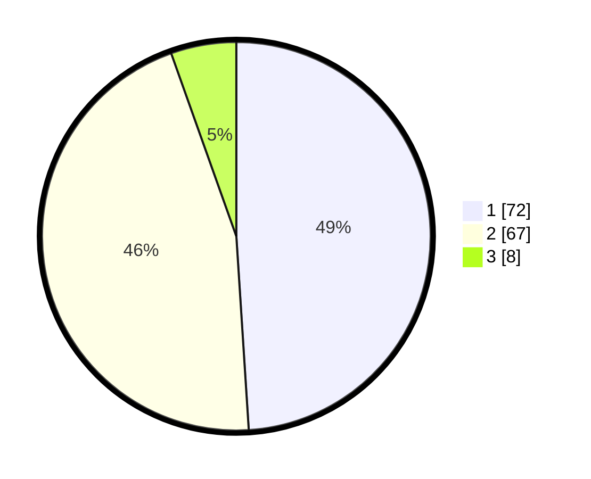

# Hasil

## Grafik

## Tabel

| No. | Nama Paslon    | Suara | Suara (raw) | Persentase |
|:--- |:-------------- | -----:| -----------:| ----------:|
| 1   | ANIES MUHAIMIN | 72    | [72][p-1]   | 48,98      |
| 2   | PRABOWO GIBRAN | 67    | [67][p-2]   | 45,58      |
| 3   | GANJAR MAHFUD  | 8     | [8][p-3]    | 5,44       |

[p-1]: https://github.com/gigit-pemilu/pemilu-2024/blob/main/pilpres/hitung-suara/sub/99-luar-negeri/sub/89-penang-malaysia/sub/01-penang-malaysia/sub/0001-penang-malaysia/sub/123-ksk-108/sub/paslon-1.txt
[p-2]: https://github.com/gigit-pemilu/pemilu-2024/blob/main/pilpres/hitung-suara/sub/99-luar-negeri/sub/89-penang-malaysia/sub/01-penang-malaysia/sub/0001-penang-malaysia/sub/123-ksk-108/sub/paslon-2.txt
[p-3]: https://github.com/gigit-pemilu/pemilu-2024/blob/main/pilpres/hitung-suara/sub/99-luar-negeri/sub/89-penang-malaysia/sub/01-penang-malaysia/sub/0001-penang-malaysia/sub/123-ksk-108/sub/paslon-3.txt

## Foto C Plano

https://sirekap-obj-formc.kpu.go.id/1bbf/pemilu/ppwp/99/89/01/00/01/9989010001123-20240218-081046--e68fec87-edc7-4968-a13e-1d276addc6bb.jpg

https://sirekap-obj-formc.kpu.go.id/1bbf/pemilu/ppwp/99/89/01/00/01/9989010001123-20240218-081531--e73bbe84-63fb-4ef8-a267-a9c8f0bc2d02.jpg

https://sirekap-obj-formc.kpu.go.id/1bbf/pemilu/ppwp/99/89/01/00/01/9989010001123-20240218-081659--ca0cd596-50f0-40ea-9cf6-604299e7716c.jpg

## Metadata

| Key        | Value               |
| ---------- | ------------------- |
| Time Stamp | 2024-02-19 06:16:00 |

## DATA PEMILIH TETAP

Jumlah pemilih dalam DPT: **160**.
 * L: **18**.
 * P: **142**.

## DATA PENGGUNA HAK PILIH

Jumlah pengguna hak pilih dalam DPT: **17**.
 * L: **5**.
 * P: **12**.

Jumlah pengguna hak pilih dalam DPTb: **65**.
 * L: **23**.
 * P: **42**.

Jumlah pengguna hak pilih dalam DPK: **66**.
 * L: **17**.
 * P: **49**.

Jumlah pengguna hak pilih: **148**.
 * L: **45**.
 * P: **103**.

## JUMLAH SUARA SAH DAN TIDAK SAH

JUMLAH SELURUH SUARA SAH: **147**.

JUMLAH SUARA TIDAK SAH: **1**.

JUMLAH SELURUH SUARA SAH DAN SUARA TIDAK SAH: **148**.

