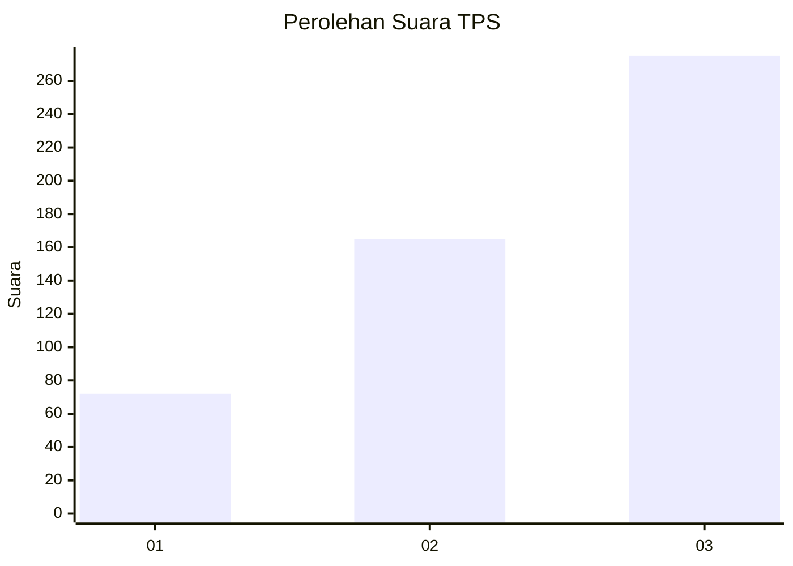
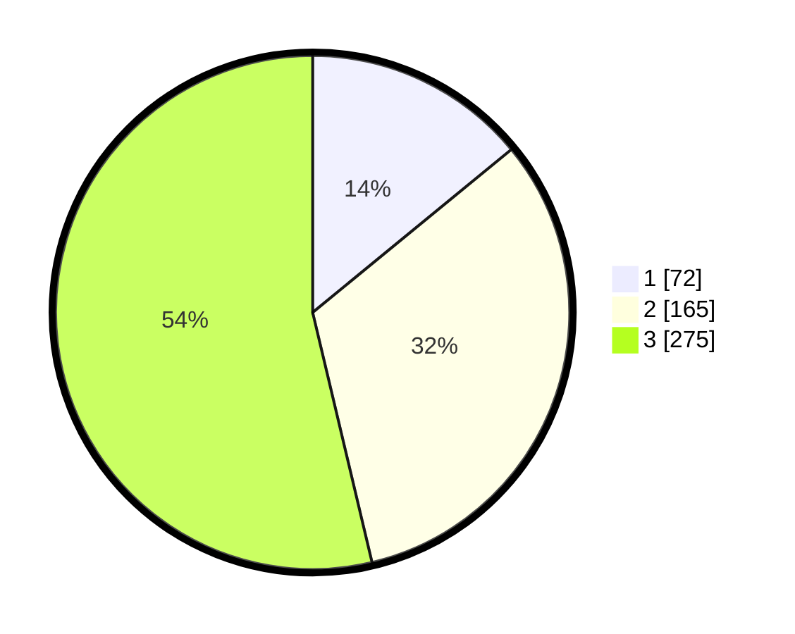

# Hasil

## Grafik

## Tabel

| No. | Nama Paslon    | Suara | Suara (raw) | Persentase |
|:--- |:-------------- | -----:| -----------:| ----------:|
| 1   | ANIES MUHAIMIN | 72    | [72][p-1]   | 14,06      |
| 2   | PRABOWO GIBRAN | 165   | [165][p-2]  | 32,23      |
| 3   | GANJAR MAHFUD  | 275   | [275][p-3]  | 53,71      |

[p-1]: https://github.com/gigit-pemilu/pemilu-2024-99-luar-negeri/blob/main/pilpres/hitung-suara/sub/99-luar-negeri/sub/90-perth-australia/sub/01-perth-australia/sub/0001-perth-australia/sub/001-pos-001/sub/paslon-1.txt
[p-2]: https://github.com/gigit-pemilu/pemilu-2024-99-luar-negeri/blob/main/pilpres/hitung-suara/sub/99-luar-negeri/sub/90-perth-australia/sub/01-perth-australia/sub/0001-perth-australia/sub/001-pos-001/sub/paslon-2.txt
[p-3]: https://github.com/gigit-pemilu/pemilu-2024-99-luar-negeri/blob/main/pilpres/hitung-suara/sub/99-luar-negeri/sub/90-perth-australia/sub/01-perth-australia/sub/0001-perth-australia/sub/001-pos-001/sub/paslon-3.txt

## Foto C Plano

https://sirekap-obj-formc.kpu.go.id/a85d/pemilu/ppwp/99/90/01/00/01/9990010001001-20240217-134904--314ab089-d511-414d-8a9e-d3b88f4c8163.jpg

https://sirekap-obj-formc.kpu.go.id/a85d/pemilu/ppwp/99/90/01/00/01/9990010001001-20240217-135840--6bc6fe68-55bb-43cd-9c1c-8d7c186899dc.jpg

https://sirekap-obj-formc.kpu.go.id/a85d/pemilu/ppwp/99/90/01/00/01/9990010001001-20240217-134437--5d2e6786-17e0-4eb2-b403-4618169b2a4e.jpg

## Metadata

| Key        | Value               |
| ---------- | ------------------- |
| Time Stamp | 2024-02-17 17:30:00 |

## DATA PEMILIH TETAP

Jumlah pemilih dalam DPT: **667**.
 * L: **215**.
 * P: **452**.

## DATA PENGGUNA HAK PILIH

Jumlah pengguna hak pilih dalam DPT: **521**.
 * L: **173**.
 * P: **348**.

Jumlah pengguna hak pilih dalam DPTb: **0**.
 * L: **0**.
 * P: **0**.

Jumlah pengguna hak pilih dalam DPK: **0**.
 * L: **0**.
 * P: **0**.

Jumlah pengguna hak pilih: **521**.
 * L: **173**.
 * P: **348**.

## JUMLAH SUARA SAH DAN TIDAK SAH

JUMLAH SELURUH SUARA SAH: **512**.

JUMLAH SUARA TIDAK SAH: **9**.

JUMLAH SELURUH SUARA SAH DAN SUARA TIDAK SAH: **521**.

