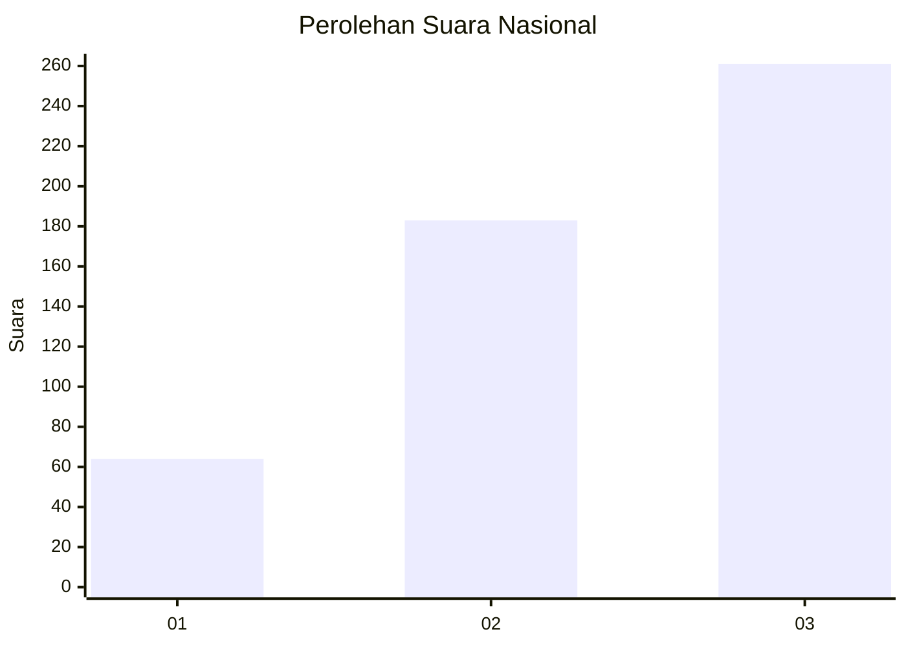
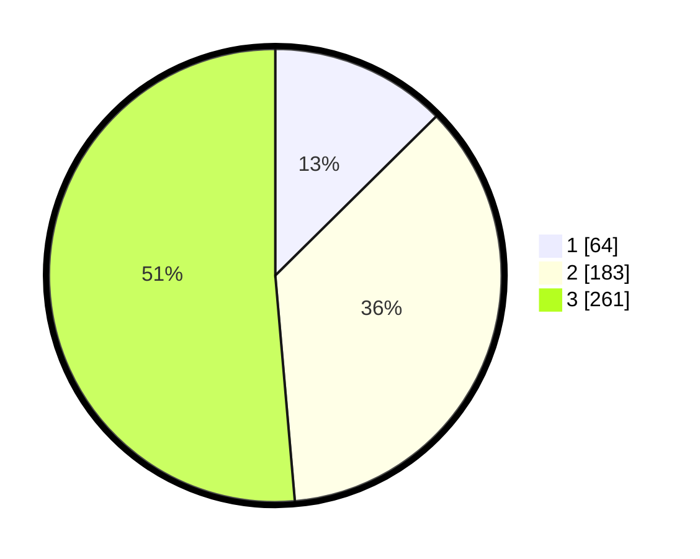

# Hasil

## Grafik

## Tabel

| No. | Nama Paslon    | Suara | Suara (raw) | Persentase |
|:--- |:-------------- | -----:| -----------:| ----------:|
| 1   | ANIES MUHAIMIN | 64    | [64][p-1]   | 12,60      |
| 2   | PRABOWO GIBRAN | 183   | [183][p-2]  | 36,02      |
| 3   | GANJAR MAHFUD  | 261   | [261][p-3]  | 51,38      |

[p-1]: https://github.com/gigit-pemilu/pemilu-2024/blob/main/pilpres/hitung-suara/sub/99-luar-negeri/sub/90-perth-australia/sub/01-perth-australia/sub/0001-perth-australia/sub/002-pos-002/sub/paslon-1.txt
[p-2]: https://github.com/gigit-pemilu/pemilu-2024/blob/main/pilpres/hitung-suara/sub/99-luar-negeri/sub/90-perth-australia/sub/01-perth-australia/sub/0001-perth-australia/sub/002-pos-002/sub/paslon-2.txt
[p-3]: https://github.com/gigit-pemilu/pemilu-2024/blob/main/pilpres/hitung-suara/sub/99-luar-negeri/sub/90-perth-australia/sub/01-perth-australia/sub/0001-perth-australia/sub/002-pos-002/sub/paslon-3.txt

## Foto C Plano

https://sirekap-obj-formc.kpu.go.id/6163/pemilu/ppwp/99/90/01/00/01/9990010001002-20240217-130011--64c26f18-223c-4857-9a15-4ff399a6c75a.jpg

https://sirekap-obj-formc.kpu.go.id/6163/pemilu/ppwp/99/90/01/00/01/9990010001002-20240217-130900--0ff8bafd-fab2-41a9-b2c4-abfddddea4ec.jpg

https://sirekap-obj-formc.kpu.go.id/6163/pemilu/ppwp/99/90/01/00/01/9990010001002-20240217-131124--45caa696-f909-4b5b-8cc3-b13140d509ce.jpg

## Metadata

| Key        | Value               |
| ---------- | ------------------- |
| Time Stamp | 2024-02-17 17:30:00 |

## DATA PEMILIH TETAP

Jumlah pemilih dalam DPT: **745**.
 * L: **236**.
 * P: **509**.

## DATA PENGGUNA HAK PILIH

Jumlah pengguna hak pilih dalam DPT: **519**.
 * L: **164**.
 * P: **355**.

Jumlah pengguna hak pilih dalam DPTb: **0**.
 * L: **0**.
 * P: **0**.

Jumlah pengguna hak pilih dalam DPK: **0**.
 * L: **0**.
 * P: **0**.

Jumlah pengguna hak pilih: **519**.
 * L: **164**.
 * P: **355**.

## JUMLAH SUARA SAH DAN TIDAK SAH

JUMLAH SELURUH SUARA SAH: **508**.

JUMLAH SUARA TIDAK SAH: **11**.

JUMLAH SELURUH SUARA SAH DAN SUARA TIDAK SAH: **519**.

