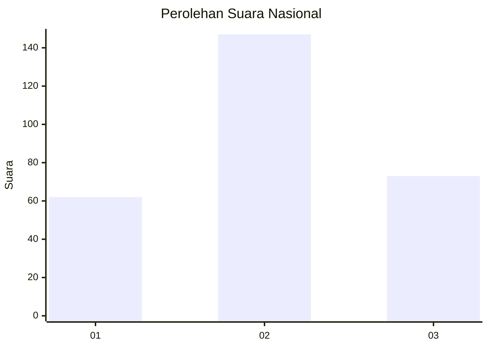
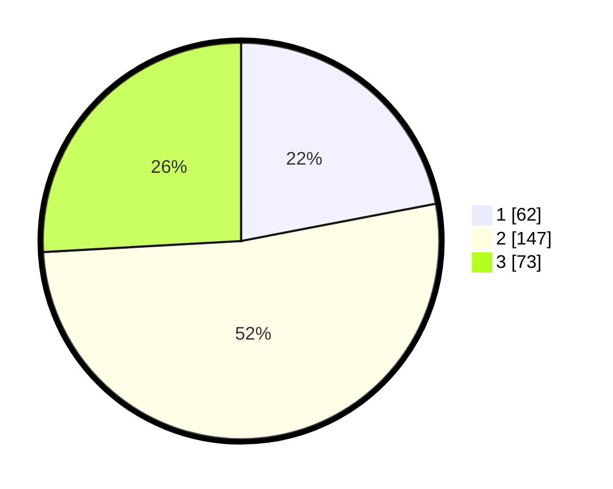

# Hasil

## Grafik

## Tabel

| No. | Nama Paslon    | Suara | Suara (raw) | Persentase |
|:--- |:-------------- | -----:| -----------:| ----------:|
| 1   | ANIES MUHAIMIN | 62    | [62][p-1]   | 21,99      |
| 2   | PRABOWO GIBRAN | 147   | [147][p-2]  | 52,13      |
| 3   | GANJAR MAHFUD  | 73    | [73][p-3]   | 25,89      |

[p-1]: https://github.com/gigit-pemilu/pemilu-2024/blob/main/pilpres/hitung-suara/sub/99-luar-negeri/sub/91-phnom-penh-kamboja/sub/01-phnom-penh-kamboja/sub/0001-phnom-penh-kamboja/sub/001-tps/sub/paslon-1.txt
[p-2]: https://github.com/gigit-pemilu/pemilu-2024/blob/main/pilpres/hitung-suara/sub/99-luar-negeri/sub/91-phnom-penh-kamboja/sub/01-phnom-penh-kamboja/sub/0001-phnom-penh-kamboja/sub/001-tps/sub/paslon-2.txt
[p-3]: https://github.com/gigit-pemilu/pemilu-2024/blob/main/pilpres/hitung-suara/sub/99-luar-negeri/sub/91-phnom-penh-kamboja/sub/01-phnom-penh-kamboja/sub/0001-phnom-penh-kamboja/sub/001-tps/sub/paslon-3.txt

## Foto C Plano

https://sirekap-obj-formc.kpu.go.id/8ec5/pemilu/ppwp/99/91/01/00/01/9991010001001-20240214-230110--9ad9ff67-0bcd-4109-802c-d190c716f4ab.jpg

https://sirekap-obj-formc.kpu.go.id/8ec5/pemilu/ppwp/99/91/01/00/01/9991010001001-20240215-162417--f6ac35e1-0924-48b9-a5c3-82ea07f4c00c.jpg

https://sirekap-obj-formc.kpu.go.id/8ec5/pemilu/ppwp/99/91/01/00/01/9991010001001-20240215-133231--117ebd64-d1fa-44c1-ba83-e018c2a79305.jpg

## Metadata

| Key        | Value               |
| ---------- | ------------------- |
| Time Stamp | 2024-02-15 19:30:26 |

## DATA PEMILIH TETAP

Jumlah pemilih dalam DPT: **1066**.
 * L: **762**.
 * P: **304**.

## DATA PENGGUNA HAK PILIH

Jumlah pengguna hak pilih dalam DPT: **173**.
 * L: **100**.
 * P: **73**.

Jumlah pengguna hak pilih dalam DPTb: **96**.
 * L: **55**.
 * P: **41**.

Jumlah pengguna hak pilih dalam DPK: **18**.
 * L: **15**.
 * P: **3**.

Jumlah pengguna hak pilih: **287**.
 * L: **170**.
 * P: **117**.

## JUMLAH SUARA SAH DAN TIDAK SAH

JUMLAH SELURUH SUARA SAH: **282**.

JUMLAH SUARA TIDAK SAH: **5**.

JUMLAH SELURUH SUARA SAH DAN SUARA TIDAK SAH: **287**.

