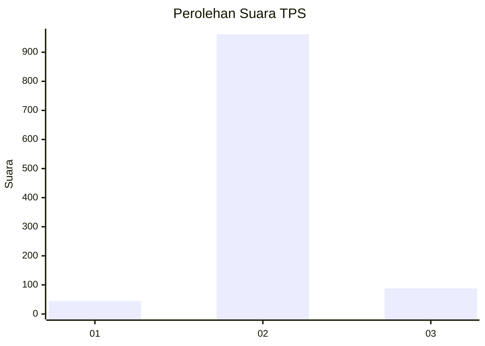
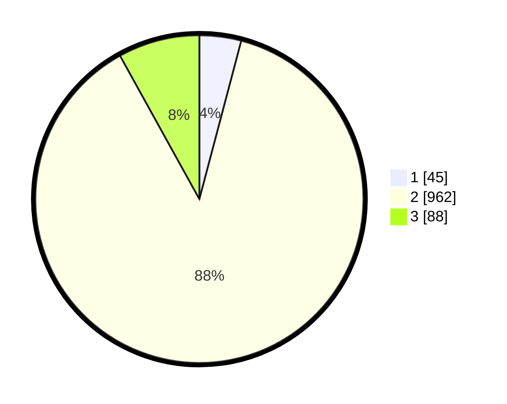

# Hasil

## Grafik

## Tabel

| No. | Nama Paslon    | Suara | Suara (raw) | Persentase |
|:--- |:-------------- | -----:| -----------:| ----------:|
| 1   | ANIES MUHAIMIN | 45    | [45][p-1]   | 4,11       |
| 2   | PRABOWO GIBRAN | 962   | [962][p-2]  | 87,85      |
| 3   | GANJAR MAHFUD  | 88    | [88][p-3]   | 8,04       |

[p-1]: https://github.com/gigit-pemilu/pemilu-2024-99-luar-negeri/blob/main/pilpres/hitung-suara/sub/99-luar-negeri/sub/91-phnom-penh-kamboja/sub/01-phnom-penh-kamboja/sub/0001-phnom-penh-kamboja/sub/002-ksk-001/sub/paslon-1.txt
[p-2]: https://github.com/gigit-pemilu/pemilu-2024-99-luar-negeri/blob/main/pilpres/hitung-suara/sub/99-luar-negeri/sub/91-phnom-penh-kamboja/sub/01-phnom-penh-kamboja/sub/0001-phnom-penh-kamboja/sub/002-ksk-001/sub/paslon-2.txt
[p-3]: https://github.com/gigit-pemilu/pemilu-2024-99-luar-negeri/blob/main/pilpres/hitung-suara/sub/99-luar-negeri/sub/91-phnom-penh-kamboja/sub/01-phnom-penh-kamboja/sub/0001-phnom-penh-kamboja/sub/002-ksk-001/sub/paslon-3.txt

## Foto C Plano

https://sirekap-obj-formc.kpu.go.id/b009/pemilu/ppwp/99/91/01/00/01/9991010001002-20240215-184026--4f99eedf-bdb6-4c61-9351-b424cda2061f.jpg

https://sirekap-obj-formc.kpu.go.id/b009/pemilu/ppwp/99/91/01/00/01/9991010001002-20240216-125518--2a291e66-37a5-48f2-8434-689db16c406f.jpg

https://sirekap-obj-formc.kpu.go.id/b009/pemilu/ppwp/99/91/01/00/01/9991010001002-20240215-184348--71df0030-affe-42da-8dd6-4dff2ab6fce6.jpg

## Metadata

| Key        | Value               |
| ---------- | ------------------- |
| Time Stamp | 2024-02-19 06:16:00 |

## DATA PEMILIH TETAP

Jumlah pemilih dalam DPT: **2526**.
 * L: **2056**.
 * P: **470**.

## DATA PENGGUNA HAK PILIH

Jumlah pengguna hak pilih dalam DPT: **171**.
 * L: **137**.
 * P: **34**.

Jumlah pengguna hak pilih dalam DPTb: **611**.
 * L: **441**.
 * P: **170**.

Jumlah pengguna hak pilih dalam DPK: **333**.
 * L: **2600**.
 * P: **73**.

Jumlah pengguna hak pilih: **1115**.
 * L: **838**.
 * P: **277**.

## JUMLAH SUARA SAH DAN TIDAK SAH

JUMLAH SELURUH SUARA SAH: **1095**.

JUMLAH SUARA TIDAK SAH: **21**.

JUMLAH SELURUH SUARA SAH DAN SUARA TIDAK SAH: **1116**.

