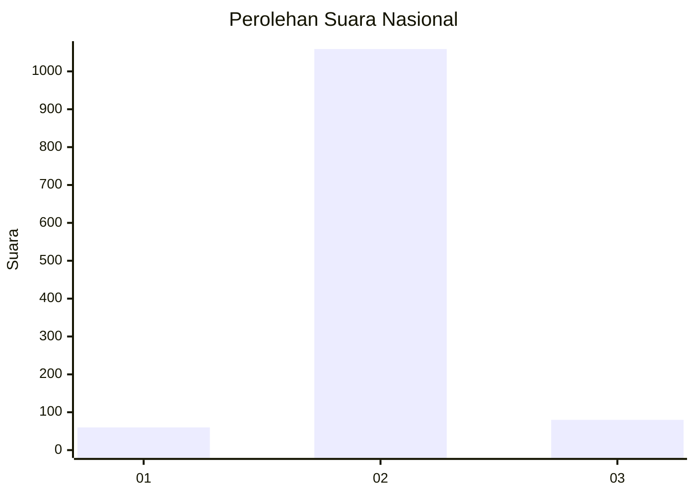
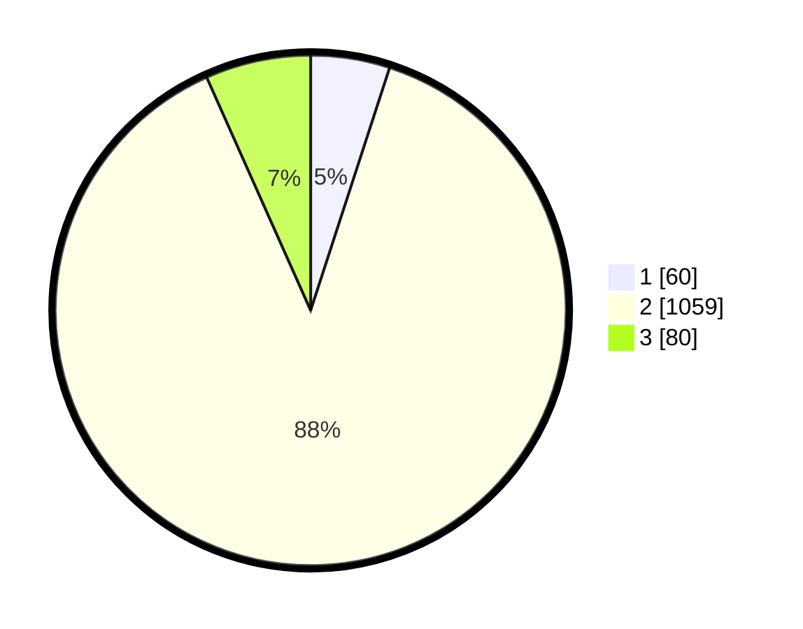

# Hasil

## Grafik

## Tabel

| No. | Nama Paslon    | Suara | Suara (raw) | Persentase |
|:--- |:-------------- | -----:| -----------:| ----------:|
| 1   | ANIES MUHAIMIN | 60    | [60][p-1]   | 5,00       |
| 2   | PRABOWO GIBRAN | 1.059 | [1059][p-2] | 88,32      |
| 3   | GANJAR MAHFUD  | 80    | [80][p-3]   | 6,67       |

[p-1]: https://github.com/gigit-pemilu/pemilu-2024/blob/main/pilpres/hitung-suara/sub/99-luar-negeri/sub/91-phnom-penh-kamboja/sub/01-phnom-penh-kamboja/sub/0001-phnom-penh-kamboja/sub/003-ksk-002/sub/paslon-1.txt
[p-2]: https://github.com/gigit-pemilu/pemilu-2024/blob/main/pilpres/hitung-suara/sub/99-luar-negeri/sub/91-phnom-penh-kamboja/sub/01-phnom-penh-kamboja/sub/0001-phnom-penh-kamboja/sub/003-ksk-002/sub/paslon-2.txt
[p-3]: https://github.com/gigit-pemilu/pemilu-2024/blob/main/pilpres/hitung-suara/sub/99-luar-negeri/sub/91-phnom-penh-kamboja/sub/01-phnom-penh-kamboja/sub/0001-phnom-penh-kamboja/sub/003-ksk-002/sub/paslon-3.txt

## Foto C Plano

https://sirekap-obj-formc.kpu.go.id/7b7c/pemilu/ppwp/99/91/01/00/01/9991010001003-20240215-163240--4fa3b425-2c14-41e3-9e20-914f933e7f02.jpg

https://sirekap-obj-formc.kpu.go.id/7b7c/pemilu/ppwp/99/91/01/00/01/9991010001003-20240215-194549--ae4c184e-12d0-4c75-9118-06664eab659d.jpg

https://sirekap-obj-formc.kpu.go.id/7b7c/pemilu/ppwp/99/91/01/00/01/9991010001003-20240215-163342--a36ed35c-7695-45ad-b928-7e45f774aa70.jpg

## Metadata

| Key        | Value               |
| ---------- | ------------------- |
| Time Stamp | 2024-02-15 20:30:46 |

## DATA PEMILIH TETAP

Jumlah pemilih dalam DPT: **2118**.
 * L: **1674**.
 * P: **444**.

## DATA PENGGUNA HAK PILIH

Jumlah pengguna hak pilih dalam DPT: **89**.
 * L: **70**.
 * P: **19**.

Jumlah pengguna hak pilih dalam DPTb: **1085**.
 * L: **792**.
 * P: **293**.

Jumlah pengguna hak pilih dalam DPK: **48**.
 * L: **41**.
 * P: **7**.

Jumlah pengguna hak pilih: **1222**.
 * L: **903**.
 * P: **319**.

## JUMLAH SUARA SAH DAN TIDAK SAH

JUMLAH SELURUH SUARA SAH: **1199**.

JUMLAH SUARA TIDAK SAH: **21**.

JUMLAH SELURUH SUARA SAH DAN SUARA TIDAK SAH: **1220**.

