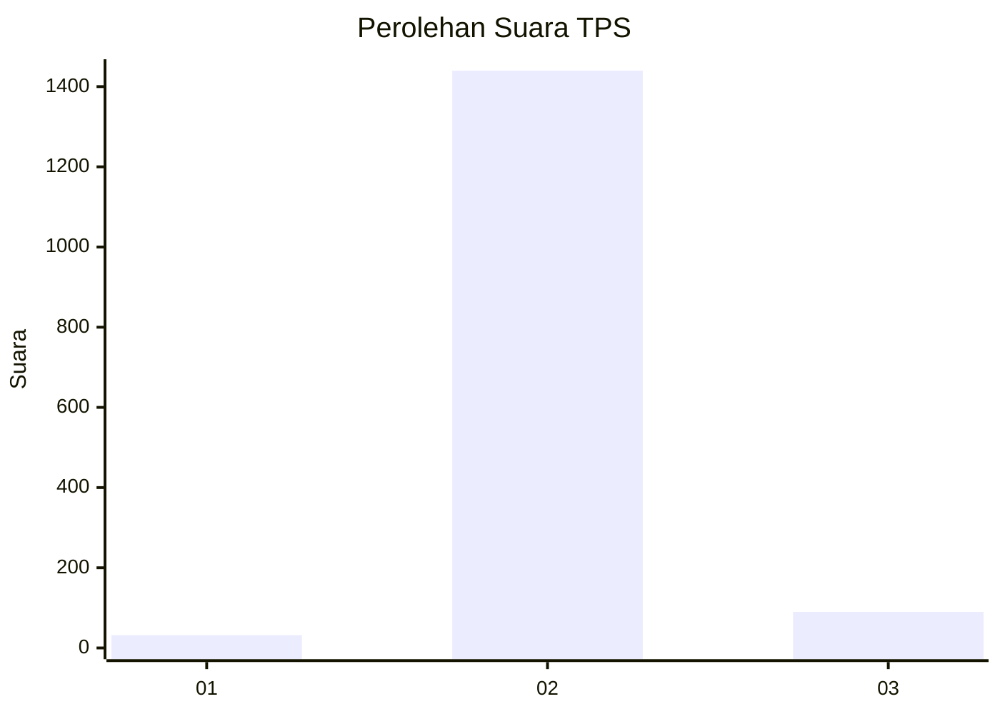
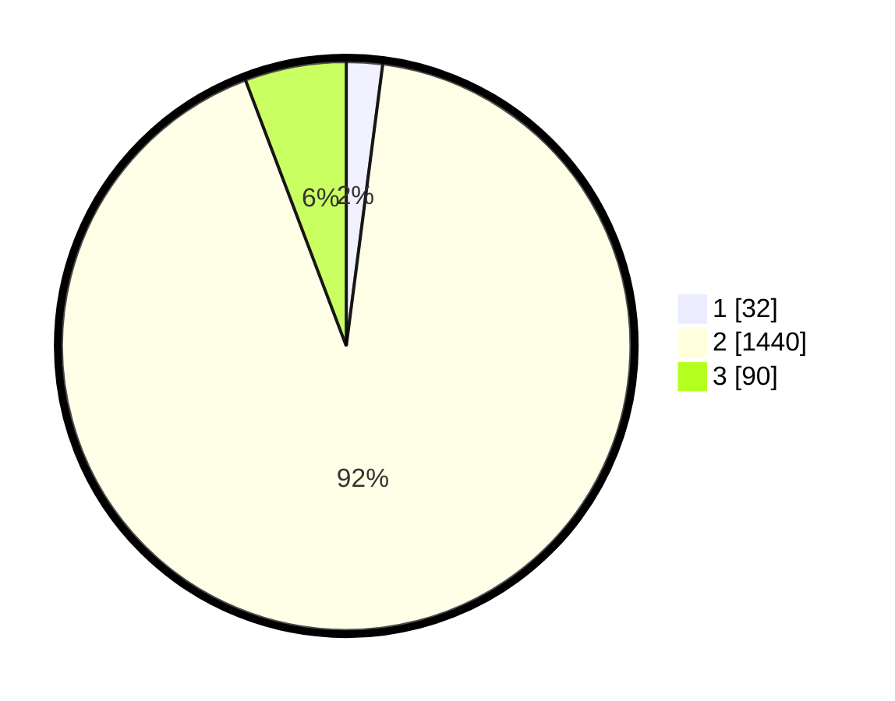

# Hasil

## Grafik

## Tabel

| No. | Nama Paslon    | Suara | Suara (raw) | Persentase |
|:--- |:-------------- | -----:| -----------:| ----------:|
| 1   | ANIES MUHAIMIN | 32    | [32][p-1]   | 2,05       |
| 2   | PRABOWO GIBRAN | 1.440 | [1440][p-2] | 92,19      |
| 3   | GANJAR MAHFUD  | 90    | [90][p-3]   | 5,76       |

[p-1]: https://github.com/gigit-pemilu/pemilu-2024-99-luar-negeri/blob/main/pilpres/hitung-suara/sub/99-luar-negeri/sub/91-phnom-penh-kamboja/sub/01-phnom-penh-kamboja/sub/0001-phnom-penh-kamboja/sub/004-ksk-003/sub/paslon-1.txt
[p-2]: https://github.com/gigit-pemilu/pemilu-2024-99-luar-negeri/blob/main/pilpres/hitung-suara/sub/99-luar-negeri/sub/91-phnom-penh-kamboja/sub/01-phnom-penh-kamboja/sub/0001-phnom-penh-kamboja/sub/004-ksk-003/sub/paslon-2.txt
[p-3]: https://github.com/gigit-pemilu/pemilu-2024-99-luar-negeri/blob/main/pilpres/hitung-suara/sub/99-luar-negeri/sub/91-phnom-penh-kamboja/sub/01-phnom-penh-kamboja/sub/0001-phnom-penh-kamboja/sub/004-ksk-003/sub/paslon-3.txt

## Foto C Plano

https://sirekap-obj-formc.kpu.go.id/3a3b/pemilu/ppwp/99/91/01/00/01/9991010001004-20240215-150216--2a8404a3-9fd5-4a13-b6dc-ae6b19958255.jpg

https://sirekap-obj-formc.kpu.go.id/3a3b/pemilu/ppwp/99/91/01/00/01/9991010001004-20240216-100309--639a2443-f1c2-4785-9e48-683688d5c716.jpg

https://sirekap-obj-formc.kpu.go.id/3a3b/pemilu/ppwp/99/91/01/00/01/9991010001004-20240215-150648--1053d8e8-ee91-4ae6-bc45-225cbb7040cd.jpg

## Metadata

| Key        | Value               |
| ---------- | ------------------- |
| Time Stamp | 2024-02-19 06:16:00 |

## DATA PEMILIH TETAP

Jumlah pemilih dalam DPT: **2581**.
 * L: **1994**.
 * P: **587**.

## DATA PENGGUNA HAK PILIH

Jumlah pengguna hak pilih dalam DPT: **254**.
 * L: **193**.
 * P: **61**.

Jumlah pengguna hak pilih dalam DPTb: **1206**.
 * L: **869**.
 * P: **337**.

Jumlah pengguna hak pilih dalam DPK: **124**.
 * L: **96**.
 * P: **28**.

Jumlah pengguna hak pilih: **1584**.
 * L: **1158**.
 * P: **426**.

## JUMLAH SUARA SAH DAN TIDAK SAH

JUMLAH SELURUH SUARA SAH: **1562**.

JUMLAH SUARA TIDAK SAH: **21**.

JUMLAH SELURUH SUARA SAH DAN SUARA TIDAK SAH: **1583**.

