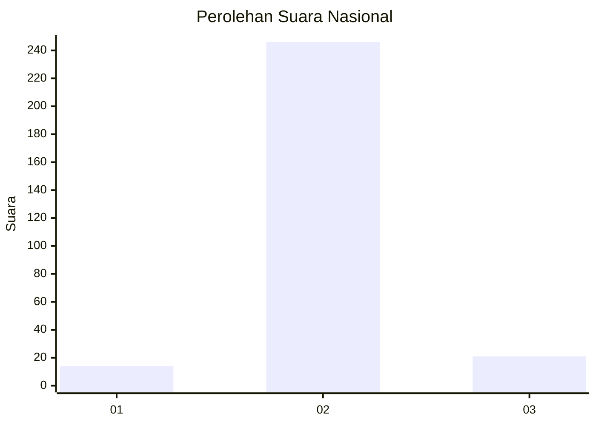
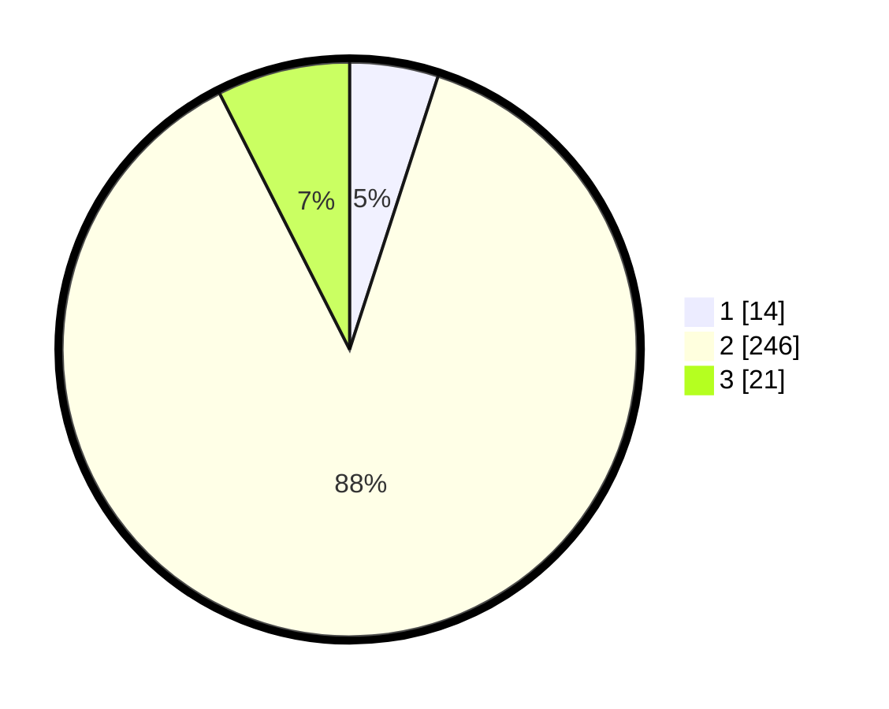

# Hasil

## Grafik

## Tabel

| No. | Nama Paslon    | Suara | Suara (raw) | Persentase |
|:--- |:-------------- | -----:| -----------:| ----------:|
| 1   | ANIES MUHAIMIN | 14    | [14][p-1]   | 4,98       |
| 2   | PRABOWO GIBRAN | 246   | [246][p-2]  | 87,54      |
| 3   | GANJAR MAHFUD  | 21    | [21][p-3]   | 7,47       |

[p-1]: https://github.com/gigit-pemilu/pemilu-2024/blob/main/pilpres/hitung-suara/sub/99-luar-negeri/sub/91-phnom-penh-kamboja/sub/01-phnom-penh-kamboja/sub/0001-phnom-penh-kamboja/sub/005-ksk-004/sub/paslon-1.txt
[p-2]: https://github.com/gigit-pemilu/pemilu-2024/blob/main/pilpres/hitung-suara/sub/99-luar-negeri/sub/91-phnom-penh-kamboja/sub/01-phnom-penh-kamboja/sub/0001-phnom-penh-kamboja/sub/005-ksk-004/sub/paslon-2.txt
[p-3]: https://github.com/gigit-pemilu/pemilu-2024/blob/main/pilpres/hitung-suara/sub/99-luar-negeri/sub/91-phnom-penh-kamboja/sub/01-phnom-penh-kamboja/sub/0001-phnom-penh-kamboja/sub/005-ksk-004/sub/paslon-3.txt

## Foto C Plano

https://sirekap-obj-formc.kpu.go.id/8b59/pemilu/ppwp/99/91/01/00/01/9991010001005-20240216-091521--2a621a13-d882-4614-9ec5-8cedb150ab52.jpg

https://sirekap-obj-formc.kpu.go.id/8b59/pemilu/ppwp/99/91/01/00/01/9991010001005-20240216-091555--ff43d58c-1938-45c6-8934-500168f2afcd.jpg

https://sirekap-obj-formc.kpu.go.id/8b59/pemilu/ppwp/99/91/01/00/01/9991010001005-20240216-091701--43444f02-2923-4fc4-97c8-28b967c9ef9c.jpg

## Metadata

| Key        | Value               |
| ---------- | ------------------- |
| Time Stamp | 2024-02-16 10:00:28 |

## DATA PEMILIH TETAP

Jumlah pemilih dalam DPT: **808**.
 * L: **644**.
 * P: **164**.

## DATA PENGGUNA HAK PILIH

Jumlah pengguna hak pilih dalam DPT: **18**.
 * L: **14**.
 * P: **4**.

Jumlah pengguna hak pilih dalam DPTb: **252**.
 * L: **188**.
 * P: **64**.

Jumlah pengguna hak pilih dalam DPK: **14**.
 * L: **9**.
 * P: **5**.

Jumlah pengguna hak pilih: **284**.
 * L: **211**.
 * P: **73**.

## JUMLAH SUARA SAH DAN TIDAK SAH

JUMLAH SELURUH SUARA SAH: **281**.

JUMLAH SUARA TIDAK SAH: **5**.

JUMLAH SELURUH SUARA SAH DAN SUARA TIDAK SAH: **286**.

