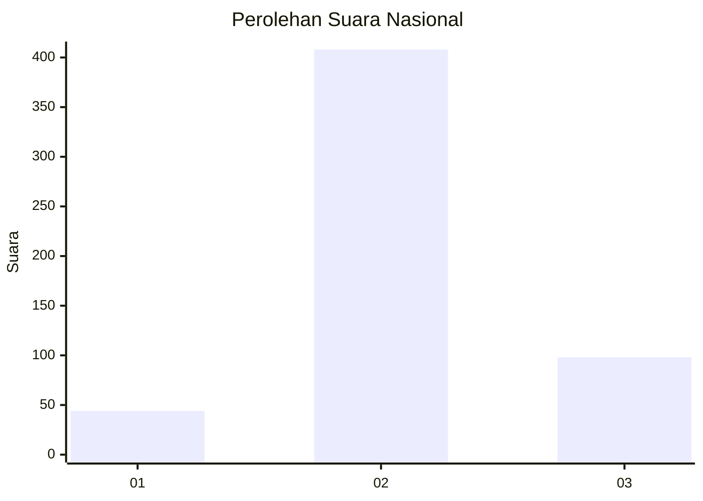

# Hasil

## Grafik

## Tabel

| No. | Nama Paslon    | Suara | Suara (raw) | Persentase |
|:--- |:-------------- | -----:| -----------:| ----------:|
| 1   | ANIES MUHAIMIN | 44    | [44][p-1]   | 8,00       |
| 2   | PRABOWO GIBRAN | 408   | [408][p-2]  | 74,18      |
| 3   | GANJAR MAHFUD  | 98    | [98][p-3]   | 17,82      |

[p-1]: https://github.com/gigit-pemilu/pemilu-2024/blob/main/pilpres/hitung-suara/sub/99-luar-negeri/sub/92-port-moresby-papua-nugini/sub/01-port-moresby-papua-nugini/sub/0001-port-moresby-papua-nugini/sub/001-pos-003/sub/paslon-1.txt
[p-2]: https://github.com/gigit-pemilu/pemilu-2024/blob/main/pilpres/hitung-suara/sub/99-luar-negeri/sub/92-port-moresby-papua-nugini/sub/01-port-moresby-papua-nugini/sub/0001-port-moresby-papua-nugini/sub/001-pos-003/sub/paslon-2.txt
[p-3]: https://github.com/gigit-pemilu/pemilu-2024/blob/main/pilpres/hitung-suara/sub/99-luar-negeri/sub/92-port-moresby-papua-nugini/sub/01-port-moresby-papua-nugini/sub/0001-port-moresby-papua-nugini/sub/001-pos-003/sub/paslon-3.txt

## Foto C Plano

https://sirekap-obj-formc.kpu.go.id/26cb/pemilu/ppwp/99/92/01/00/01/9992010001001-20240216-155032--941e3943-2798-498a-8cf9-0253f75bed41.jpg

https://sirekap-obj-formc.kpu.go.id/26cb/pemilu/ppwp/99/92/01/00/01/9992010001001-20240216-131314--2cbdd6e2-ea2e-4d2b-9d0a-afd4ffd3653f.jpg

https://sirekap-obj-formc.kpu.go.id/26cb/pemilu/ppwp/99/92/01/00/01/9992010001001-20240216-155219--02d6fc1f-f47d-4538-90e4-2afa92c35835.jpg

## Metadata

| Key        | Value               |
| ---------- | ------------------- |
| Time Stamp | 2024-02-16 16:25:10 |

## DATA PEMILIH TETAP

Jumlah pemilih dalam DPT: **998**.
 * L: **947**.
 * P: **51**.

## DATA PENGGUNA HAK PILIH

Jumlah pengguna hak pilih dalam DPT: **569**.
 * L: **537**.
 * P: **32**.

Jumlah pengguna hak pilih dalam DPTb: **0**.
 * L: **0**.
 * P: **0**.

Jumlah pengguna hak pilih dalam DPK: **0**.
 * L: **0**.
 * P: **0**.

Jumlah pengguna hak pilih: **569**.
 * L: **537**.
 * P: **32**.

## JUMLAH SUARA SAH DAN TIDAK SAH

JUMLAH SELURUH SUARA SAH: **550**.

JUMLAH SUARA TIDAK SAH: **19**.

JUMLAH SELURUH SUARA SAH DAN SUARA TIDAK SAH: **569**.

