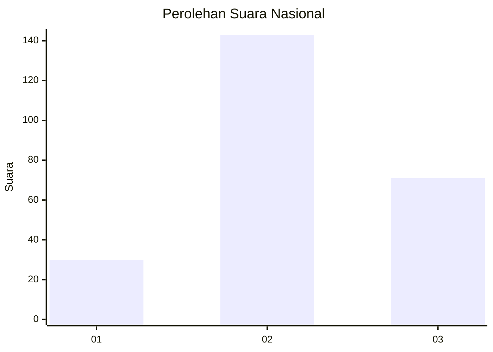
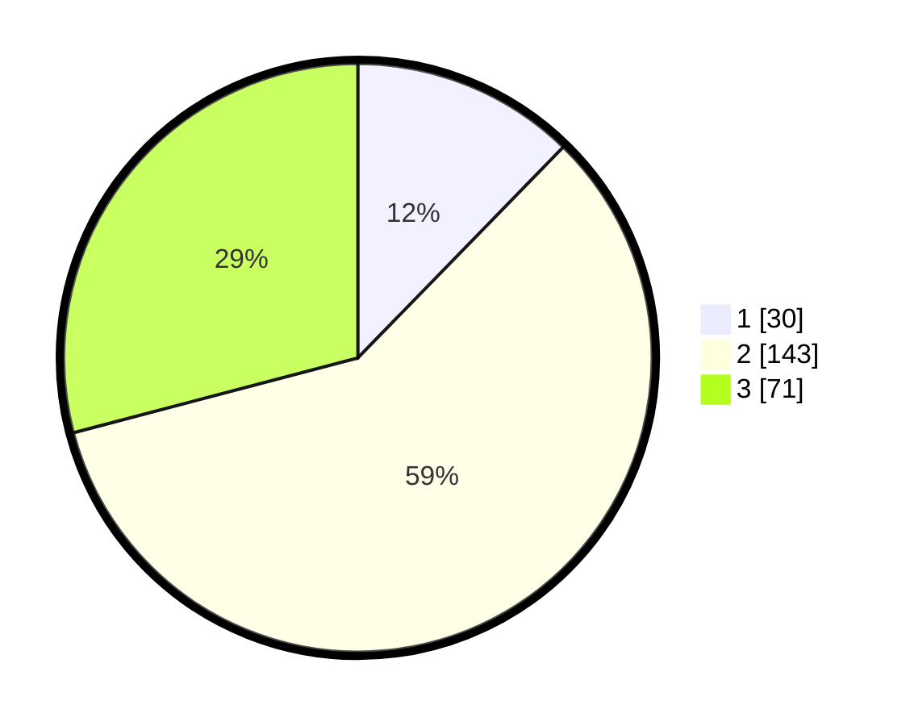

# Hasil

## Grafik

## Tabel

| No. | Nama Paslon    | Suara | Suara (raw) | Persentase |
|:--- |:-------------- | -----:| -----------:| ----------:|
| 1   | ANIES MUHAIMIN | 30    | [30][p-1]   | 12,30      |
| 2   | PRABOWO GIBRAN | 143   | [143][p-2]  | 58,61      |
| 3   | GANJAR MAHFUD  | 71    | [71][p-3]   | 29,10      |

[p-1]: https://github.com/gigit-pemilu/pemilu-2024/blob/main/pilpres/hitung-suara/sub/99-luar-negeri/sub/92-port-moresby-papua-nugini/sub/01-port-moresby-papua-nugini/sub/0001-port-moresby-papua-nugini/sub/002-tps-001/sub/paslon-1.txt
[p-2]: https://github.com/gigit-pemilu/pemilu-2024/blob/main/pilpres/hitung-suara/sub/99-luar-negeri/sub/92-port-moresby-papua-nugini/sub/01-port-moresby-papua-nugini/sub/0001-port-moresby-papua-nugini/sub/002-tps-001/sub/paslon-2.txt
[p-3]: https://github.com/gigit-pemilu/pemilu-2024/blob/main/pilpres/hitung-suara/sub/99-luar-negeri/sub/92-port-moresby-papua-nugini/sub/01-port-moresby-papua-nugini/sub/0001-port-moresby-papua-nugini/sub/002-tps-001/sub/paslon-3.txt

## Foto C Plano

https://sirekap-obj-formc.kpu.go.id/9ca7/pemilu/ppwp/99/92/01/00/01/9992010001002-20240215-183810--d6149e09-ce36-4e30-bad6-a6939a303b68.jpg

https://sirekap-obj-formc.kpu.go.id/9ca7/pemilu/ppwp/99/92/01/00/01/9992010001002-20240215-190334--9495acf1-f60e-400b-8b37-a94fafdb0381.jpg

https://sirekap-obj-formc.kpu.go.id/9ca7/pemilu/ppwp/99/92/01/00/01/9992010001002-20240215-190531--aeb670c5-58d6-43a9-89f7-13cb5171f978.jpg

## Metadata

| Key        | Value               |
| ---------- | ------------------- |
| Time Stamp | 2024-02-16 12:51:22 |

## DATA PEMILIH TETAP

Jumlah pemilih dalam DPT: **310**.
 * L: **260**.
 * P: **50**.

## DATA PENGGUNA HAK PILIH

Jumlah pengguna hak pilih dalam DPT: **163**.
 * L: **135**.
 * P: **28**.

Jumlah pengguna hak pilih dalam DPTb: **74**.
 * L: **51**.
 * P: **23**.

Jumlah pengguna hak pilih dalam DPK: **7**.
 * L: **4**.
 * P: **3**.

Jumlah pengguna hak pilih: **244**.
 * L: **190**.
 * P: **54**.

## JUMLAH SUARA SAH DAN TIDAK SAH

JUMLAH SELURUH SUARA SAH: **244**.

JUMLAH SUARA TIDAK SAH: **0**.

JUMLAH SELURUH SUARA SAH DAN SUARA TIDAK SAH: **244**.

