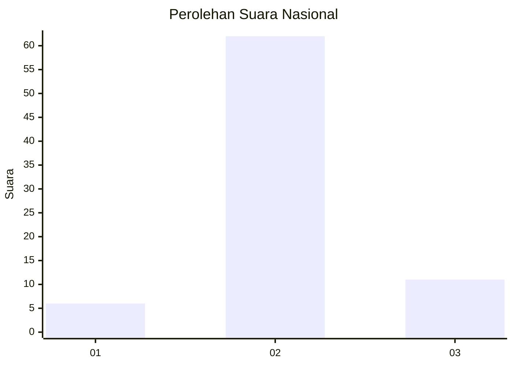
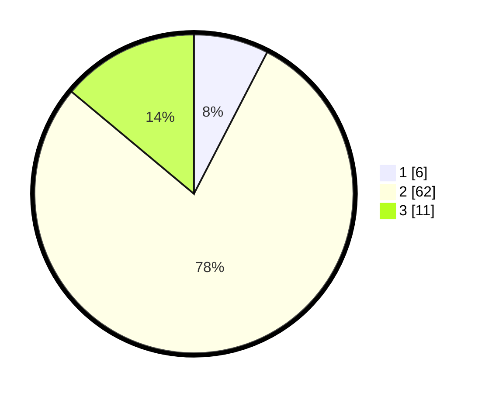

# Hasil

## Grafik

## Tabel

| No. | Nama Paslon    | Suara | Suara (raw) | Persentase |
|:--- |:-------------- | -----:| -----------:| ----------:|
| 1   | ANIES MUHAIMIN | 6     | [6][p-1]    | 7,59       |
| 2   | PRABOWO GIBRAN | 62    | [62][p-2]   | 78,48      |
| 3   | GANJAR MAHFUD  | 11    | [11][p-3]   | 13,92      |

[p-1]: https://github.com/gigit-pemilu/pemilu-2024/blob/main/pilpres/hitung-suara/sub/99-luar-negeri/sub/92-port-moresby-papua-nugini/sub/01-port-moresby-papua-nugini/sub/0001-port-moresby-papua-nugini/sub/003-ksk-002/sub/paslon-1.txt
[p-2]: https://github.com/gigit-pemilu/pemilu-2024/blob/main/pilpres/hitung-suara/sub/99-luar-negeri/sub/92-port-moresby-papua-nugini/sub/01-port-moresby-papua-nugini/sub/0001-port-moresby-papua-nugini/sub/003-ksk-002/sub/paslon-2.txt
[p-3]: https://github.com/gigit-pemilu/pemilu-2024/blob/main/pilpres/hitung-suara/sub/99-luar-negeri/sub/92-port-moresby-papua-nugini/sub/01-port-moresby-papua-nugini/sub/0001-port-moresby-papua-nugini/sub/003-ksk-002/sub/paslon-3.txt

## Foto C Plano

https://sirekap-obj-formc.kpu.go.id/4693/pemilu/ppwp/99/92/01/00/01/9992010001003-20240216-150519--1326bf73-fdfa-4948-8a4e-139e67a53aea.jpg

https://sirekap-obj-formc.kpu.go.id/4693/pemilu/ppwp/99/92/01/00/01/9992010001003-20240215-194140--a3a4d3f0-0b74-4cb6-abbe-0466925983eb.jpg

https://sirekap-obj-formc.kpu.go.id/4693/pemilu/ppwp/99/92/01/00/01/9992010001003-20240215-194330--b0e69cdb-91ad-4e0a-ab62-53ba738c2f20.jpg

## Metadata

| Key        | Value               |
| ---------- | ------------------- |
| Time Stamp | 2024-02-16 16:25:10 |

## DATA PEMILIH TETAP

Jumlah pemilih dalam DPT: **134**.
 * L: **123**.
 * P: **11**.

## DATA PENGGUNA HAK PILIH

Jumlah pengguna hak pilih dalam DPT: **75**.
 * L: **68**.
 * P: **7**.

Jumlah pengguna hak pilih dalam DPTb: **5**.
 * L: **5**.
 * P: **0**.

Jumlah pengguna hak pilih dalam DPK: **0**.
 * L: **0**.
 * P: **0**.

Jumlah pengguna hak pilih: **80**.
 * L: **73**.
 * P: **7**.

## JUMLAH SUARA SAH DAN TIDAK SAH

JUMLAH SELURUH SUARA SAH: **79**.

JUMLAH SUARA TIDAK SAH: **1**.

JUMLAH SELURUH SUARA SAH DAN SUARA TIDAK SAH: **80**.

