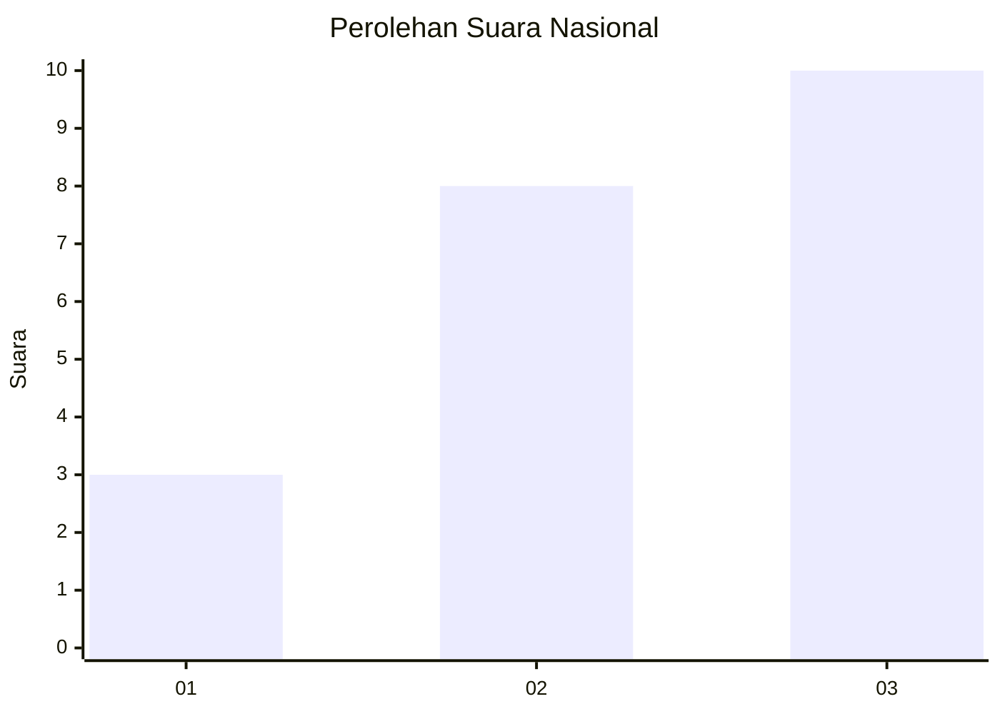
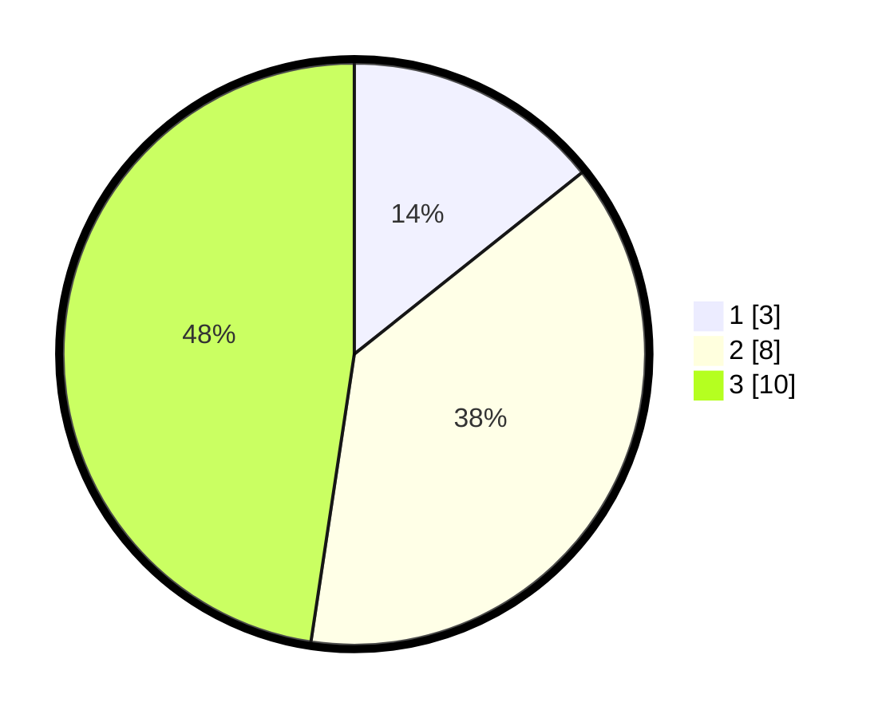

# Hasil

## Grafik

## Tabel

| No. | Nama Paslon    | Suara | Suara (raw) | Persentase |
|:--- |:-------------- | -----:| -----------:| ----------:|
| 1   | ANIES MUHAIMIN | 3     | [3][p-1]    | 14,29      |
| 2   | PRABOWO GIBRAN | 8     | [8][p-2]    | 38,10      |
| 3   | GANJAR MAHFUD  | 10    | [10][p-3]   | 47,62      |

[p-1]: https://github.com/gigit-pemilu/pemilu-2024/blob/main/pilpres/hitung-suara/sub/99-luar-negeri/sub/94-pretoria-afrika-selatan/sub/01-pretoria-afrika-selatan/sub/0001-pretoria-afrika-selatan/sub/001-pos-001/sub/paslon-1.txt
[p-2]: https://github.com/gigit-pemilu/pemilu-2024/blob/main/pilpres/hitung-suara/sub/99-luar-negeri/sub/94-pretoria-afrika-selatan/sub/01-pretoria-afrika-selatan/sub/0001-pretoria-afrika-selatan/sub/001-pos-001/sub/paslon-2.txt
[p-3]: https://github.com/gigit-pemilu/pemilu-2024/blob/main/pilpres/hitung-suara/sub/99-luar-negeri/sub/94-pretoria-afrika-selatan/sub/01-pretoria-afrika-selatan/sub/0001-pretoria-afrika-selatan/sub/001-pos-001/sub/paslon-3.txt

## Foto C Plano

https://sirekap-obj-formc.kpu.go.id/f830/pemilu/ppwp/99/94/01/00/01/9994010001001-20240216-163531--236f6826-d07c-4219-8dab-e76bf41d959d.jpg

https://sirekap-obj-formc.kpu.go.id/f830/pemilu/ppwp/99/94/01/00/01/9994010001001-20240216-163533--886caed3-56ca-4dfb-b481-f584762415ff.jpg

https://sirekap-obj-formc.kpu.go.id/f830/pemilu/ppwp/99/94/01/00/01/9994010001001-20240216-163532--3a7f6d0d-49bf-41cf-b77e-14e7d75016b3.jpg

## Metadata

| Key        | Value               |
| ---------- | ------------------- |
| Time Stamp | 2024-02-19 16:00:00 |

## DATA PEMILIH TETAP

Jumlah pemilih dalam DPT: **44**.
 * L: **20**.
 * P: **24**.

## DATA PENGGUNA HAK PILIH

Jumlah pengguna hak pilih dalam DPT: **19**.
 * L: **9**.
 * P: **10**.

Jumlah pengguna hak pilih dalam DPTb: **2**.
 * L: **1**.
 * P: **1**.

Jumlah pengguna hak pilih dalam DPK: **0**.
 * L: **0**.
 * P: **0**.

Jumlah pengguna hak pilih: **21**.
 * L: **10**.
 * P: **11**.

## JUMLAH SUARA SAH DAN TIDAK SAH

JUMLAH SELURUH SUARA SAH: **21**.

JUMLAH SUARA TIDAK SAH: **0**.

JUMLAH SELURUH SUARA SAH DAN SUARA TIDAK SAH: **21**.

