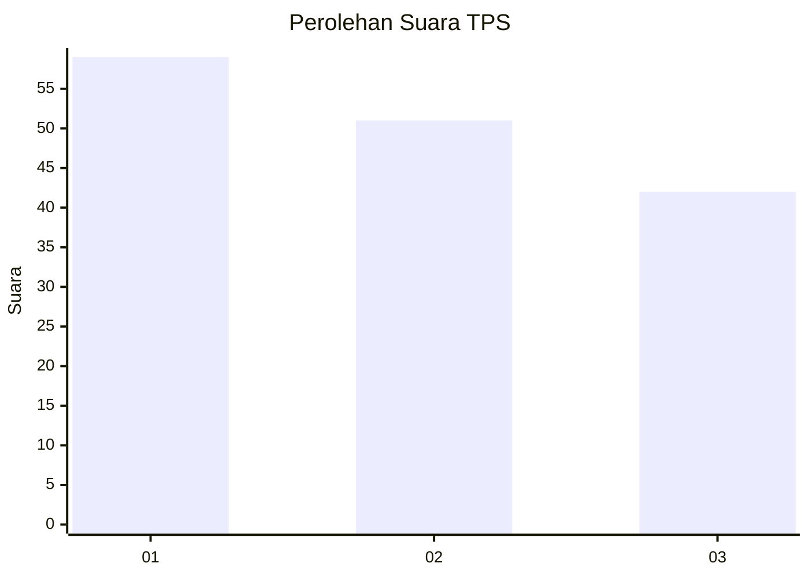
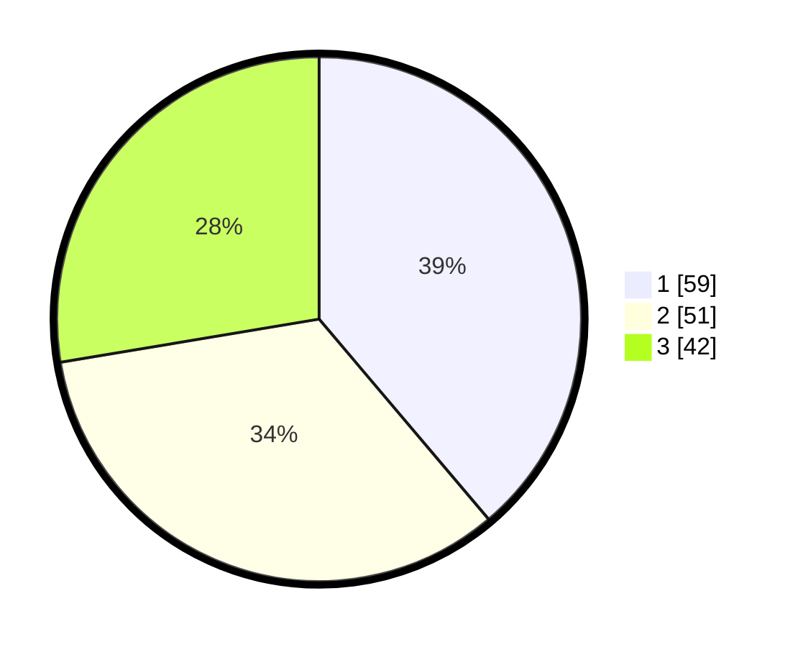

# Hasil

## Grafik

## Tabel

| No. | Nama Paslon    | Suara | Suara (raw) | Persentase |
|:--- |:-------------- | -----:| -----------:| ----------:|
| 1   | ANIES MUHAIMIN | 59    | [59][p-1]   | 38,82      |
| 2   | PRABOWO GIBRAN | 51    | [51][p-2]   | 33,55      |
| 3   | GANJAR MAHFUD  | 42    | [42][p-3]   | 27,63      |

[p-1]: https://github.com/gigit-pemilu/pemilu-2024-99-luar-negeri/blob/main/pilpres/hitung-suara/sub/99-luar-negeri/sub/94-pretoria-afrika-selatan/sub/01-pretoria-afrika-selatan/sub/0001-pretoria-afrika-selatan/sub/002-tps-001/sub/paslon-1.txt
[p-2]: https://github.com/gigit-pemilu/pemilu-2024-99-luar-negeri/blob/main/pilpres/hitung-suara/sub/99-luar-negeri/sub/94-pretoria-afrika-selatan/sub/01-pretoria-afrika-selatan/sub/0001-pretoria-afrika-selatan/sub/002-tps-001/sub/paslon-2.txt
[p-3]: https://github.com/gigit-pemilu/pemilu-2024-99-luar-negeri/blob/main/pilpres/hitung-suara/sub/99-luar-negeri/sub/94-pretoria-afrika-selatan/sub/01-pretoria-afrika-selatan/sub/0001-pretoria-afrika-selatan/sub/002-tps-001/sub/paslon-3.txt

## Foto C Plano

https://sirekap-obj-formc.kpu.go.id/3594/pemilu/ppwp/99/94/01/00/01/9994010001002-20240214-185121--13434208-f633-47a9-9c5e-fb9effb70550.jpg

https://sirekap-obj-formc.kpu.go.id/3594/pemilu/ppwp/99/94/01/00/01/9994010001002-20240214-204502--f8429671-7d9f-42f9-a32b-31234f87b73c.jpg

https://sirekap-obj-formc.kpu.go.id/3594/pemilu/ppwp/99/94/01/00/01/9994010001002-20240214-185126--7ad8d788-69c7-44d5-8c18-920ec4c4041a.jpg

## Metadata

| Key        | Value               |
| ---------- | ------------------- |
| Time Stamp | 2024-02-19 16:00:00 |

## DATA PEMILIH TETAP

Jumlah pemilih dalam DPT: **197**.
 * L: **114**.
 * P: **83**.

## DATA PENGGUNA HAK PILIH

Jumlah pengguna hak pilih dalam DPT: **130**.
 * L: **82**.
 * P: **48**.

Jumlah pengguna hak pilih dalam DPTb: **28**.
 * L: **18**.
 * P: **10**.

Jumlah pengguna hak pilih dalam DPK: **1**.
 * L: **0**.
 * P: **1**.

Jumlah pengguna hak pilih: **159**.
 * L: **100**.
 * P: **59**.

## JUMLAH SUARA SAH DAN TIDAK SAH

JUMLAH SELURUH SUARA SAH: **152**.

JUMLAH SUARA TIDAK SAH: **7**.

JUMLAH SELURUH SUARA SAH DAN SUARA TIDAK SAH: **159**.

