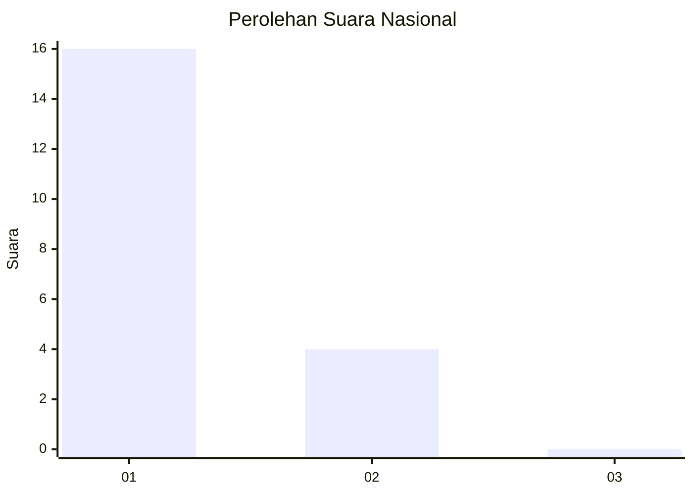
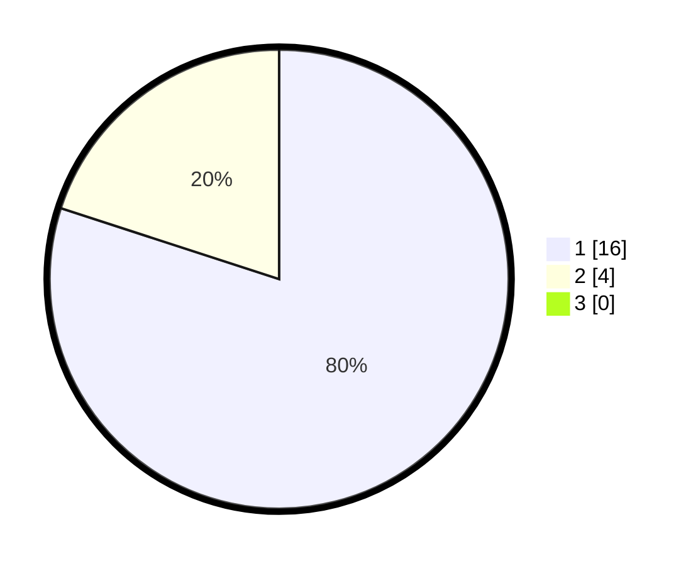

# Hasil

## Grafik

## Tabel

| No. | Nama Paslon    | Suara | Suara (raw) | Persentase |
|:--- |:-------------- | -----:| -----------:| ----------:|
| 1   | ANIES MUHAIMIN | 16    | [16][p-1]   | 80,00      |
| 2   | PRABOWO GIBRAN | 4     | [4][p-2]    | 20,00      |
| 3   | GANJAR MAHFUD  | 0     | [0][p-3]    | 0,00       |

[p-1]: https://github.com/gigit-pemilu/pemilu-2024/blob/main/pilpres/hitung-suara/sub/99-luar-negeri/sub/94-pretoria-afrika-selatan/sub/01-pretoria-afrika-selatan/sub/0001-pretoria-afrika-selatan/sub/003-ksk-001/sub/paslon-1.txt
[p-2]: https://github.com/gigit-pemilu/pemilu-2024/blob/main/pilpres/hitung-suara/sub/99-luar-negeri/sub/94-pretoria-afrika-selatan/sub/01-pretoria-afrika-selatan/sub/0001-pretoria-afrika-selatan/sub/003-ksk-001/sub/paslon-2.txt
[p-3]: https://github.com/gigit-pemilu/pemilu-2024/blob/main/pilpres/hitung-suara/sub/99-luar-negeri/sub/94-pretoria-afrika-selatan/sub/01-pretoria-afrika-selatan/sub/0001-pretoria-afrika-selatan/sub/003-ksk-001/sub/paslon-3.txt

## Foto C Plano

https://sirekap-obj-formc.kpu.go.id/b2c2/pemilu/ppwp/99/94/01/00/01/9994010001003-20240216-143542--bd71722b-4304-47e8-ab03-f15394188ddd.jpg

https://sirekap-obj-formc.kpu.go.id/b2c2/pemilu/ppwp/99/94/01/00/01/9994010001003-20240216-143543--e9868ced-be00-4fdd-8dbf-a82da8a7dc20.jpg

https://sirekap-obj-formc.kpu.go.id/b2c2/pemilu/ppwp/99/94/01/00/01/9994010001003-20240216-143543--db86822d-101b-4148-bbe9-b8533aa023f7.jpg

## Metadata

| Key        | Value               |
| ---------- | ------------------- |
| Time Stamp | 2024-02-19 16:00:00 |

## DATA PEMILIH TETAP

Jumlah pemilih dalam DPT: **16**.
 * L: **16**.
 * P: **0**.

## DATA PENGGUNA HAK PILIH

Jumlah pengguna hak pilih dalam DPT: **15**.
 * L: **15**.
 * P: **0**.

Jumlah pengguna hak pilih dalam DPTb: **6**.
 * L: **6**.
 * P: **0**.

Jumlah pengguna hak pilih dalam DPK: **0**.
 * L: **0**.
 * P: **0**.

Jumlah pengguna hak pilih: **21**.
 * L: **21**.
 * P: **0**.

## JUMLAH SUARA SAH DAN TIDAK SAH

JUMLAH SELURUH SUARA SAH: **20**.

JUMLAH SUARA TIDAK SAH: **1**.

JUMLAH SELURUH SUARA SAH DAN SUARA TIDAK SAH: **21**.

