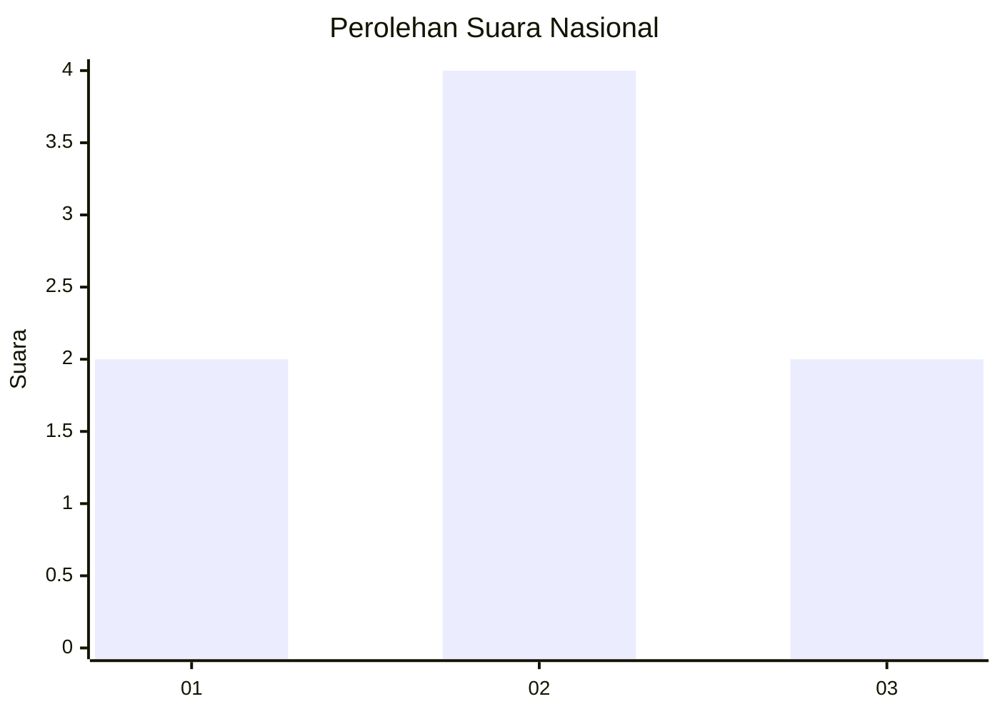
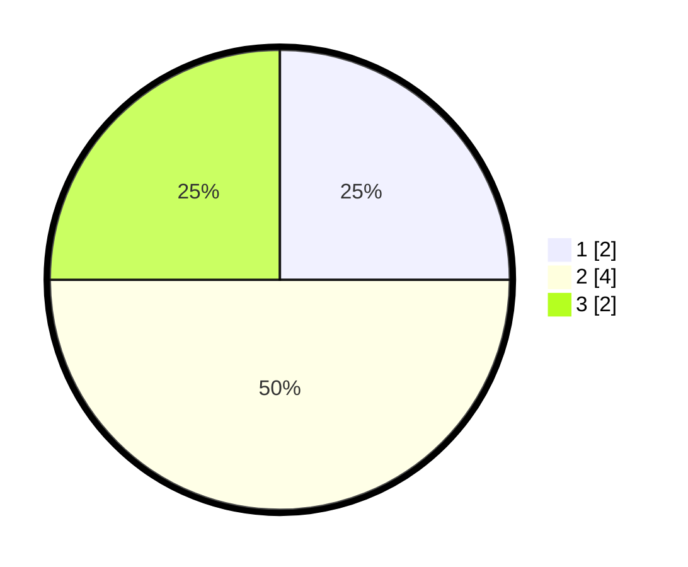

# Hasil

## Grafik

## Tabel

| No. | Nama Paslon    | Suara | Suara (raw) | Persentase |
|:--- |:-------------- | -----:| -----------:| ----------:|
| 1   | ANIES MUHAIMIN | 2     | [2][p-1]    | 25,00      |
| 2   | PRABOWO GIBRAN | 4     | [4][p-2]    | 50,00      |
| 3   | GANJAR MAHFUD  | 2     | [2][p-3]    | 25,00      |

[p-1]: https://github.com/gigit-pemilu/pemilu-2024/blob/main/pilpres/hitung-suara/sub/99-luar-negeri/sub/94-pretoria-afrika-selatan/sub/01-pretoria-afrika-selatan/sub/0001-pretoria-afrika-selatan/sub/004-ksk-002/sub/paslon-1.txt
[p-2]: https://github.com/gigit-pemilu/pemilu-2024/blob/main/pilpres/hitung-suara/sub/99-luar-negeri/sub/94-pretoria-afrika-selatan/sub/01-pretoria-afrika-selatan/sub/0001-pretoria-afrika-selatan/sub/004-ksk-002/sub/paslon-2.txt
[p-3]: https://github.com/gigit-pemilu/pemilu-2024/blob/main/pilpres/hitung-suara/sub/99-luar-negeri/sub/94-pretoria-afrika-selatan/sub/01-pretoria-afrika-selatan/sub/0001-pretoria-afrika-selatan/sub/004-ksk-002/sub/paslon-3.txt

## Foto C Plano

https://sirekap-obj-formc.kpu.go.id/aba1/pemilu/ppwp/99/94/01/00/01/9994010001004-20240214-213642--c9c65e61-5aa8-4b3f-b476-ca2c9f715d1c.jpg

https://sirekap-obj-formc.kpu.go.id/aba1/pemilu/ppwp/99/94/01/00/01/9994010001004-20240214-213755--c5d4f427-dc4c-400d-8d4a-802abd6da592.jpg

https://sirekap-obj-formc.kpu.go.id/aba1/pemilu/ppwp/99/94/01/00/01/9994010001004-20240214-213851--09455048-5269-40b5-a7be-6a87eb0906c8.jpg

## Metadata

| Key        | Value               |
| ---------- | ------------------- |
| Time Stamp | 2024-02-19 17:00:00 |

## DATA PEMILIH TETAP

Jumlah pemilih dalam DPT: **10**.
 * L: **8**.
 * P: **2**.

## DATA PENGGUNA HAK PILIH

Jumlah pengguna hak pilih dalam DPT: **8**.
 * L: **7**.
 * P: **1**.

Jumlah pengguna hak pilih dalam DPTb: **0**.
 * L: **0**.
 * P: **0**.

Jumlah pengguna hak pilih dalam DPK: **0**.
 * L: **0**.
 * P: **0**.

Jumlah pengguna hak pilih: **8**.
 * L: **7**.
 * P: **1**.

## JUMLAH SUARA SAH DAN TIDAK SAH

JUMLAH SELURUH SUARA SAH: **8**.

JUMLAH SUARA TIDAK SAH: **0**.

JUMLAH SELURUH SUARA SAH DAN SUARA TIDAK SAH: **8**.

