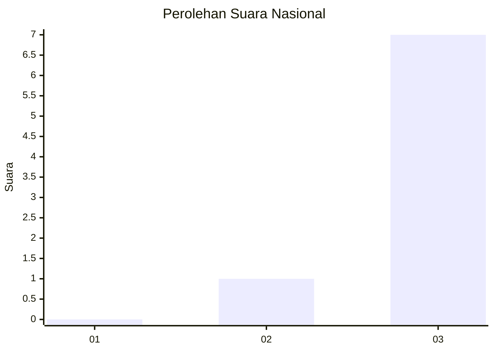
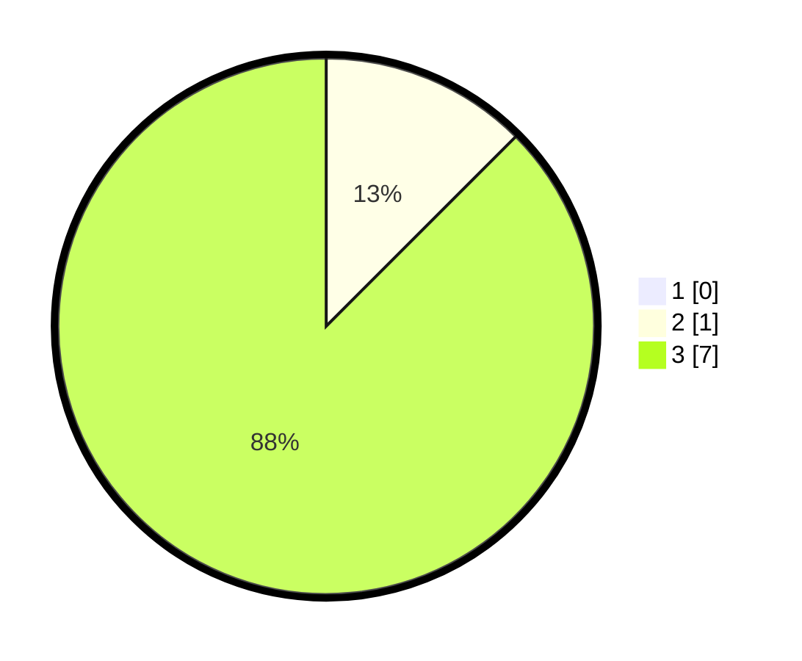

# Hasil

## Grafik

## Tabel

| No. | Nama Paslon    | Suara | Suara (raw) | Persentase |
|:--- |:-------------- | -----:| -----------:| ----------:|
| 1   | ANIES MUHAIMIN | 0     | [0][p-1]    | 0,00       |
| 2   | PRABOWO GIBRAN | 1     | [1][p-2]    | 12,50      |
| 3   | GANJAR MAHFUD  | 7     | [7][p-3]    | 87,50      |

[p-1]: https://github.com/gigit-pemilu/pemilu-2024/blob/main/pilpres/hitung-suara/sub/99-luar-negeri/sub/96-quito-ekuador/sub/01-quito-ekuador/sub/0001-quito-ekuador/sub/001-pos-001/sub/paslon-1.txt
[p-2]: https://github.com/gigit-pemilu/pemilu-2024/blob/main/pilpres/hitung-suara/sub/99-luar-negeri/sub/96-quito-ekuador/sub/01-quito-ekuador/sub/0001-quito-ekuador/sub/001-pos-001/sub/paslon-2.txt
[p-3]: https://github.com/gigit-pemilu/pemilu-2024/blob/main/pilpres/hitung-suara/sub/99-luar-negeri/sub/96-quito-ekuador/sub/01-quito-ekuador/sub/0001-quito-ekuador/sub/001-pos-001/sub/paslon-3.txt

## Foto C Plano

https://sirekap-obj-formc.kpu.go.id/0b56/pemilu/ppwp/99/96/01/00/01/9996010001001-20240216-062524--98701e7e-731f-431b-a287-2e952a3aa8ab.jpg

https://sirekap-obj-formc.kpu.go.id/0b56/pemilu/ppwp/99/96/01/00/01/9996010001001-20240216-005539--b7af9ad5-b672-4bed-8621-7d4741a0cc7d.jpg

https://sirekap-obj-formc.kpu.go.id/0b56/pemilu/ppwp/99/96/01/00/01/9996010001001-20240216-005639--c9c52e42-3a2f-406b-a442-fcd3a8273076.jpg

## Metadata

| Key        | Value               |
| ---------- | ------------------- |
| Time Stamp | 2024-02-19 06:16:00 |

## DATA PEMILIH TETAP

Jumlah pemilih dalam DPT: **12**.
 * L: **9**.
 * P: **3**.

## DATA PENGGUNA HAK PILIH

Jumlah pengguna hak pilih dalam DPT: **10**.
 * L: **8**.
 * P: **2**.

Jumlah pengguna hak pilih dalam DPTb: **0**.
 * L: **0**.
 * P: **0**.

Jumlah pengguna hak pilih dalam DPK: **0**.
 * L: **0**.
 * P: **0**.

Jumlah pengguna hak pilih: **10**.
 * L: **8**.
 * P: **2**.

## JUMLAH SUARA SAH DAN TIDAK SAH

JUMLAH SELURUH SUARA SAH: **8**.

JUMLAH SUARA TIDAK SAH: **2**.

JUMLAH SELURUH SUARA SAH DAN SUARA TIDAK SAH: **10**.

