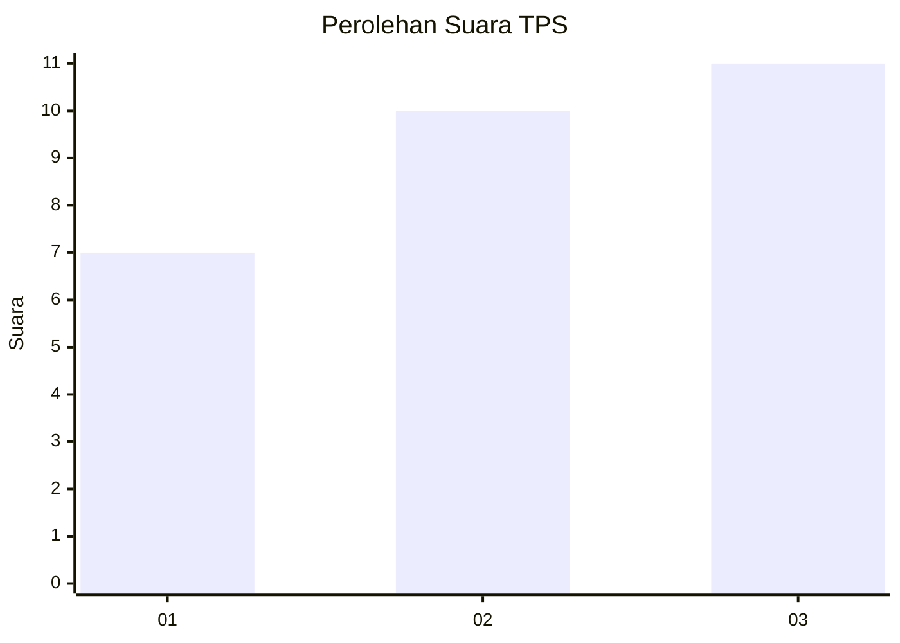
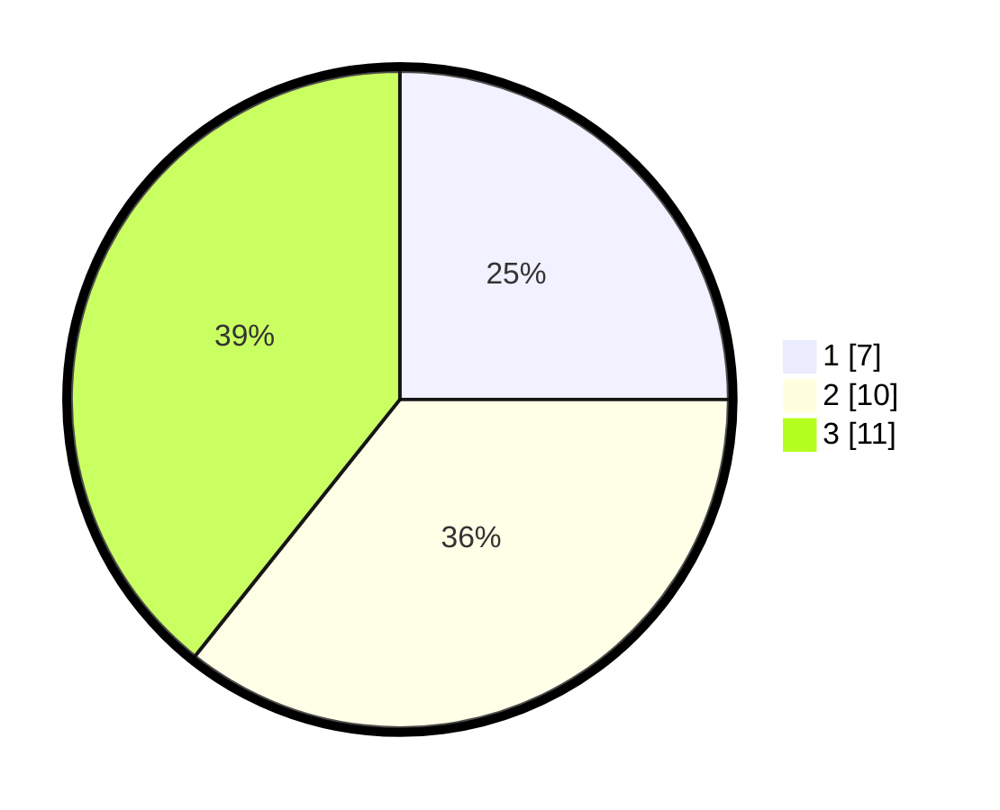

# Hasil

## Grafik

## Tabel

| No. | Nama Paslon    | Suara | Suara (raw) | Persentase |
|:--- |:-------------- | -----:| -----------:| ----------:|
| 1   | ANIES MUHAIMIN | 7     | [7][p-1]    | 25,00      |
| 2   | PRABOWO GIBRAN | 10    | [10][p-2]   | 35,71      |
| 3   | GANJAR MAHFUD  | 11    | [11][p-3]   | 39,29      |

[p-1]: https://github.com/gigit-pemilu/pemilu-2024-99-luar-negeri/blob/main/pilpres/hitung-suara/sub/99-luar-negeri/sub/96-quito-ekuador/sub/01-quito-ekuador/sub/0001-quito-ekuador/sub/002-tps-001/sub/paslon-1.txt
[p-2]: https://github.com/gigit-pemilu/pemilu-2024-99-luar-negeri/blob/main/pilpres/hitung-suara/sub/99-luar-negeri/sub/96-quito-ekuador/sub/01-quito-ekuador/sub/0001-quito-ekuador/sub/002-tps-001/sub/paslon-2.txt
[p-3]: https://github.com/gigit-pemilu/pemilu-2024-99-luar-negeri/blob/main/pilpres/hitung-suara/sub/99-luar-negeri/sub/96-quito-ekuador/sub/01-quito-ekuador/sub/0001-quito-ekuador/sub/002-tps-001/sub/paslon-3.txt

## Foto C Plano

https://sirekap-obj-formc.kpu.go.id/73a3/pemilu/ppwp/99/96/01/00/01/9996010001002-20240218-040528--53eb5061-45be-4abc-9fd8-6e6e493a9bf5.jpg

https://sirekap-obj-formc.kpu.go.id/73a3/pemilu/ppwp/99/96/01/00/01/9996010001002-20240218-040551--516f4a67-aa13-4f2b-9e62-2bddd67cd07a.jpg

https://sirekap-obj-formc.kpu.go.id/73a3/pemilu/ppwp/99/96/01/00/01/9996010001002-20240218-040616--be97073b-0eb3-4b3f-8d69-6c830f37fad8.jpg

## Metadata

| Key        | Value               |
| ---------- | ------------------- |
| Time Stamp | 2024-02-19 06:16:00 |

## DATA PEMILIH TETAP

Jumlah pemilih dalam DPT: **32**.
 * L: **19**.
 * P: **13**.

## DATA PENGGUNA HAK PILIH

Jumlah pengguna hak pilih dalam DPT: **25**.
 * L: **15**.
 * P: **10**.

Jumlah pengguna hak pilih dalam DPTb: **3**.
 * L: **2**.
 * P: **1**.

Jumlah pengguna hak pilih dalam DPK: **0**.
 * L: **0**.
 * P: **0**.

Jumlah pengguna hak pilih: **28**.
 * L: **17**.
 * P: **11**.

## JUMLAH SUARA SAH DAN TIDAK SAH

JUMLAH SELURUH SUARA SAH: **28**.

JUMLAH SUARA TIDAK SAH: **0**.

JUMLAH SELURUH SUARA SAH DAN SUARA TIDAK SAH: **28**.

