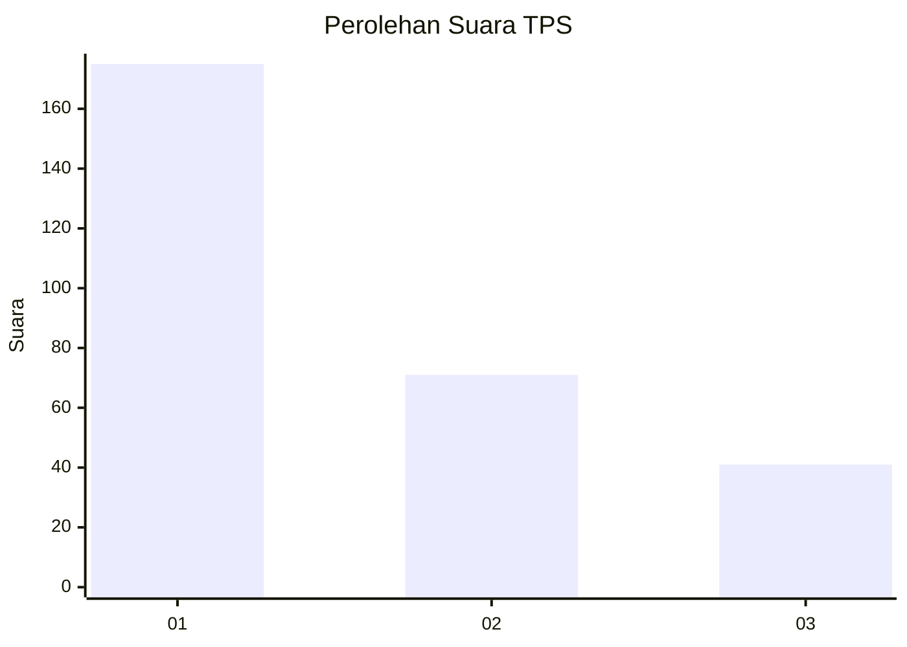
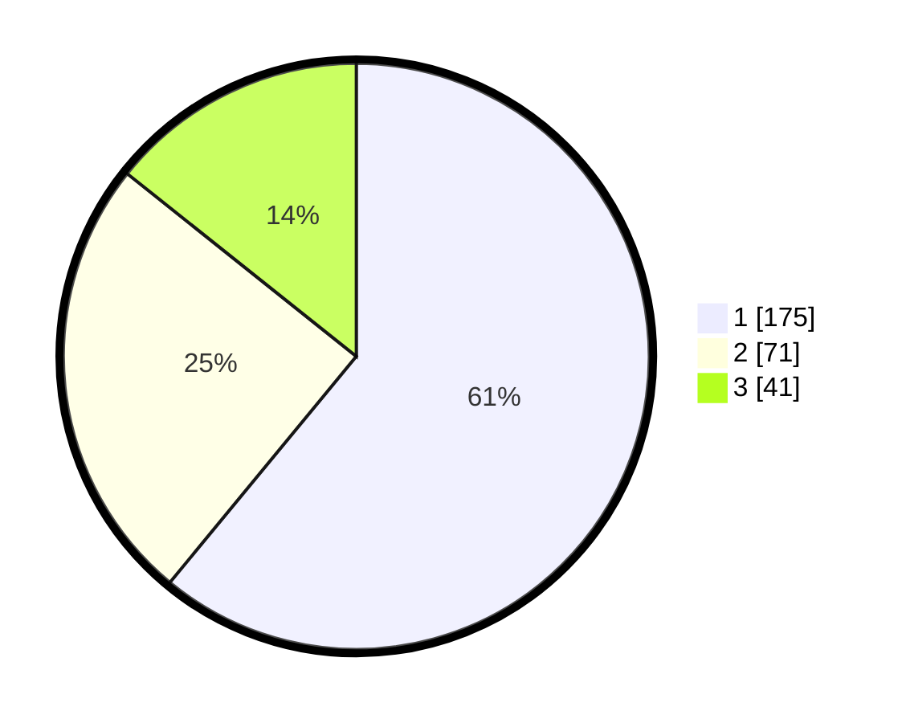

# Hasil

## Grafik

## Tabel

| No. | Nama Paslon    | Suara | Suara (raw) | Persentase |
|:--- |:-------------- | -----:| -----------:| ----------:|
| 1   | ANIES MUHAIMIN | 175   | [175][p-1]  | 60,98      |
| 2   | PRABOWO GIBRAN | 71    | [71][p-2]   | 24,74      |
| 3   | GANJAR MAHFUD  | 41    | [41][p-3]   | 14,29      |

[p-1]: https://github.com/gigit-pemilu/pemilu-2024-99-luar-negeri/blob/main/pilpres/hitung-suara/sub/99-luar-negeri/sub/97-rabat-morocco/sub/01-rabat-morocco/sub/0001-rabat-morocco/sub/002-tps-001/sub/paslon-1.txt
[p-2]: https://github.com/gigit-pemilu/pemilu-2024-99-luar-negeri/blob/main/pilpres/hitung-suara/sub/99-luar-negeri/sub/97-rabat-morocco/sub/01-rabat-morocco/sub/0001-rabat-morocco/sub/002-tps-001/sub/paslon-2.txt
[p-3]: https://github.com/gigit-pemilu/pemilu-2024-99-luar-negeri/blob/main/pilpres/hitung-suara/sub/99-luar-negeri/sub/97-rabat-morocco/sub/01-rabat-morocco/sub/0001-rabat-morocco/sub/002-tps-001/sub/paslon-3.txt

## Foto C Plano

https://sirekap-obj-formc.kpu.go.id/6eca/pemilu/ppwp/99/97/01/00/01/9997010001002-20240216-132903--3e5b7cf1-5e17-4a81-9092-a2e1e7663a1d.jpg

https://sirekap-obj-formc.kpu.go.id/6eca/pemilu/ppwp/99/97/01/00/01/9997010001002-20240216-132904--5001f955-4403-492e-bec0-e38423dc737c.jpg

https://sirekap-obj-formc.kpu.go.id/6eca/pemilu/ppwp/99/97/01/00/01/9997010001002-20240216-132903--2cb5825d-8588-4b3d-bd83-f2fa4ae21cfc.jpg

## Metadata

| Key        | Value               |
| ---------- | ------------------- |
| Time Stamp | 2024-02-19 06:16:00 |

## DATA PEMILIH TETAP

Jumlah pemilih dalam DPT: **288**.
 * L: **155**.
 * P: **133**.

## DATA PENGGUNA HAK PILIH

Jumlah pengguna hak pilih dalam DPT: **218**.
 * L: **127**.
 * P: **91**.

Jumlah pengguna hak pilih dalam DPTb: **69**.
 * L: **47**.
 * P: **22**.

Jumlah pengguna hak pilih dalam DPK: **5**.
 * L: **1**.
 * P: **4**.

Jumlah pengguna hak pilih: **292**.
 * L: **175**.
 * P: **117**.

## JUMLAH SUARA SAH DAN TIDAK SAH

JUMLAH SELURUH SUARA SAH: **287**.

JUMLAH SUARA TIDAK SAH: **5**.

JUMLAH SELURUH SUARA SAH DAN SUARA TIDAK SAH: **292**.

