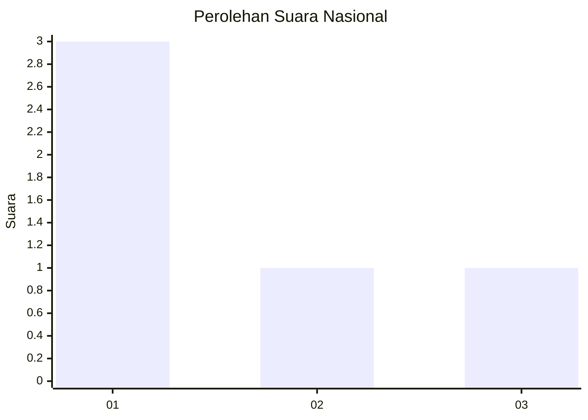
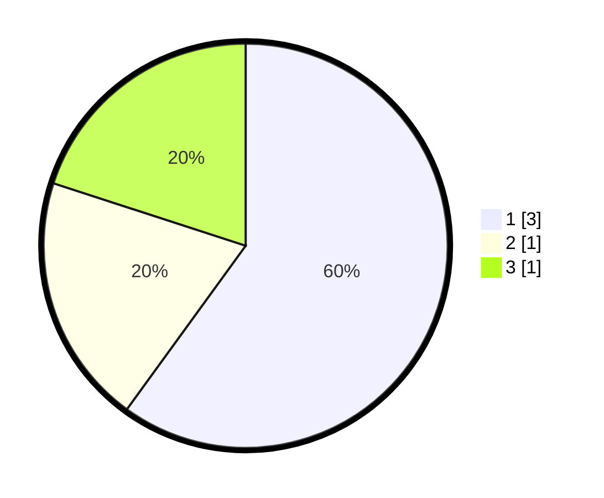

# Hasil

## Grafik

## Tabel

| No. | Nama Paslon    | Suara | Suara (raw) | Persentase |
|:--- |:-------------- | -----:| -----------:| ----------:|
| 1   | ANIES MUHAIMIN | 3     | [3][p-1]    | 60,00      |
| 2   | PRABOWO GIBRAN | 1     | [1][p-2]    | 20,00      |
| 3   | GANJAR MAHFUD  | 1     | [1][p-3]    | 20,00      |

[p-1]: https://github.com/gigit-pemilu/pemilu-2024/blob/main/pilpres/hitung-suara/sub/99-luar-negeri/sub/97-rabat-morocco/sub/01-rabat-morocco/sub/0001-rabat-morocco/sub/003-ksk-001/sub/paslon-1.txt
[p-2]: https://github.com/gigit-pemilu/pemilu-2024/blob/main/pilpres/hitung-suara/sub/99-luar-negeri/sub/97-rabat-morocco/sub/01-rabat-morocco/sub/0001-rabat-morocco/sub/003-ksk-001/sub/paslon-2.txt
[p-3]: https://github.com/gigit-pemilu/pemilu-2024/blob/main/pilpres/hitung-suara/sub/99-luar-negeri/sub/97-rabat-morocco/sub/01-rabat-morocco/sub/0001-rabat-morocco/sub/003-ksk-001/sub/paslon-3.txt

## Foto C Plano

https://sirekap-obj-formc.kpu.go.id/09bf/pemilu/ppwp/99/97/01/00/01/9997010001003-20240216-141633--af4e6787-5ea7-423a-b979-876a77bdd80d.jpg

https://sirekap-obj-formc.kpu.go.id/09bf/pemilu/ppwp/99/97/01/00/01/9997010001003-20240216-141634--1e6bb0e0-e879-4f20-8395-99c5f6ebee82.jpg

https://sirekap-obj-formc.kpu.go.id/09bf/pemilu/ppwp/99/97/01/00/01/9997010001003-20240216-141633--0a4f97ff-3a25-41ae-8aa1-7cf2c8a6dca3.jpg

## Metadata

| Key        | Value               |
| ---------- | ------------------- |
| Time Stamp | 2024-02-19 06:16:00 |

## DATA PEMILIH TETAP

Jumlah pemilih dalam DPT: **8**.
 * L: **7**.
 * P: **1**.

## DATA PENGGUNA HAK PILIH

Jumlah pengguna hak pilih dalam DPT: **8**.
 * L: **7**.
 * P: **1**.

Jumlah pengguna hak pilih dalam DPTb: **0**.
 * L: **0**.
 * P: **0**.

Jumlah pengguna hak pilih dalam DPK: **1**.
 * L: **1**.
 * P: **0**.

Jumlah pengguna hak pilih: **9**.
 * L: **8**.
 * P: **1**.

## JUMLAH SUARA SAH DAN TIDAK SAH

JUMLAH SELURUH SUARA SAH: **5**.

JUMLAH SUARA TIDAK SAH: **4**.

JUMLAH SELURUH SUARA SAH DAN SUARA TIDAK SAH: **9**.

