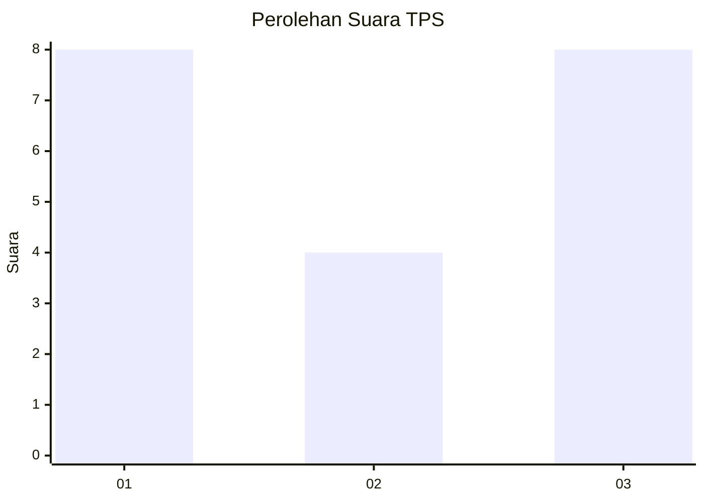
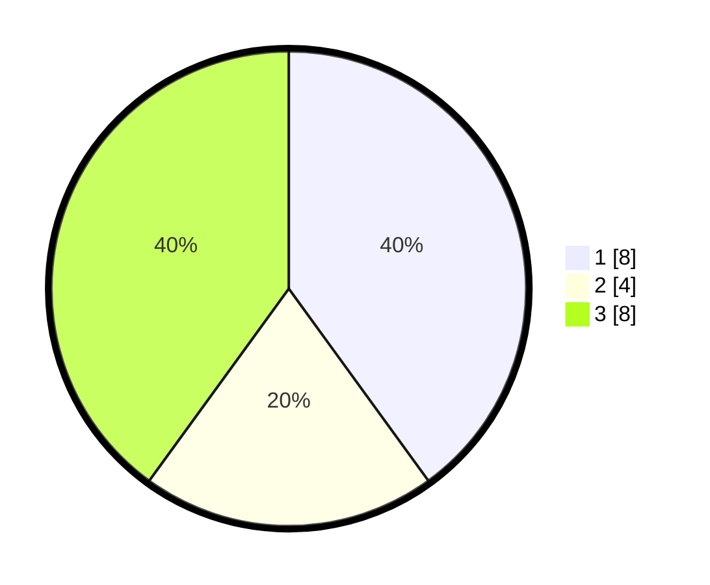

# Hasil

## Grafik

## Tabel

| No. | Nama Paslon    | Suara | Suara (raw) | Persentase |
|:--- |:-------------- | -----:| -----------:| ----------:|
| 1   | ANIES MUHAIMIN | 8     | [8][p-1]    | 40,00      |
| 2   | PRABOWO GIBRAN | 4     | [4][p-2]    | 20,00      |
| 3   | GANJAR MAHFUD  | 8     | [8][p-3]    | 40,00      |

[p-1]: https://github.com/gigit-pemilu/pemilu-2024-99-luar-negeri/blob/main/pilpres/hitung-suara/sub/99-luar-negeri/sub/97-rabat-morocco/sub/01-rabat-morocco/sub/0001-rabat-morocco/sub/004-ksk-002/sub/paslon-1.txt
[p-2]: https://github.com/gigit-pemilu/pemilu-2024-99-luar-negeri/blob/main/pilpres/hitung-suara/sub/99-luar-negeri/sub/97-rabat-morocco/sub/01-rabat-morocco/sub/0001-rabat-morocco/sub/004-ksk-002/sub/paslon-2.txt
[p-3]: https://github.com/gigit-pemilu/pemilu-2024-99-luar-negeri/blob/main/pilpres/hitung-suara/sub/99-luar-negeri/sub/97-rabat-morocco/sub/01-rabat-morocco/sub/0001-rabat-morocco/sub/004-ksk-002/sub/paslon-3.txt

## Foto C Plano

https://sirekap-obj-formc.kpu.go.id/4fc3/pemilu/ppwp/99/97/01/00/01/9997010001004-20240216-021610--e56868cf-a8c2-44a3-a8e3-f4df3811e206.jpg

https://sirekap-obj-formc.kpu.go.id/4fc3/pemilu/ppwp/99/97/01/00/01/9997010001004-20240216-020248--b05481aa-cbec-45ee-ad7f-920b2121c98a.jpg

https://sirekap-obj-formc.kpu.go.id/4fc3/pemilu/ppwp/99/97/01/00/01/9997010001004-20240216-020241--63568073-5b45-44bc-b628-59b73f2fa052.jpg

## Metadata

| Key        | Value               |
| ---------- | ------------------- |
| Time Stamp | 2024-02-19 06:16:00 |

## DATA PEMILIH TETAP

Jumlah pemilih dalam DPT: **20**.
 * L: **15**.
 * P: **5**.

## DATA PENGGUNA HAK PILIH

Jumlah pengguna hak pilih dalam DPT: **16**.
 * L: **12**.
 * P: **4**.

Jumlah pengguna hak pilih dalam DPTb: **1**.
 * L: **2**.
 * P: **1**.

Jumlah pengguna hak pilih dalam DPK: **1**.
 * L: **0**.
 * P: **1**.

Jumlah pengguna hak pilih: **20**.
 * L: **14**.
 * P: **6**.

## JUMLAH SUARA SAH DAN TIDAK SAH

JUMLAH SELURUH SUARA SAH: **20**.

JUMLAH SUARA TIDAK SAH: **0**.

JUMLAH SELURUH SUARA SAH DAN SUARA TIDAK SAH: **20**.

