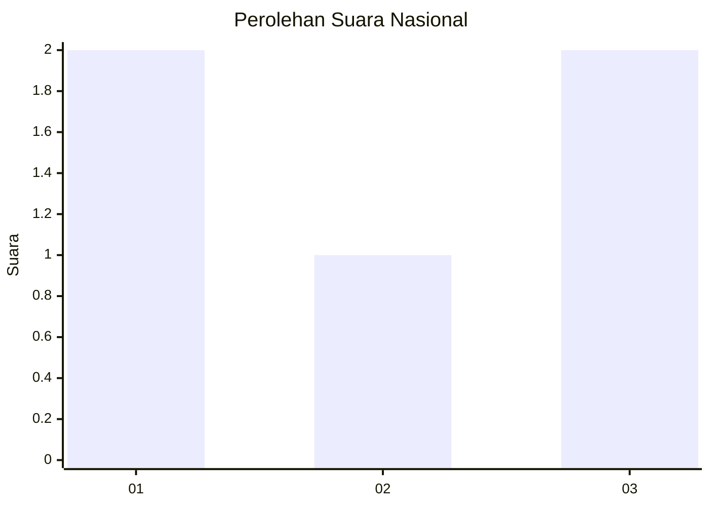
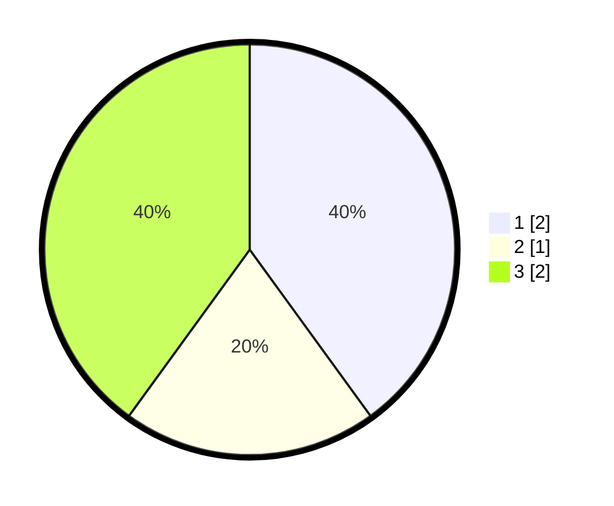

# Hasil

## Grafik

## Tabel

| No. | Nama Paslon    | Suara | Suara (raw) | Persentase |
|:--- |:-------------- | -----:| -----------:| ----------:|
| 1   | ANIES MUHAIMIN | 2     | [2][p-1]    | 40,00      |
| 2   | PRABOWO GIBRAN | 1     | [1][p-2]    | 20,00      |
| 3   | GANJAR MAHFUD  | 2     | [2][p-3]    | 40,00      |

[p-1]: https://github.com/gigit-pemilu/pemilu-2024/blob/main/pilpres/hitung-suara/sub/99-luar-negeri/sub/97-rabat-morocco/sub/01-rabat-morocco/sub/0001-rabat-morocco/sub/005-ksk-003/sub/paslon-1.txt
[p-2]: https://github.com/gigit-pemilu/pemilu-2024/blob/main/pilpres/hitung-suara/sub/99-luar-negeri/sub/97-rabat-morocco/sub/01-rabat-morocco/sub/0001-rabat-morocco/sub/005-ksk-003/sub/paslon-2.txt
[p-3]: https://github.com/gigit-pemilu/pemilu-2024/blob/main/pilpres/hitung-suara/sub/99-luar-negeri/sub/97-rabat-morocco/sub/01-rabat-morocco/sub/0001-rabat-morocco/sub/005-ksk-003/sub/paslon-3.txt

## Foto C Plano

https://sirekap-obj-formc.kpu.go.id/4175/pemilu/ppwp/99/97/01/00/01/9997010001005-20240216-140812--564f0aff-0a6d-4091-b187-88a2b5ea2719.jpg

https://sirekap-obj-formc.kpu.go.id/4175/pemilu/ppwp/99/97/01/00/01/9997010001005-20240216-140813--f02678ff-c754-4977-8578-84d77383f845.jpg

https://sirekap-obj-formc.kpu.go.id/4175/pemilu/ppwp/99/97/01/00/01/9997010001005-20240216-140812--f59d2be5-06c8-4cad-8d3c-d7d2cdd381dd.jpg

## Metadata

| Key        | Value               |
| ---------- | ------------------- |
| Time Stamp | 2024-02-19 06:16:00 |

## DATA PEMILIH TETAP

Jumlah pemilih dalam DPT: **5**.
 * L: **5**.
 * P: **0**.

## DATA PENGGUNA HAK PILIH

Jumlah pengguna hak pilih dalam DPT: **5**.
 * L: **5**.
 * P: **0**.

Jumlah pengguna hak pilih dalam DPTb: **0**.
 * L: **0**.
 * P: **0**.

Jumlah pengguna hak pilih dalam DPK: **0**.
 * L: **0**.
 * P: **0**.

Jumlah pengguna hak pilih: **5**.
 * L: **5**.
 * P: **0**.

## JUMLAH SUARA SAH DAN TIDAK SAH

JUMLAH SELURUH SUARA SAH: **5**.

JUMLAH SUARA TIDAK SAH: **0**.

JUMLAH SELURUH SUARA SAH DAN SUARA TIDAK SAH: **5**.

