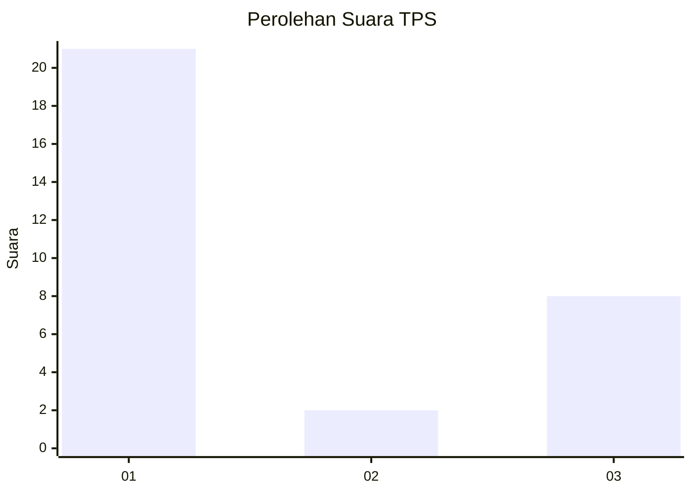
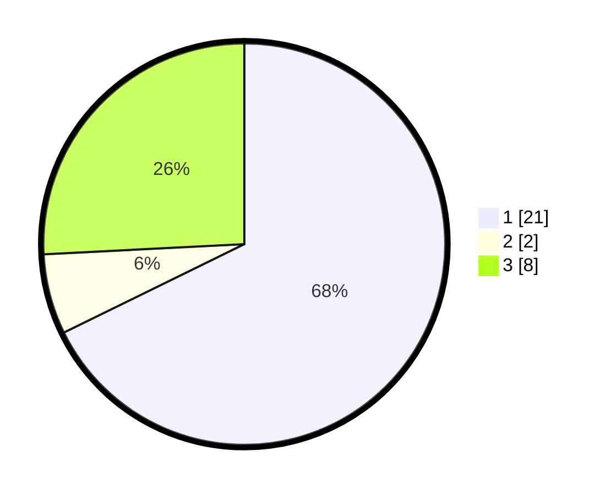

# Hasil

## Grafik

## Tabel

| No. | Nama Paslon    | Suara | Suara (raw) | Persentase |
|:--- |:-------------- | -----:| -----------:| ----------:|
| 1   | ANIES MUHAIMIN | 21    | [21][p-1]   | 67,74      |
| 2   | PRABOWO GIBRAN | 2     | [2][p-2]    | 6,45       |
| 3   | GANJAR MAHFUD  | 8     | [8][p-3]    | 25,81      |

[p-1]: https://github.com/gigit-pemilu/pemilu-2024-99-luar-negeri/blob/main/pilpres/hitung-suara/sub/99-luar-negeri/sub/98-riyadh-arab-saudi/sub/01-riyadh-arab-saudi/sub/0001-riyadh-arab-saudi/sub/001-pos-001/sub/paslon-1.txt
[p-2]: https://github.com/gigit-pemilu/pemilu-2024-99-luar-negeri/blob/main/pilpres/hitung-suara/sub/99-luar-negeri/sub/98-riyadh-arab-saudi/sub/01-riyadh-arab-saudi/sub/0001-riyadh-arab-saudi/sub/001-pos-001/sub/paslon-2.txt
[p-3]: https://github.com/gigit-pemilu/pemilu-2024-99-luar-negeri/blob/main/pilpres/hitung-suara/sub/99-luar-negeri/sub/98-riyadh-arab-saudi/sub/01-riyadh-arab-saudi/sub/0001-riyadh-arab-saudi/sub/001-pos-001/sub/paslon-3.txt

## Foto C Plano

https://sirekap-obj-formc.kpu.go.id/0eb1/pemilu/ppwp/99/98/01/00/01/9998010001001-20240215-032036--6494c254-29af-4d9c-a257-995c118bf7dd.jpg

https://sirekap-obj-formc.kpu.go.id/0eb1/pemilu/ppwp/99/98/01/00/01/9998010001001-20240215-032215--19302211-c2e3-4bb4-9f9e-b4e9723757ed.jpg

https://sirekap-obj-formc.kpu.go.id/0eb1/pemilu/ppwp/99/98/01/00/01/9998010001001-20240215-032313--fcf6d0c6-9623-4d4a-9385-1274b5f22fd0.jpg

## Metadata

| Key        | Value               |
| ---------- | ------------------- |
| Time Stamp | 2024-02-15 20:30:46 |

## DATA PEMILIH TETAP

Jumlah pemilih dalam DPT: **79**.
 * L: **39**.
 * P: **40**.

## DATA PENGGUNA HAK PILIH

Jumlah pengguna hak pilih dalam DPT: **31**.
 * L: **21**.
 * P: **10**.

Jumlah pengguna hak pilih dalam DPTb: **0**.
 * L: **0**.
 * P: **0**.

Jumlah pengguna hak pilih dalam DPK: **0**.
 * L: **0**.
 * P: **0**.

Jumlah pengguna hak pilih: **31**.
 * L: **21**.
 * P: **10**.

## JUMLAH SUARA SAH DAN TIDAK SAH

JUMLAH SELURUH SUARA SAH: **31**.

JUMLAH SUARA TIDAK SAH: **0**.

JUMLAH SELURUH SUARA SAH DAN SUARA TIDAK SAH: **31**.

