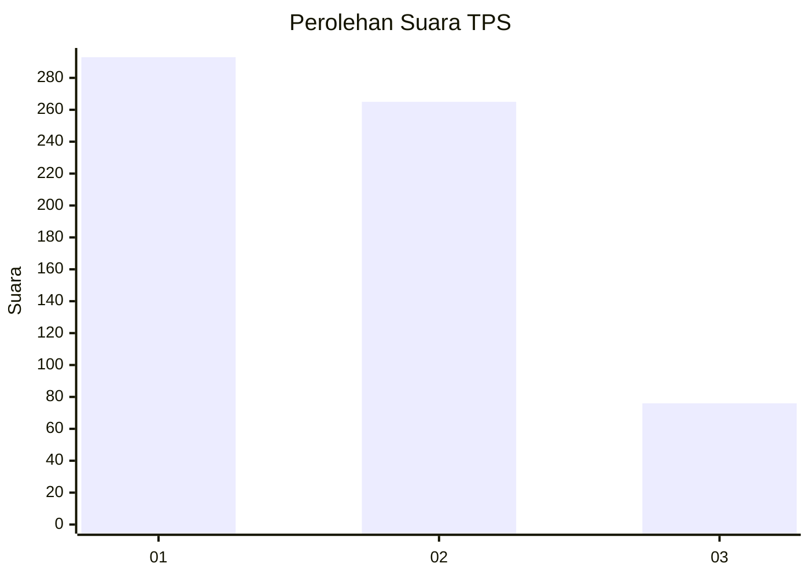
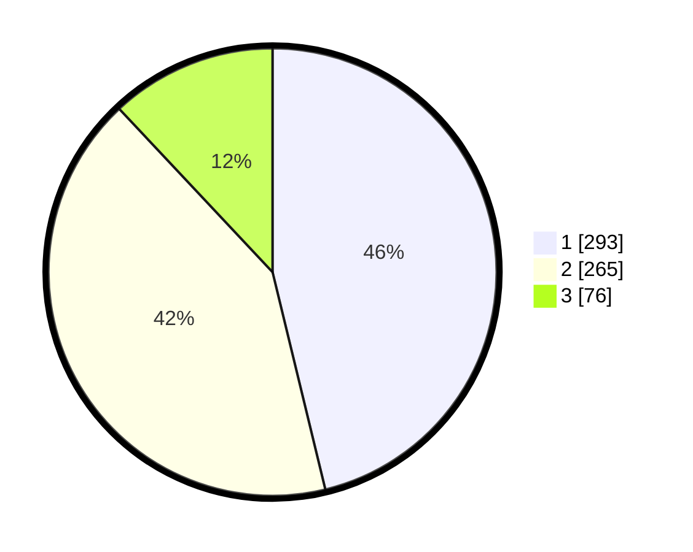

# Hasil

## Grafik

## Tabel

| No. | Nama Paslon    | Suara | Suara (raw) | Persentase |
|:--- |:-------------- | -----:| -----------:| ----------:|
| 1   | ANIES MUHAIMIN | 293   | [293][p-1]  | 46,21      |
| 2   | PRABOWO GIBRAN | 265   | [265][p-2]  | 41,80      |
| 3   | GANJAR MAHFUD  | 76    | [76][p-3]   | 11,99      |

[p-1]: https://github.com/gigit-pemilu/pemilu-2024-99-luar-negeri/blob/main/pilpres/hitung-suara/sub/99-luar-negeri/sub/98-riyadh-arab-saudi/sub/01-riyadh-arab-saudi/sub/0001-riyadh-arab-saudi/sub/002-tps-001/sub/paslon-1.txt
[p-2]: https://github.com/gigit-pemilu/pemilu-2024-99-luar-negeri/blob/main/pilpres/hitung-suara/sub/99-luar-negeri/sub/98-riyadh-arab-saudi/sub/01-riyadh-arab-saudi/sub/0001-riyadh-arab-saudi/sub/002-tps-001/sub/paslon-2.txt
[p-3]: https://github.com/gigit-pemilu/pemilu-2024-99-luar-negeri/blob/main/pilpres/hitung-suara/sub/99-luar-negeri/sub/98-riyadh-arab-saudi/sub/01-riyadh-arab-saudi/sub/0001-riyadh-arab-saudi/sub/002-tps-001/sub/paslon-3.txt

## Foto C Plano

https://sirekap-obj-formc.kpu.go.id/8926/pemilu/ppwp/99/98/01/00/01/9998010001002-20240214-185538--b4eb890c-3889-4760-a5d3-dfd7eb83606d.jpg

https://sirekap-obj-formc.kpu.go.id/8926/pemilu/ppwp/99/98/01/00/01/9998010001002-20240214-185601--28080bc4-271e-47ca-b59c-95d80c38adcc.jpg

https://sirekap-obj-formc.kpu.go.id/8926/pemilu/ppwp/99/98/01/00/01/9998010001002-20240214-185622--1943afd1-5d6d-4b75-9f48-3b166e245b15.jpg

## Metadata

| Key        | Value               |
| ---------- | ------------------- |
| Time Stamp | 2024-02-15 03:06:03 |

## DATA PEMILIH TETAP

Jumlah pemilih dalam DPT: **3005**.
 * L: **1300**.
 * P: **1705**.

## DATA PENGGUNA HAK PILIH

Jumlah pengguna hak pilih dalam DPT: **269**.
 * L: **215**.
 * P: **54**.

Jumlah pengguna hak pilih dalam DPTb: **51**.
 * L: **22**.
 * P: **29**.

Jumlah pengguna hak pilih dalam DPK: **325**.
 * L: **147**.
 * P: **178**.

Jumlah pengguna hak pilih: **645**.
 * L: **384**.
 * P: **261**.

## JUMLAH SUARA SAH DAN TIDAK SAH

JUMLAH SELURUH SUARA SAH: **634**.

JUMLAH SUARA TIDAK SAH: **11**.

JUMLAH SELURUH SUARA SAH DAN SUARA TIDAK SAH: **645**.

