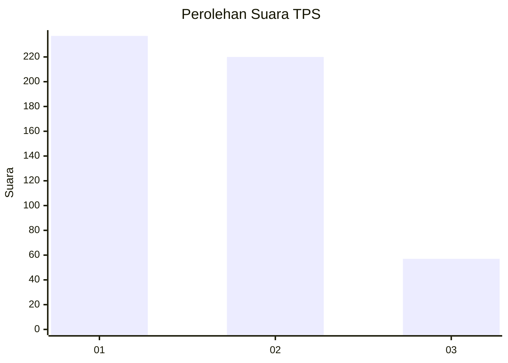
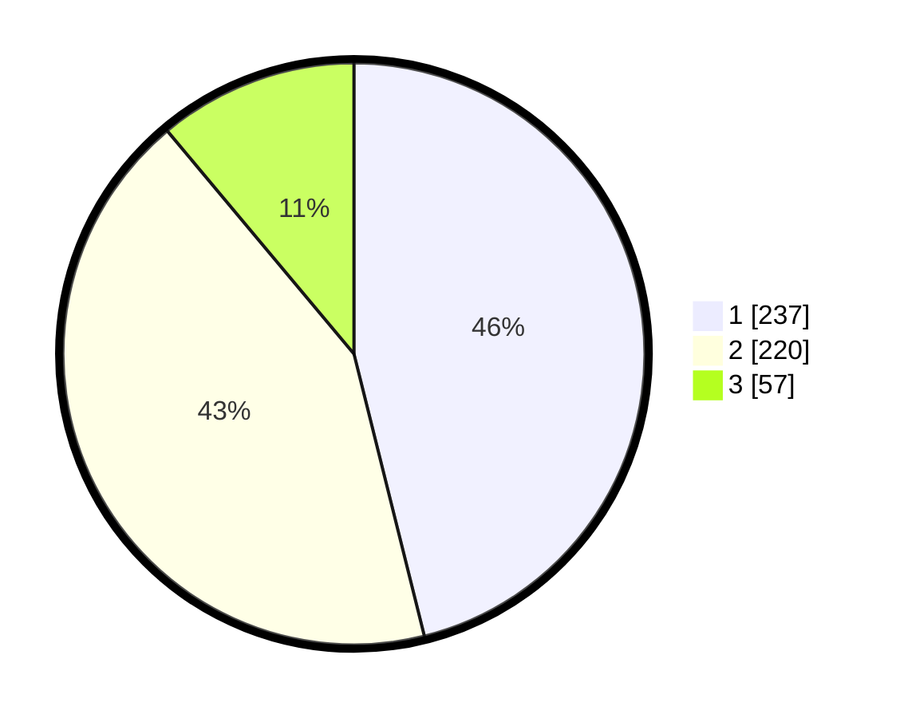

# Hasil

## Grafik

## Tabel

| No. | Nama Paslon    | Suara | Suara (raw) | Persentase |
|:--- |:-------------- | -----:| -----------:| ----------:|
| 1   | ANIES MUHAIMIN | 237   | [237][p-1]  | 46,11      |
| 2   | PRABOWO GIBRAN | 220   | [220][p-2]  | 42,80      |
| 3   | GANJAR MAHFUD  | 57    | [57][p-3]   | 11,09      |

[p-1]: https://github.com/gigit-pemilu/pemilu-2024-99-luar-negeri/blob/main/pilpres/hitung-suara/sub/99-luar-negeri/sub/98-riyadh-arab-saudi/sub/01-riyadh-arab-saudi/sub/0001-riyadh-arab-saudi/sub/003-tps-002/sub/paslon-1.txt
[p-2]: https://github.com/gigit-pemilu/pemilu-2024-99-luar-negeri/blob/main/pilpres/hitung-suara/sub/99-luar-negeri/sub/98-riyadh-arab-saudi/sub/01-riyadh-arab-saudi/sub/0001-riyadh-arab-saudi/sub/003-tps-002/sub/paslon-2.txt
[p-3]: https://github.com/gigit-pemilu/pemilu-2024-99-luar-negeri/blob/main/pilpres/hitung-suara/sub/99-luar-negeri/sub/98-riyadh-arab-saudi/sub/01-riyadh-arab-saudi/sub/0001-riyadh-arab-saudi/sub/003-tps-002/sub/paslon-3.txt

## Foto C Plano

https://sirekap-obj-formc.kpu.go.id/1ebd/pemilu/ppwp/99/98/01/00/01/9998010001003-20240215-001114--678b6a7e-93a7-4789-a5f8-c6d1f1ffe1e2.jpg

https://sirekap-obj-formc.kpu.go.id/1ebd/pemilu/ppwp/99/98/01/00/01/9998010001003-20240215-001242--4c32045a-cd63-43eb-814d-bcd075dba17c.jpg

https://sirekap-obj-formc.kpu.go.id/1ebd/pemilu/ppwp/99/98/01/00/01/9998010001003-20240216-214127--1c81ae03-176d-4c19-8684-4588c345de6f.jpg

## Metadata

| Key        | Value               |
| ---------- | ------------------- |
| Time Stamp | 2024-02-19 06:16:00 |

## DATA PEMILIH TETAP

Jumlah pemilih dalam DPT: **2783**.
 * L: **607**.
 * P: **2176**.

## DATA PENGGUNA HAK PILIH

Jumlah pengguna hak pilih dalam DPT: **245**.
 * L: **145**.
 * P: **100**.

Jumlah pengguna hak pilih dalam DPTb: **53**.
 * L: **19**.
 * P: **34**.

Jumlah pengguna hak pilih dalam DPK: **229**.
 * L: **89**.
 * P: **140**.

Jumlah pengguna hak pilih: **527**.
 * L: **253**.
 * P: **274**.

## JUMLAH SUARA SAH DAN TIDAK SAH

JUMLAH SELURUH SUARA SAH: **514**.

JUMLAH SUARA TIDAK SAH: **13**.

JUMLAH SELURUH SUARA SAH DAN SUARA TIDAK SAH: **527**.

