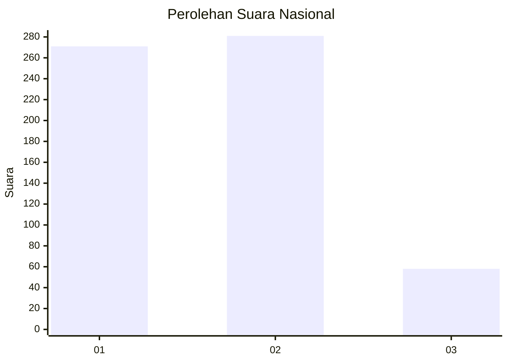
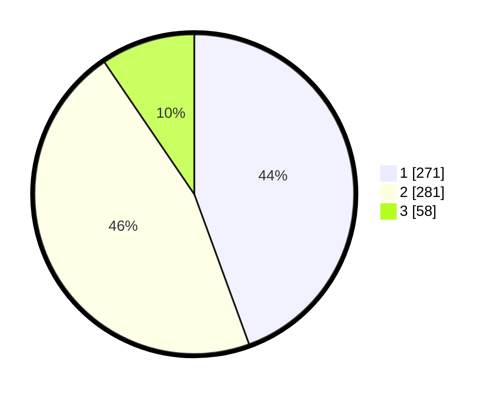

# Hasil

## Grafik

## Tabel

| No. | Nama Paslon    | Suara | Suara (raw) | Persentase |
|:--- |:-------------- | -----:| -----------:| ----------:|
| 1   | ANIES MUHAIMIN | 271   | [271][p-1]  | 44,43      |
| 2   | PRABOWO GIBRAN | 281   | [281][p-2]  | 46,07      |
| 3   | GANJAR MAHFUD  | 58    | [58][p-3]   | 9,51       |

[p-1]: https://github.com/gigit-pemilu/pemilu-2024/blob/main/pilpres/hitung-suara/sub/99-luar-negeri/sub/98-riyadh-arab-saudi/sub/01-riyadh-arab-saudi/sub/0001-riyadh-arab-saudi/sub/004-tps-003/sub/paslon-1.txt
[p-2]: https://github.com/gigit-pemilu/pemilu-2024/blob/main/pilpres/hitung-suara/sub/99-luar-negeri/sub/98-riyadh-arab-saudi/sub/01-riyadh-arab-saudi/sub/0001-riyadh-arab-saudi/sub/004-tps-003/sub/paslon-2.txt
[p-3]: https://github.com/gigit-pemilu/pemilu-2024/blob/main/pilpres/hitung-suara/sub/99-luar-negeri/sub/98-riyadh-arab-saudi/sub/01-riyadh-arab-saudi/sub/0001-riyadh-arab-saudi/sub/004-tps-003/sub/paslon-3.txt

## Foto C Plano

https://sirekap-obj-formc.kpu.go.id/3b20/pemilu/ppwp/99/98/01/00/01/9998010001004-20240216-192352--4695c091-d199-409b-9daa-924034017961.jpg

https://sirekap-obj-formc.kpu.go.id/3b20/pemilu/ppwp/99/98/01/00/01/9998010001004-20240216-192955--68dcf2f8-9c2a-45af-bf0b-4cdc2a45a446.jpg

https://sirekap-obj-formc.kpu.go.id/3b20/pemilu/ppwp/99/98/01/00/01/9998010001004-20240216-193225--c24f7043-ff7b-445d-b156-aac4e06dcfc5.jpg

## Metadata

| Key        | Value               |
| ---------- | ------------------- |
| Time Stamp | 2024-02-16 21:01:00 |

## DATA PEMILIH TETAP

Jumlah pemilih dalam DPT: **1899**.
 * L: **455**.
 * P: **1444**.

## DATA PENGGUNA HAK PILIH

Jumlah pengguna hak pilih dalam DPT: **168**.
 * L: **78**.
 * P: **90**.

Jumlah pengguna hak pilih dalam DPTb: **103**.
 * L: **50**.
 * P: **53**.

Jumlah pengguna hak pilih dalam DPK: **346**.
 * L: **155**.
 * P: **191**.

Jumlah pengguna hak pilih: **617**.
 * L: **283**.
 * P: **334**.

## JUMLAH SUARA SAH DAN TIDAK SAH

JUMLAH SELURUH SUARA SAH: **610**.

JUMLAH SUARA TIDAK SAH: **7**.

JUMLAH SELURUH SUARA SAH DAN SUARA TIDAK SAH: **617**.

