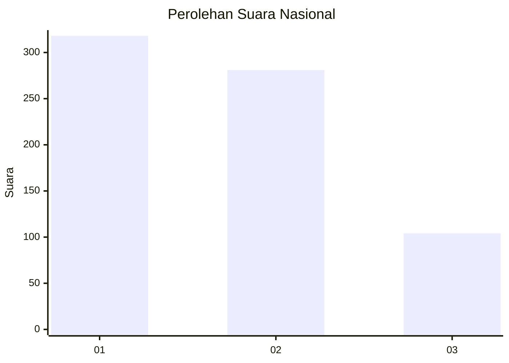
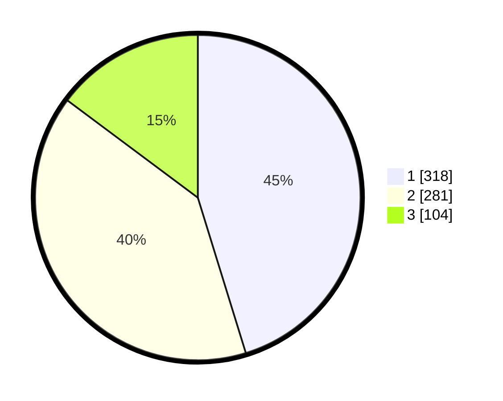

# Hasil

## Grafik

## Tabel

| No. | Nama Paslon    | Suara | Suara (raw) | Persentase |
|:--- |:-------------- | -----:| -----------:| ----------:|
| 1   | ANIES MUHAIMIN | 318   | [318][p-1]  | 45,23      |
| 2   | PRABOWO GIBRAN | 281   | [281][p-2]  | 39,97      |
| 3   | GANJAR MAHFUD  | 104   | [104][p-3]  | 14,79      |

[p-1]: https://github.com/gigit-pemilu/pemilu-2024/blob/main/pilpres/hitung-suara/sub/99-luar-negeri/sub/98-riyadh-arab-saudi/sub/01-riyadh-arab-saudi/sub/0001-riyadh-arab-saudi/sub/005-tps-004/sub/paslon-1.txt
[p-2]: https://github.com/gigit-pemilu/pemilu-2024/blob/main/pilpres/hitung-suara/sub/99-luar-negeri/sub/98-riyadh-arab-saudi/sub/01-riyadh-arab-saudi/sub/0001-riyadh-arab-saudi/sub/005-tps-004/sub/paslon-2.txt
[p-3]: https://github.com/gigit-pemilu/pemilu-2024/blob/main/pilpres/hitung-suara/sub/99-luar-negeri/sub/98-riyadh-arab-saudi/sub/01-riyadh-arab-saudi/sub/0001-riyadh-arab-saudi/sub/005-tps-004/sub/paslon-3.txt

## Foto C Plano

https://sirekap-obj-formc.kpu.go.id/0afe/pemilu/ppwp/99/98/01/00/01/9998010001005-20240214-184701--7fbfc115-23b8-4eac-a457-33c2805644a4.jpg

https://sirekap-obj-formc.kpu.go.id/0afe/pemilu/ppwp/99/98/01/00/01/9998010001005-20240216-200229--fcdbaf8e-6cb9-44cf-9cad-fdfbaf6f1523.jpg

https://sirekap-obj-formc.kpu.go.id/0afe/pemilu/ppwp/99/98/01/00/01/9998010001005-20240214-184724--af4142e5-0731-44e8-9310-f52ac60bcf8b.jpg

## Metadata

| Key        | Value               |
| ---------- | ------------------- |
| Time Stamp | 2024-02-19 17:00:00 |

## DATA PEMILIH TETAP

Jumlah pemilih dalam DPT: **1933**.
 * L: **596**.
 * P: **1337**.

## DATA PENGGUNA HAK PILIH

Jumlah pengguna hak pilih dalam DPT: **285**.
 * L: **164**.
 * P: **121**.

Jumlah pengguna hak pilih dalam DPTb: **91**.
 * L: **36**.
 * P: **55**.

Jumlah pengguna hak pilih dalam DPK: **333**.
 * L: **158**.
 * P: **175**.

Jumlah pengguna hak pilih: **709**.
 * L: **358**.
 * P: **351**.

## JUMLAH SUARA SAH DAN TIDAK SAH

JUMLAH SELURUH SUARA SAH: **703**.

JUMLAH SUARA TIDAK SAH: **6**.

JUMLAH SELURUH SUARA SAH DAN SUARA TIDAK SAH: **709**.

