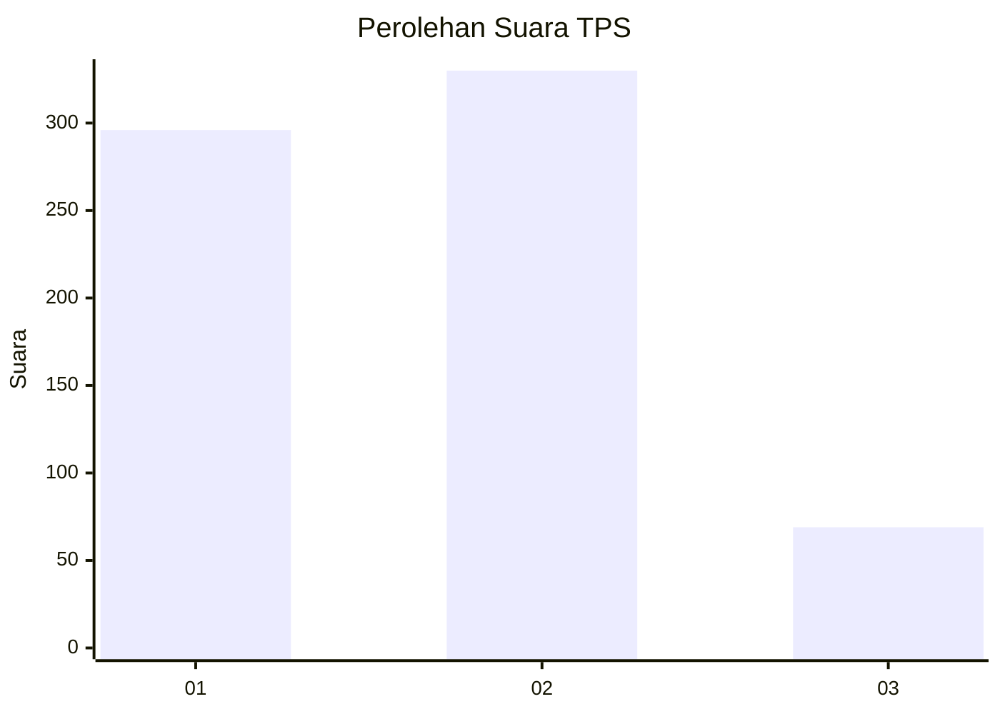
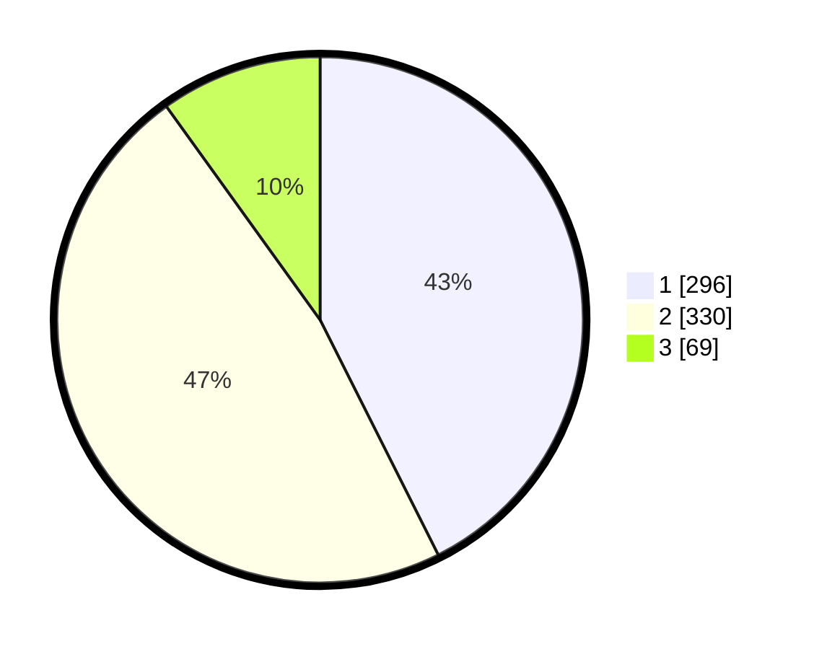

# Hasil

## Grafik

## Tabel

| No. | Nama Paslon    | Suara | Suara (raw) | Persentase |
|:--- |:-------------- | -----:| -----------:| ----------:|
| 1   | ANIES MUHAIMIN | 296   | [296][p-1]  | 42,59      |
| 2   | PRABOWO GIBRAN | 330   | [330][p-2]  | 47,48      |
| 3   | GANJAR MAHFUD  | 69    | [69][p-3]   | 9,93       |

[p-1]: https://github.com/gigit-pemilu/pemilu-2024-99-luar-negeri/blob/main/pilpres/hitung-suara/sub/99-luar-negeri/sub/98-riyadh-arab-saudi/sub/01-riyadh-arab-saudi/sub/0001-riyadh-arab-saudi/sub/006-tps-005/sub/paslon-1.txt
[p-2]: https://github.com/gigit-pemilu/pemilu-2024-99-luar-negeri/blob/main/pilpres/hitung-suara/sub/99-luar-negeri/sub/98-riyadh-arab-saudi/sub/01-riyadh-arab-saudi/sub/0001-riyadh-arab-saudi/sub/006-tps-005/sub/paslon-2.txt
[p-3]: https://github.com/gigit-pemilu/pemilu-2024-99-luar-negeri/blob/main/pilpres/hitung-suara/sub/99-luar-negeri/sub/98-riyadh-arab-saudi/sub/01-riyadh-arab-saudi/sub/0001-riyadh-arab-saudi/sub/006-tps-005/sub/paslon-3.txt

## Foto C Plano

https://sirekap-obj-formc.kpu.go.id/5e12/pemilu/ppwp/99/98/01/00/01/9998010001006-20240216-122700--d7d5d65c-a25c-4e4b-b800-fca3af4bc915.jpg

https://sirekap-obj-formc.kpu.go.id/5e12/pemilu/ppwp/99/98/01/00/01/9998010001006-20240216-122701--ab43ecf2-5558-4dcd-b067-cc8aafc744c6.jpg

https://sirekap-obj-formc.kpu.go.id/5e12/pemilu/ppwp/99/98/01/00/01/9998010001006-20240216-122701--e03bb5fd-36dd-46c6-b6de-d64ac112ffdd.jpg

## Metadata

| Key        | Value               |
| ---------- | ------------------- |
| Time Stamp | 2024-02-19 17:00:00 |

## DATA PEMILIH TETAP

Jumlah pemilih dalam DPT: **2377**.
 * L: **530**.
 * P: **1847**.

## DATA PENGGUNA HAK PILIH

Jumlah pengguna hak pilih dalam DPT: **204**.
 * L: **111**.
 * P: **93**.

Jumlah pengguna hak pilih dalam DPTb: **68**.
 * L: **20**.
 * P: **48**.

Jumlah pengguna hak pilih dalam DPK: **434**.
 * L: **183**.
 * P: **251**.

Jumlah pengguna hak pilih: **706**.
 * L: **314**.
 * P: **392**.

## JUMLAH SUARA SAH DAN TIDAK SAH

JUMLAH SELURUH SUARA SAH: **695**.

JUMLAH SUARA TIDAK SAH: **11**.

JUMLAH SELURUH SUARA SAH DAN SUARA TIDAK SAH: **706**.

