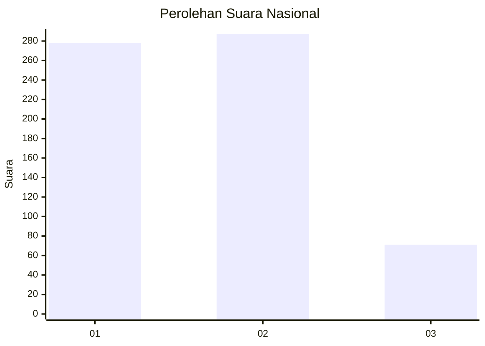
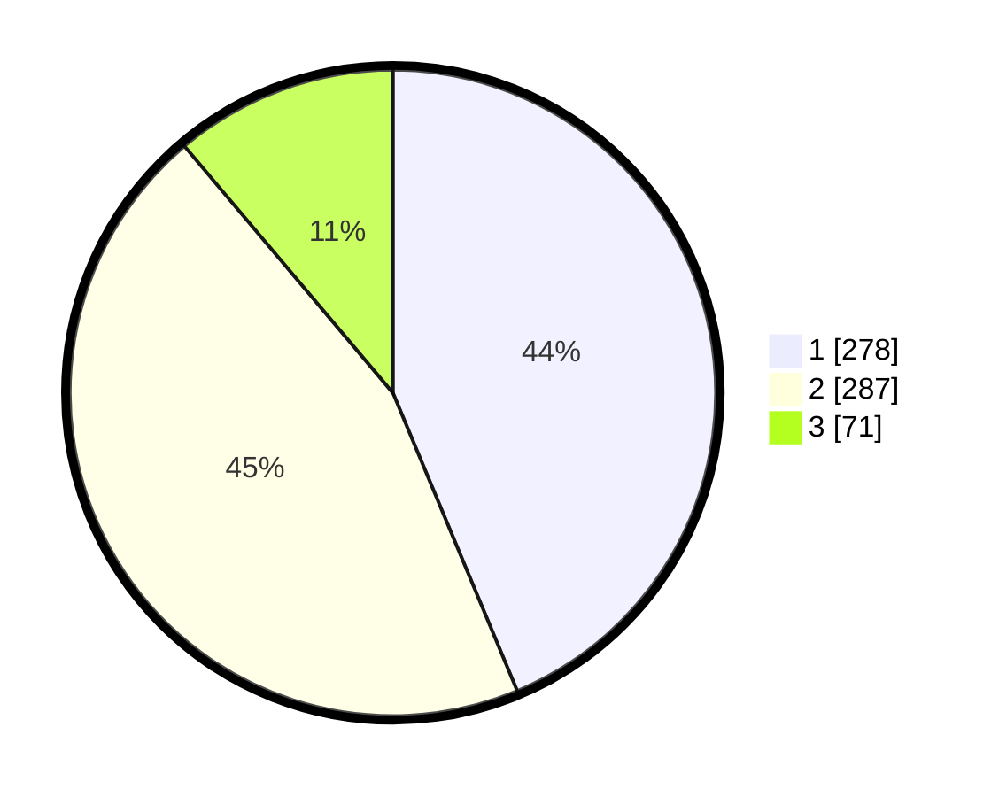

# Hasil

## Grafik

## Tabel

| No. | Nama Paslon    | Suara | Suara (raw) | Persentase |
|:--- |:-------------- | -----:| -----------:| ----------:|
| 1   | ANIES MUHAIMIN | 278   | [278][p-1]  | 43,71      |
| 2   | PRABOWO GIBRAN | 287   | [287][p-2]  | 45,13      |
| 3   | GANJAR MAHFUD  | 71    | [71][p-3]   | 11,16      |

[p-1]: https://github.com/gigit-pemilu/pemilu-2024/blob/main/pilpres/hitung-suara/sub/99-luar-negeri/sub/98-riyadh-arab-saudi/sub/01-riyadh-arab-saudi/sub/0001-riyadh-arab-saudi/sub/007-tps-006/sub/paslon-1.txt
[p-2]: https://github.com/gigit-pemilu/pemilu-2024/blob/main/pilpres/hitung-suara/sub/99-luar-negeri/sub/98-riyadh-arab-saudi/sub/01-riyadh-arab-saudi/sub/0001-riyadh-arab-saudi/sub/007-tps-006/sub/paslon-2.txt
[p-3]: https://github.com/gigit-pemilu/pemilu-2024/blob/main/pilpres/hitung-suara/sub/99-luar-negeri/sub/98-riyadh-arab-saudi/sub/01-riyadh-arab-saudi/sub/0001-riyadh-arab-saudi/sub/007-tps-006/sub/paslon-3.txt

## Foto C Plano

https://sirekap-obj-formc.kpu.go.id/bb6b/pemilu/ppwp/99/98/01/00/01/9998010001007-20240215-003010--17044c8d-3600-440a-8784-48bc44fb10b2.jpg

https://sirekap-obj-formc.kpu.go.id/bb6b/pemilu/ppwp/99/98/01/00/01/9998010001007-20240215-003049--86940c2b-116e-40a3-be5e-a4a020e83ce7.jpg

https://sirekap-obj-formc.kpu.go.id/bb6b/pemilu/ppwp/99/98/01/00/01/9998010001007-20240216-231556--0be9068e-869a-4db2-8314-10379dd3e76c.jpg

## Metadata

| Key        | Value               |
| ---------- | ------------------- |
| Time Stamp | 2024-02-16 23:30:00 |

## DATA PEMILIH TETAP

Jumlah pemilih dalam DPT: **1910**.
 * L: **434**.
 * P: **1476**.

## DATA PENGGUNA HAK PILIH

Jumlah pengguna hak pilih dalam DPT: **210**.
 * L: **122**.
 * P: **88**.

Jumlah pengguna hak pilih dalam DPTb: **72**.
 * L: **30**.
 * P: **42**.

Jumlah pengguna hak pilih dalam DPK: **362**.
 * L: **149**.
 * P: **213**.

Jumlah pengguna hak pilih: **644**.
 * L: **301**.
 * P: **343**.

## JUMLAH SUARA SAH DAN TIDAK SAH

JUMLAH SELURUH SUARA SAH: **636**.

JUMLAH SUARA TIDAK SAH: **8**.

JUMLAH SELURUH SUARA SAH DAN SUARA TIDAK SAH: **644**.

