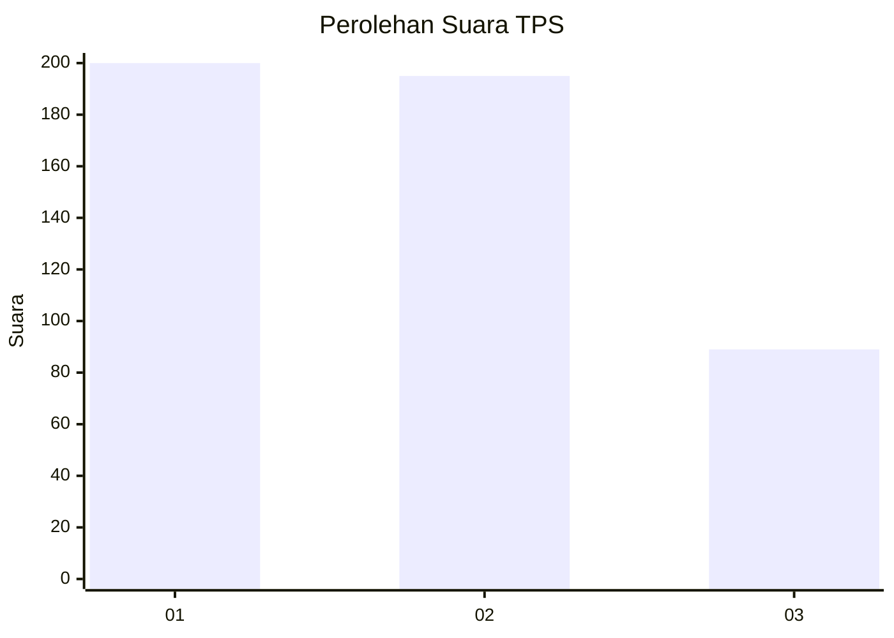
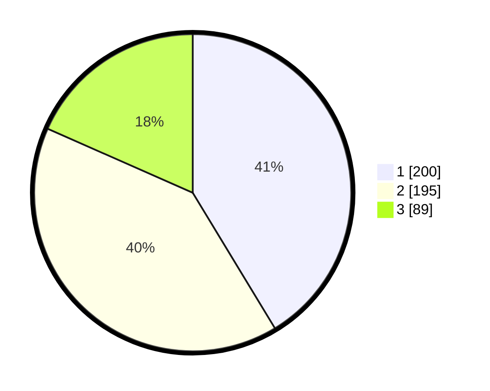

# Hasil

## Grafik

## Tabel

| No. | Nama Paslon    | Suara | Suara (raw) | Persentase |
|:--- |:-------------- | -----:| -----------:| ----------:|
| 1   | ANIES MUHAIMIN | 200   | [200][p-1]  | 41,32      |
| 2   | PRABOWO GIBRAN | 195   | [195][p-2]  | 40,29      |
| 3   | GANJAR MAHFUD  | 89    | [89][p-3]   | 18,39      |

[p-1]: https://github.com/gigit-pemilu/pemilu-2024-99-luar-negeri/blob/main/pilpres/hitung-suara/sub/99-luar-negeri/sub/98-riyadh-arab-saudi/sub/01-riyadh-arab-saudi/sub/0001-riyadh-arab-saudi/sub/008-tps-007/sub/paslon-1.txt
[p-2]: https://github.com/gigit-pemilu/pemilu-2024-99-luar-negeri/blob/main/pilpres/hitung-suara/sub/99-luar-negeri/sub/98-riyadh-arab-saudi/sub/01-riyadh-arab-saudi/sub/0001-riyadh-arab-saudi/sub/008-tps-007/sub/paslon-2.txt
[p-3]: https://github.com/gigit-pemilu/pemilu-2024-99-luar-negeri/blob/main/pilpres/hitung-suara/sub/99-luar-negeri/sub/98-riyadh-arab-saudi/sub/01-riyadh-arab-saudi/sub/0001-riyadh-arab-saudi/sub/008-tps-007/sub/paslon-3.txt

## Foto C Plano

https://sirekap-obj-formc.kpu.go.id/3883/pemilu/ppwp/99/98/01/00/01/9998010001008-20240214-232726--769ee660-7273-4c62-a3a6-1e1ac0ef4b57.jpg

https://sirekap-obj-formc.kpu.go.id/3883/pemilu/ppwp/99/98/01/00/01/9998010001008-20240214-232829--b5ed4cd1-4bbb-4df8-85df-801218a53754.jpg

https://sirekap-obj-formc.kpu.go.id/3883/pemilu/ppwp/99/98/01/00/01/9998010001008-20240214-232913--9b6b3914-d178-4f2d-bf3c-7f7e27c103a5.jpg

## Metadata

| Key        | Value               |
| ---------- | ------------------- |
| Time Stamp | 2024-02-15 18:30:25 |

## DATA PEMILIH TETAP

Jumlah pemilih dalam DPT: **1925**.
 * L: **396**.
 * P: **1529**.

## DATA PENGGUNA HAK PILIH

Jumlah pengguna hak pilih dalam DPT: **161**.
 * L: **95**.
 * P: **66**.

Jumlah pengguna hak pilih dalam DPTb: **78**.
 * L: **45**.
 * P: **33**.

Jumlah pengguna hak pilih dalam DPK: **251**.
 * L: **119**.
 * P: **132**.

Jumlah pengguna hak pilih: **490**.
 * L: **259**.
 * P: **231**.

## JUMLAH SUARA SAH DAN TIDAK SAH

JUMLAH SELURUH SUARA SAH: **484**.

JUMLAH SUARA TIDAK SAH: **6**.

JUMLAH SELURUH SUARA SAH DAN SUARA TIDAK SAH: **490**.

