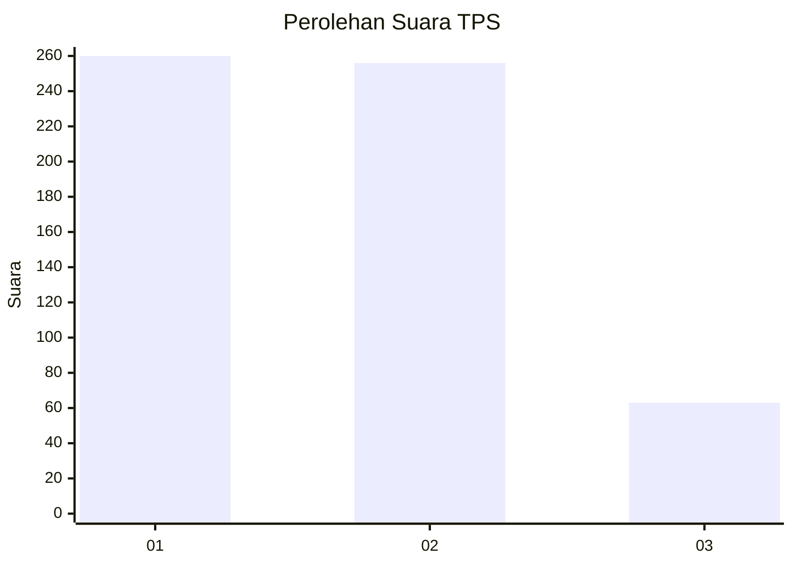
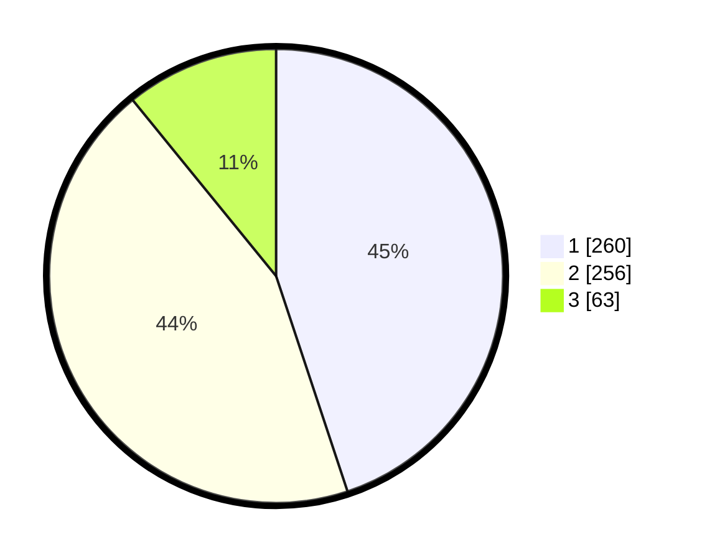

# Hasil

## Grafik

## Tabel

| No. | Nama Paslon    | Suara | Suara (raw) | Persentase |
|:--- |:-------------- | -----:| -----------:| ----------:|
| 1   | ANIES MUHAIMIN | 260   | [260][p-1]  | 44,91      |
| 2   | PRABOWO GIBRAN | 256   | [256][p-2]  | 44,21      |
| 3   | GANJAR MAHFUD  | 63    | [63][p-3]   | 10,88      |

[p-1]: https://github.com/gigit-pemilu/pemilu-2024-99-luar-negeri/blob/main/pilpres/hitung-suara/sub/99-luar-negeri/sub/98-riyadh-arab-saudi/sub/01-riyadh-arab-saudi/sub/0001-riyadh-arab-saudi/sub/009-tps-008/sub/paslon-1.txt
[p-2]: https://github.com/gigit-pemilu/pemilu-2024-99-luar-negeri/blob/main/pilpres/hitung-suara/sub/99-luar-negeri/sub/98-riyadh-arab-saudi/sub/01-riyadh-arab-saudi/sub/0001-riyadh-arab-saudi/sub/009-tps-008/sub/paslon-2.txt
[p-3]: https://github.com/gigit-pemilu/pemilu-2024-99-luar-negeri/blob/main/pilpres/hitung-suara/sub/99-luar-negeri/sub/98-riyadh-arab-saudi/sub/01-riyadh-arab-saudi/sub/0001-riyadh-arab-saudi/sub/009-tps-008/sub/paslon-3.txt

## Foto C Plano

https://sirekap-obj-formc.kpu.go.id/1c8c/pemilu/ppwp/99/98/01/00/01/9998010001009-20240214-230038--88f33cc0-758e-4aee-aacf-37857782af06.jpg

https://sirekap-obj-formc.kpu.go.id/1c8c/pemilu/ppwp/99/98/01/00/01/9998010001009-20240214-230139--12bf7716-a478-441e-9058-ee1f77ab002d.jpg

https://sirekap-obj-formc.kpu.go.id/1c8c/pemilu/ppwp/99/98/01/00/01/9998010001009-20240214-230313--114b310d-77a9-4caf-ad9d-99a58b3f2351.jpg

## Metadata

| Key        | Value               |
| ---------- | ------------------- |
| Time Stamp | 2024-02-19 06:16:00 |

## DATA PEMILIH TETAP

Jumlah pemilih dalam DPT: **2432**.
 * L: **580**.
 * P: **1852**.

## DATA PENGGUNA HAK PILIH

Jumlah pengguna hak pilih dalam DPT: **209**.
 * L: **126**.
 * P: **83**.

Jumlah pengguna hak pilih dalam DPTb: **45**.
 * L: **16**.
 * P: **29**.

Jumlah pengguna hak pilih dalam DPK: **329**.
 * L: **149**.
 * P: **180**.

Jumlah pengguna hak pilih: **583**.
 * L: **291**.
 * P: **292**.

## JUMLAH SUARA SAH DAN TIDAK SAH

JUMLAH SELURUH SUARA SAH: **579**.

JUMLAH SUARA TIDAK SAH: **4**.

JUMLAH SELURUH SUARA SAH DAN SUARA TIDAK SAH: **583**.

