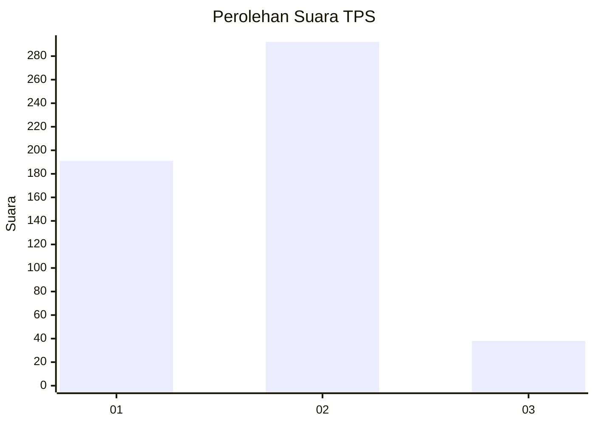

# Hasil

## Grafik

## Tabel

| No. | Nama Paslon    | Suara | Suara (raw) | Persentase |
|:--- |:-------------- | -----:| -----------:| ----------:|
| 1   | ANIES MUHAIMIN | 191   | [191][p-1]  | 36,66      |
| 2   | PRABOWO GIBRAN | 292   | [292][p-2]  | 56,05      |
| 3   | GANJAR MAHFUD  | 38    | [38][p-3]   | 7,29       |

[p-1]: https://github.com/gigit-pemilu/pemilu-2024-99-luar-negeri/blob/main/pilpres/hitung-suara/sub/99-luar-negeri/sub/98-riyadh-arab-saudi/sub/01-riyadh-arab-saudi/sub/0001-riyadh-arab-saudi/sub/010-tps-009/sub/paslon-1.txt
[p-2]: https://github.com/gigit-pemilu/pemilu-2024-99-luar-negeri/blob/main/pilpres/hitung-suara/sub/99-luar-negeri/sub/98-riyadh-arab-saudi/sub/01-riyadh-arab-saudi/sub/0001-riyadh-arab-saudi/sub/010-tps-009/sub/paslon-2.txt
[p-3]: https://github.com/gigit-pemilu/pemilu-2024-99-luar-negeri/blob/main/pilpres/hitung-suara/sub/99-luar-negeri/sub/98-riyadh-arab-saudi/sub/01-riyadh-arab-saudi/sub/0001-riyadh-arab-saudi/sub/010-tps-009/sub/paslon-3.txt

## Foto C Plano

https://sirekap-obj-formc.kpu.go.id/bea5/pemilu/ppwp/99/98/01/00/01/9998010001010-20240215-013011--84a909d0-f3c0-40ad-b9a7-3557782eef69.jpg

https://sirekap-obj-formc.kpu.go.id/bea5/pemilu/ppwp/99/98/01/00/01/9998010001010-20240215-013033--c27ecff4-bec7-4481-a5a7-57fd21b5cbb9.jpg

https://sirekap-obj-formc.kpu.go.id/bea5/pemilu/ppwp/99/98/01/00/01/9998010001010-20240215-001301--14cae220-4a65-4aec-bd25-8e0c77103dfa.jpg

## Metadata

| Key        | Value               |
| ---------- | ------------------- |
| Time Stamp | 2024-02-19 06:16:00 |

## DATA PEMILIH TETAP

Jumlah pemilih dalam DPT: **3010**.
 * L: **272**.
 * P: **2738**.

## DATA PENGGUNA HAK PILIH

Jumlah pengguna hak pilih dalam DPT: **324**.
 * L: **75**.
 * P: **249**.

Jumlah pengguna hak pilih dalam DPTb: **29**.
 * L: **5**.
 * P: **24**.

Jumlah pengguna hak pilih dalam DPK: **188**.
 * L: **65**.
 * P: **123**.

Jumlah pengguna hak pilih: **541**.
 * L: **145**.
 * P: **396**.

## JUMLAH SUARA SAH DAN TIDAK SAH

JUMLAH SELURUH SUARA SAH: **521**.

JUMLAH SUARA TIDAK SAH: **20**.

JUMLAH SELURUH SUARA SAH DAN SUARA TIDAK SAH: **541**.

