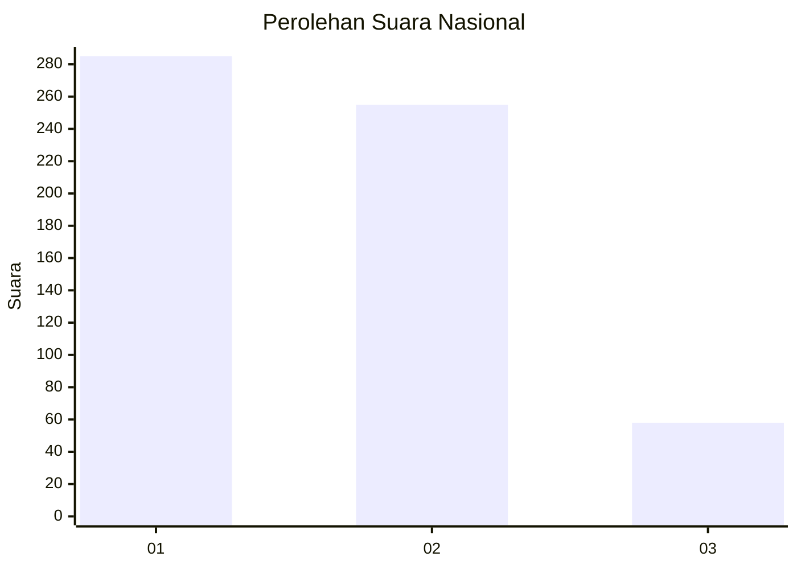
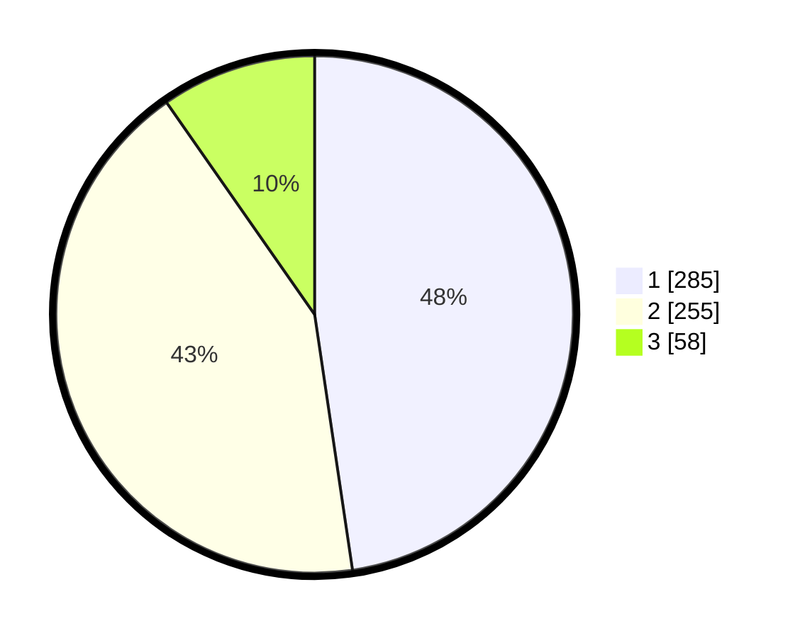

# Hasil

## Grafik

## Tabel

| No. | Nama Paslon    | Suara | Suara (raw) | Persentase |
|:--- |:-------------- | -----:| -----------:| ----------:|
| 1   | ANIES MUHAIMIN | 285   | [285][p-1]  | 47,66      |
| 2   | PRABOWO GIBRAN | 255   | [255][p-2]  | 42,64      |
| 3   | GANJAR MAHFUD  | 58    | [58][p-3]   | 9,70       |

[p-1]: https://github.com/gigit-pemilu/pemilu-2024/blob/main/pilpres/hitung-suara/sub/99-luar-negeri/sub/98-riyadh-arab-saudi/sub/01-riyadh-arab-saudi/sub/0001-riyadh-arab-saudi/sub/011-ksk-001/sub/paslon-1.txt
[p-2]: https://github.com/gigit-pemilu/pemilu-2024/blob/main/pilpres/hitung-suara/sub/99-luar-negeri/sub/98-riyadh-arab-saudi/sub/01-riyadh-arab-saudi/sub/0001-riyadh-arab-saudi/sub/011-ksk-001/sub/paslon-2.txt
[p-3]: https://github.com/gigit-pemilu/pemilu-2024/blob/main/pilpres/hitung-suara/sub/99-luar-negeri/sub/98-riyadh-arab-saudi/sub/01-riyadh-arab-saudi/sub/0001-riyadh-arab-saudi/sub/011-ksk-001/sub/paslon-3.txt

## Foto C Plano

https://sirekap-obj-formc.kpu.go.id/4971/pemilu/ppwp/99/98/01/00/01/9998010001011-20240215-000955--c430824a-57ea-4e8c-8822-c29f357bbd5f.jpg

https://sirekap-obj-formc.kpu.go.id/4971/pemilu/ppwp/99/98/01/00/01/9998010001011-20240219-222617--6682f538-a090-42d0-9f5e-96a78a88d488.jpg

https://sirekap-obj-formc.kpu.go.id/4971/pemilu/ppwp/99/98/01/00/01/9998010001011-20240215-034524--fae53037-b8e7-4436-9a77-d7f7d3738150.jpg

## Metadata

| Key        | Value               |
| ---------- | ------------------- |
| Time Stamp | 2024-02-21 18:00:00 |

## DATA PEMILIH TETAP

Jumlah pemilih dalam DPT: **2785**.
 * L: **866**.
 * P: **1919**.

## DATA PENGGUNA HAK PILIH

Jumlah pengguna hak pilih dalam DPT: **291**.
 * L: **207**.
 * P: **84**.

Jumlah pengguna hak pilih dalam DPTb: **97**.
 * L: **37**.
 * P: **60**.

Jumlah pengguna hak pilih dalam DPK: **220**.
 * L: **125**.
 * P: **95**.

Jumlah pengguna hak pilih: **608**.
 * L: **369**.
 * P: **239**.

## JUMLAH SUARA SAH DAN TIDAK SAH

JUMLAH SELURUH SUARA SAH: **598**.

JUMLAH SUARA TIDAK SAH: **10**.

JUMLAH SELURUH SUARA SAH DAN SUARA TIDAK SAH: **608**.

