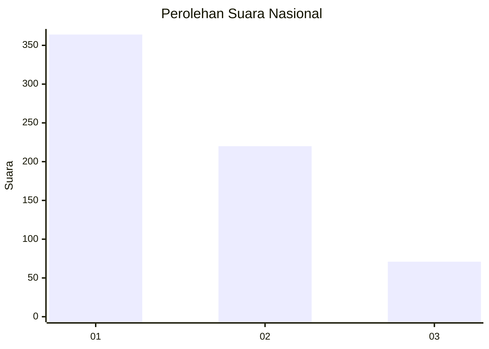
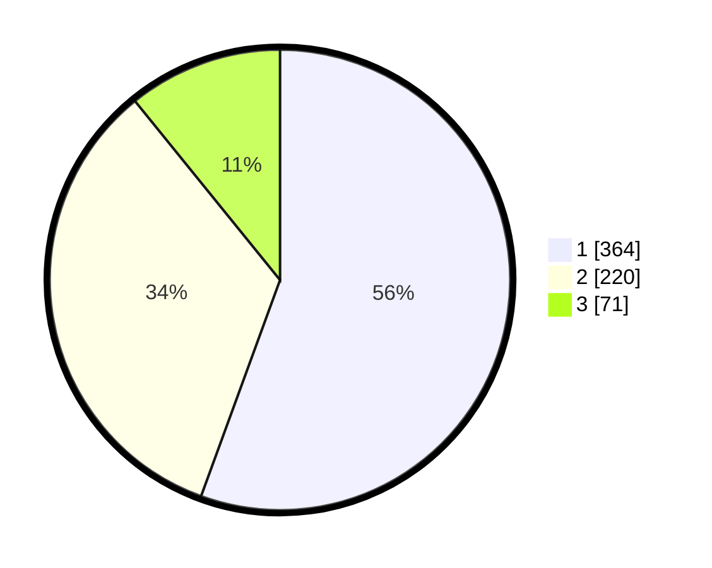

# Hasil

## Grafik

## Tabel

| No. | Nama Paslon    | Suara | Suara (raw) | Persentase |
|:--- |:-------------- | -----:| -----------:| ----------:|
| 1   | ANIES MUHAIMIN | 364   | [364][p-1]  | 55,57      |
| 2   | PRABOWO GIBRAN | 220   | [220][p-2]  | 33,59      |
| 3   | GANJAR MAHFUD  | 71    | [71][p-3]   | 10,84      |

[p-1]: https://github.com/gigit-pemilu/pemilu-2024/blob/main/pilpres/hitung-suara/sub/99-luar-negeri/sub/98-riyadh-arab-saudi/sub/01-riyadh-arab-saudi/sub/0001-riyadh-arab-saudi/sub/012-ksk-002/sub/paslon-1.txt
[p-2]: https://github.com/gigit-pemilu/pemilu-2024/blob/main/pilpres/hitung-suara/sub/99-luar-negeri/sub/98-riyadh-arab-saudi/sub/01-riyadh-arab-saudi/sub/0001-riyadh-arab-saudi/sub/012-ksk-002/sub/paslon-2.txt
[p-3]: https://github.com/gigit-pemilu/pemilu-2024/blob/main/pilpres/hitung-suara/sub/99-luar-negeri/sub/98-riyadh-arab-saudi/sub/01-riyadh-arab-saudi/sub/0001-riyadh-arab-saudi/sub/012-ksk-002/sub/paslon-3.txt

## Foto C Plano

https://sirekap-obj-formc.kpu.go.id/5756/pemilu/ppwp/99/98/01/00/01/9998010001012-20240215-224820--1b323228-f522-46ce-9d18-197645684789.jpg

https://sirekap-obj-formc.kpu.go.id/5756/pemilu/ppwp/99/98/01/00/01/9998010001012-20240215-224824--a4a19c6f-7f25-43d0-9df6-be052943f7fd.jpg

https://sirekap-obj-formc.kpu.go.id/5756/pemilu/ppwp/99/98/01/00/01/9998010001012-20240215-224823--86e5ed0a-6441-4b9b-b29d-7928d7376500.jpg

## Metadata

| Key        | Value               |
| ---------- | ------------------- |
| Time Stamp | 2024-02-19 06:16:00 |

## DATA PEMILIH TETAP

Jumlah pemilih dalam DPT: **1462**.
 * L: **489**.
 * P: **973**.

## DATA PENGGUNA HAK PILIH

Jumlah pengguna hak pilih dalam DPT: **266**.
 * L: **164**.
 * P: **102**.

Jumlah pengguna hak pilih dalam DPTb: **147**.
 * L: **67**.
 * P: **80**.

Jumlah pengguna hak pilih dalam DPK: **250**.
 * L: **138**.
 * P: **112**.

Jumlah pengguna hak pilih: **663**.
 * L: **369**.
 * P: **294**.

## JUMLAH SUARA SAH DAN TIDAK SAH

JUMLAH SELURUH SUARA SAH: **655**.

JUMLAH SUARA TIDAK SAH: **8**.

JUMLAH SELURUH SUARA SAH DAN SUARA TIDAK SAH: **663**.

