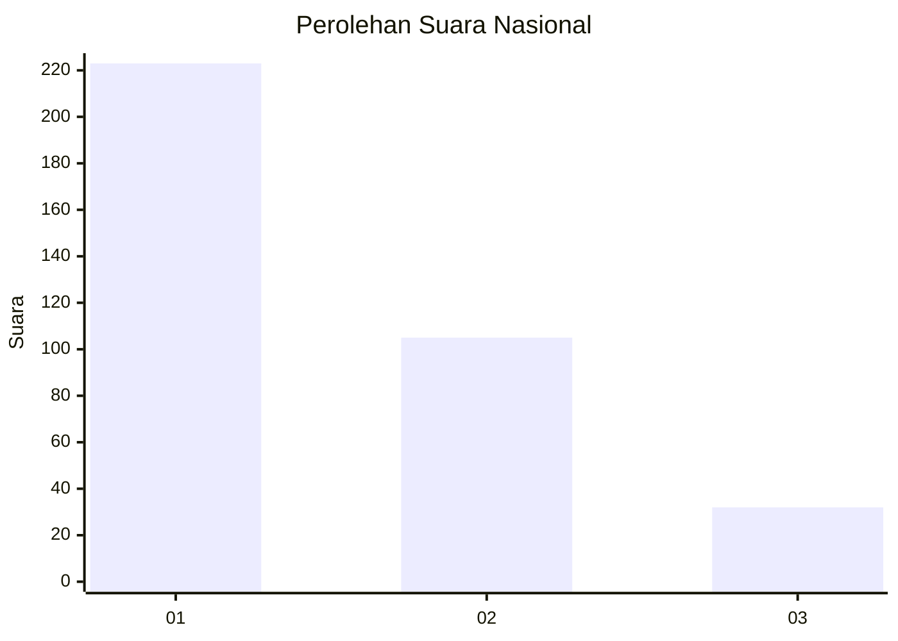
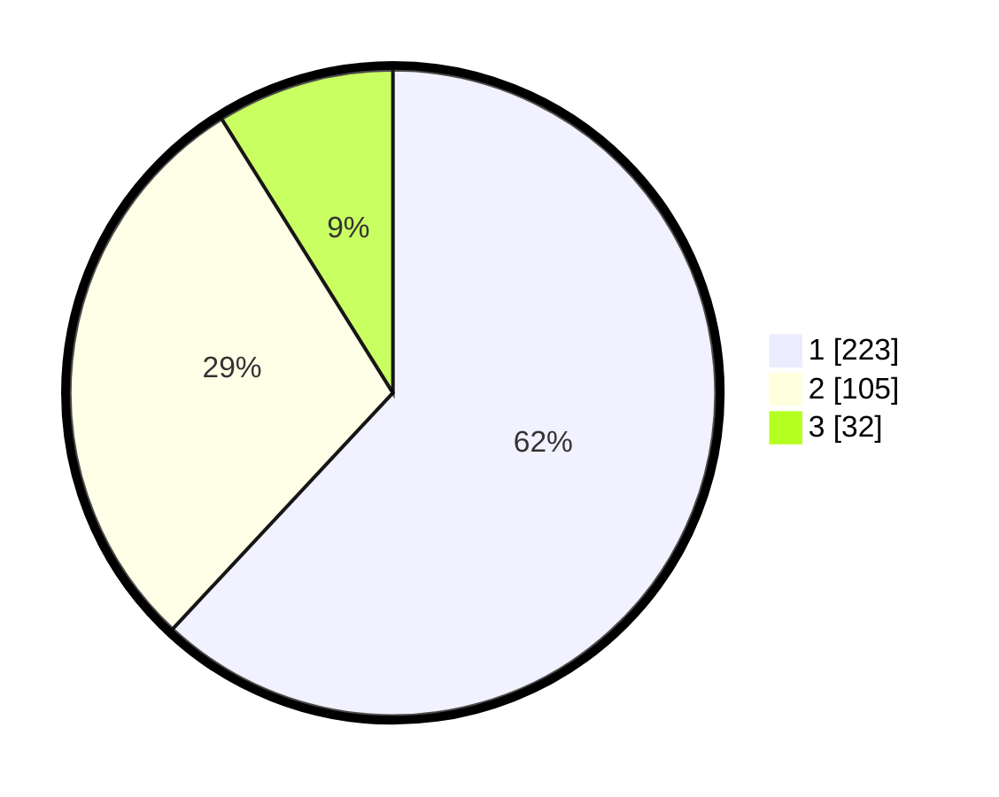

# Hasil

## Grafik

## Tabel

| No. | Nama Paslon    | Suara | Suara (raw) | Persentase |
|:--- |:-------------- | -----:| -----------:| ----------:|
| 1   | ANIES MUHAIMIN | 223   | [223][p-1]  | 61,94      |
| 2   | PRABOWO GIBRAN | 105   | [105][p-2]  | 29,17      |
| 3   | GANJAR MAHFUD  | 32    | [32][p-3]   | 8,89       |

[p-1]: https://github.com/gigit-pemilu/pemilu-2024/blob/main/pilpres/hitung-suara/sub/99-luar-negeri/sub/98-riyadh-arab-saudi/sub/01-riyadh-arab-saudi/sub/0001-riyadh-arab-saudi/sub/014-ksk-004/sub/paslon-1.txt
[p-2]: https://github.com/gigit-pemilu/pemilu-2024/blob/main/pilpres/hitung-suara/sub/99-luar-negeri/sub/98-riyadh-arab-saudi/sub/01-riyadh-arab-saudi/sub/0001-riyadh-arab-saudi/sub/014-ksk-004/sub/paslon-2.txt
[p-3]: https://github.com/gigit-pemilu/pemilu-2024/blob/main/pilpres/hitung-suara/sub/99-luar-negeri/sub/98-riyadh-arab-saudi/sub/01-riyadh-arab-saudi/sub/0001-riyadh-arab-saudi/sub/014-ksk-004/sub/paslon-3.txt

## Foto C Plano

https://sirekap-obj-formc.kpu.go.id/39f9/pemilu/ppwp/99/98/01/00/01/9998010001014-20240214-185923--a1a3a9e2-244c-40ab-a3ef-7f3b36cf0596.jpg

https://sirekap-obj-formc.kpu.go.id/39f9/pemilu/ppwp/99/98/01/00/01/9998010001014-20240214-185726--3823a743-9e89-4ff9-98e5-2013a7bb86fe.jpg

https://sirekap-obj-formc.kpu.go.id/39f9/pemilu/ppwp/99/98/01/00/01/9998010001014-20240214-190000--b63b7c4a-8a1c-4cab-a8d0-182e2d3f971c.jpg

## Metadata

| Key        | Value               |
| ---------- | ------------------- |
| Time Stamp | 2024-02-19 06:16:00 |

## DATA PEMILIH TETAP

Jumlah pemilih dalam DPT: **1020**.
 * L: **319**.
 * P: **701**.

## DATA PENGGUNA HAK PILIH

Jumlah pengguna hak pilih dalam DPT: **89**.
 * L: **58**.
 * P: **31**.

Jumlah pengguna hak pilih dalam DPTb: **67**.
 * L: **44**.
 * P: **23**.

Jumlah pengguna hak pilih dalam DPK: **217**.
 * L: **100**.
 * P: **117**.

Jumlah pengguna hak pilih: **373**.
 * L: **202**.
 * P: **171**.

## JUMLAH SUARA SAH DAN TIDAK SAH

JUMLAH SELURUH SUARA SAH: **370**.

JUMLAH SUARA TIDAK SAH: **3**.

JUMLAH SELURUH SUARA SAH DAN SUARA TIDAK SAH: **373**.

